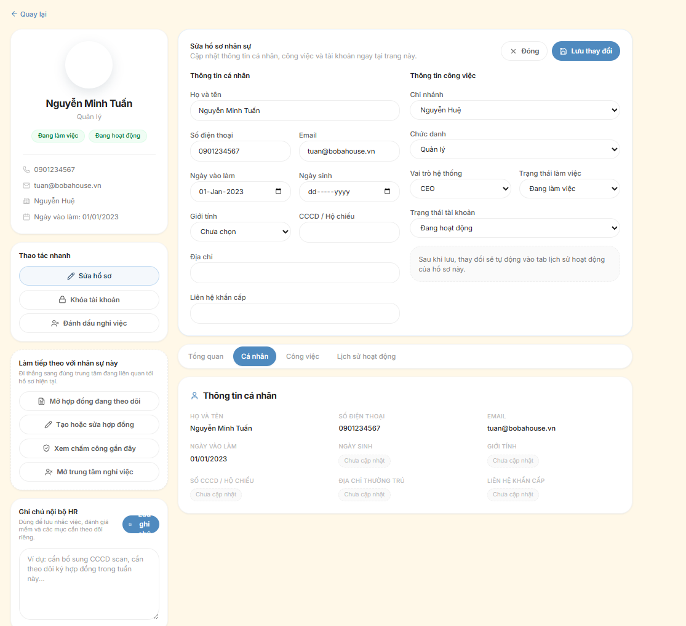
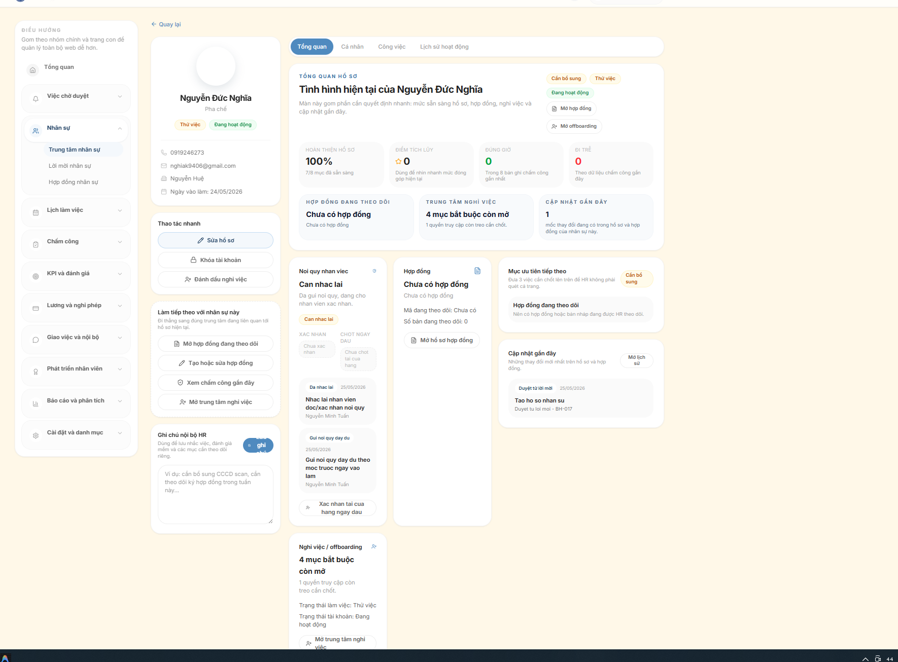

# Flow Nhan Su: Tu Dau Phong Van Den Thanh Nhan Vien

## File nay dung de lam gi
File nay mo ta theo kieu rat thuc chien:
- vao trang nao
- bam nut nao
- luc nao thi dung nut do
- bam xong thi ky vong dieu gi xay ra

Muc tieu la de HR hoac quan ly doc xong co the hinh dung ro se thao tac gi tren web Homies.

---

## Tom tat cuc ngan
Neu nho 1 cau duy nhat, hay nho:

`Nhan sau phong van -> Tao loi moi -> Gui form -> Ung vien dien -> HR duyet -> Tao hop dong -> Gui ky -> HR ky -> Dua vao danh sach nhan vien`

---

## Bang tom tat rat nhanh

| Vai tro | Vao trang nao | Bam gi | Ket qua mong muon |
| --- | --- | --- | --- |
| HR / Quan ly | `/employees/invitations` | `Tao them loi moi` | Tao 1 loi moi moi cho nguoi da dau phong van |
| HR / Quan ly | `/employees/invitations/new` | Dien thong tin offer va hoan tat tao | He thong tao invitation de theo doi |
| HR / Quan ly | `/employees/invitations` | `Gui email` hoac `Sao chep link` | Ung vien nhan duoc link form nhan viec |
| Ung vien | `/employees/invitations/form` | Dien thong tin va bam `Gui ho so nhan viec` | Ho so chuyen sang cho HR duyet |
| HR / Quan ly | `/employees/invitations` | `Mo chi tiet` | Xem lai do day du va do chinh xac cua ho so |
| HR / Quan ly | `/employees/invitations` | `Yeu cau bo sung` neu thieu | Ung vien quay lai bo sung thong tin |
| HR / Quan ly | `/employees/invitations` | `Duyet` neu da du | He thong tao nhan su chinh thuc va ma nhan vien |
| HR / Quan ly | `/employees` | Mo ho so nhan vien vua tao | Kiem tra nhan vien da vao dung chi nhanh, vi tri, trang thai |
| HR / Quan ly | `/employees/contracts` | Tao hop dong | Sinh hop dong cho nhan vien vua duyet |
| HR / Quan ly | `/employees/contracts/[id]` | `Gui ky` | Hop dong chuyen sang cho nhan vien ky |
| Nhan vien | `/employees/contracts/[id]` | `Toi dong y va ky` | Hop dong chuyen sang cho HR ky xac nhan |
| HR / Quan ly | `/employees/contracts/[id]` | `HR countersign` | Hop dong hoan tat, nhan vien san sang vao van hanh |

---

## Bat dau tu dau
Tinh huong goc la:
- 1 ban da dau phong van
- Homies da quyet dinh nhan ban do vao lam
- HR can dua ban do di het flow tren web den luc thanh nhan vien that su

Thong tin toi thieu nen chot truoc khi vao web:
- ho ten
- so dien thoai
- email
- cua hang du kien
- vi tri du kien
- ngay vao lam du kien

---

## Flow chi tiet theo man hinh

### Chang 1: Tao loi moi cho nguoi da duoc nhan

#### Buoc 1: Mo danh sach loi moi
Vao menu:
- `Nhan su`
- mo trang `/employees/invitations`

Trang nay dung de:
- xem tat ca loi moi dang co
- loc nhom can xu ly
- gui email
- duyet
- yeu cau bo sung
- huy loi moi

Tren man hinh nay, ban se thay:
- o loc `Tat ca email`
- o loc `Tat ca uu tien`
- o sap xep
- o tim kiem
- cac tab nhom loi moi
- nut `Tao them loi moi`

Neu dang bat dau tao moi:
- bam nut `Tao them loi moi`

#### Buoc 2: Tao loi moi nhan su
He thong se chuyen sang:
- `/employees/invitations/new`

Ten man hinh:
- `Tao loi moi nhan su`

Trang nay di theo 3 buoc:
1. `Chon preset`
2. `Nhap offer`
3. `Kiem tra gui`

Ban se lam lan luot:

##### 2.1 Chon preset
Tai buoc nay:
- chon mau gan nhat voi truong hop can nhan
- vi du Barista full-time, Thu ngan part-time, Truong ca

Tac dung:
- he thong dien san mot phan thong tin nhu cua hang, vai tro, loai nhan su, thu viec

##### 2.2 Nhap thong tin offer
Nhap cac muc quan trong:
- ho ten
- email
- so dien thoai
- ngay vao lam
- chi nhanh
- vi tri
- bo phan
- loai nhan su
- cap bac
- luong chinh thuc
- thong tin thu viec neu co
- ghi chu neu can

Trong cung trang nay con co phan email:
- tieu de email
- loi nhan rieng
- han phan hoi
- nguoi ho tro
- thong tin lien he ho tro

##### 2.3 Kiem tra san sang gui
Trang co checklist de bao da du dieu kien chua.

Ban nen dam bao cac muc sau da co:
- ten ung vien
- email lien he
- chi nhanh va vi tri
- muc luong chinh thuc
- ngay vao lam
- noi dung email hoan chinh

Neu chua muon gui ngay:
- bam nut luu nhap neu man hinh cho phep

Neu muon tao va di tiep:
- hoan tat tao loi moi

Ket qua mong muon:
- he thong tao ra 1 invitation moi
- co the quay lai danh sach loi moi de gui hoac theo doi

---

### Chang 2: Gui form cho ung vien tu dien

#### Buoc 3: Quay lai danh sach loi moi de gui
Quay lai:
- `/employees/invitations`

Tai bang danh sach, tim dung ung vien vua tao.

Ban co the dung:
- o tim kiem
- loc `Chua gui`
- sap xep `Moi tao gan day`

Tai moi dong ung vien, ban se thay cac nut nhanh nhu:
- `Gui email`
- `Gui lai`
- `Mo chi tiet`
- `Sao chep link`
- `Yeu cau bo sung`
- `Tu choi`
- `Huy`

#### Buoc 4: Gui link cho ung vien
Co 2 cach:

##### Cach A: Gui bang he thong
Neu loi moi dang o trang thai chua gui:
- bam `Gui email`

Neu da gui roi nhung can gui lai:
- bam `Gui lai`

Ket qua mong muon:
- he thong cap nhat lich su gui
- trang thai gui se doi sang da gui thanh cong neu khong loi

##### Cach B: Tu copy link de gui tay
Neu HR muon gui qua Zalo, Messenger, hoac tu nhan:
- bam `Sao chep link`
- gui link do cho ung vien

Link nay se dan ung vien den:
- `/employees/invitations/form`

Khi nao nen dung `Sao chep link`:
- can gui nhanh
- email khong on dinh
- can gui qua kenh chat

---

### Chang 3: Ung vien tu dien ho so

#### Buoc 5: Ung vien mo form nhan viec
Ung vien mo link HR gui.

Trang form nay hien:
- thong tin cong viec du kien
- vi tri
- chi nhanh
- ngay vao lam
- thanh tien do ho so
- cac muc bat buoc can dien

Ung vien se tu dien:
- ho va ten
- so dien thoai
- email
- ngay sinh
- gioi tinh
- dia chi
- CCCD
- lien he khan cap
- ghi chu them neu co

Trong luc dien:
- he thong tu luu tam tren thiet bi
- co hien tien do bao da dien du bao nhieu phan tram

#### Buoc 6: Ung vien gui ho so
Khi dien xong, ung vien bam:
- `Gui ho so nhan viec`

Neu thieu thong tin:
- he thong se bao loi
- chua cho gui

Neu gui thanh cong:
- he thong bao da chuyen ho so toi bo phan nhan su
- trang thai duoc cap nhat thanh `Cho duyet`

Dieu nay rat quan trong vi tu day HR moi bat dau duyet that su.

---

### Chang 4: HR quay lai de duyet ho so

#### Buoc 7: Mo danh sach loi moi cho nhom can duyet
HR quay lai:
- `/employees/invitations`

De loc nhanh dung nhom can xu ly:
- o loc uu tien chon `Can duyet`
- hoac mo tab lien quan toi trang thai cho duyet
- co the sap xep `Cho duyet lau nhat`

Tai moi dong ung vien, HR se nhin thay:
- ten
- email
- cua hang va vai tro
- ngay vao lam va luong
- trang thai xu ly
- tien do ho so, vi du 100% day du

Neu he thong hien:
- `Can bo sung truoc khi duyet`

thi co nghia la:
- ho so chua du
- chua nen bam `Duyet`

#### Buoc 8: Mo chi tiet de xem ky hon
Tai dong ung vien:
- bam `Mo chi tiet`

Hoac bam thang vao ten ung vien de mo popup chi tiet.

Trong chi tiet, HR dung de:
- xem do day du cua ho so
- xem link
- xem ghi chu
- doi chieu cac muc da nhap

Neu thay du lieu da on:
- quay lai danh sach va bam `Duyet`

Neu thay thieu hoac sai:
- bam `Yeu cau bo sung`
- nhap noi dung can bo sung

Vi du:
- thieu CCCD
- sai email
- chua co dia chi
- can xac nhan lai ngay vao lam

Ket qua:
- ung vien se roi ve nhom `Can bo sung`
- co the vao lai form de sua va gui lai

Neu khong dung tiep:
- bam `Tu choi`

Neu muon dong ca loi moi:
- bam `Huy`

#### Buoc 9: Duyet va tao nhan su chinh thuc
Khi ho so da du:
- bam `Duyet`

He thong co buoc xac nhan:
- `Xac nhan duyet ho so nay va tao nhan su chinh thuc?`

Neu dong y:
- xac nhan duyet

Ket qua mong muon:
- he thong tao nhan su moi
- co ma nhan vien moi
- loi moi coi nhu da chot xong buoc duyet

Day la moc chuyen tu:
- ung vien dang duoc moi
sang:
- nhan su da ton tai trong he thong

---

### Chang 5: Mo ho so nhan vien vua duyet

#### Buoc 10: Vao danh sach nhan vien
Sau khi duyet xong, vao:
- `/employees`

Trang nay la danh sach nhan vien chinh thuc.

Ban co the:
- tim theo ten
- tim theo ma nhan vien
- loc theo chi nhanh
- loc theo tinh trang lam viec
- loc theo trang thai tai khoan

Tim nhan vien vua tao bang:
- ten
- so dien thoai
- email
- ma nhan vien

#### Buoc 11: Mo ho so chi tiet nhan vien
Tai dong nhan vien:
- bam mo chi tiet ho so

Trang chi tiet la:
- `/employees/[id]`

Tai ho so nay, HR can kiem tra:
- thong tin ca nhan da dung chua
- vi tri va chi nhanh da dung chua
- vai tro da dung chua
- trang thai lam viec da dung chua
- trang thai tai khoan da dung chua

Day la noi de xac nhan:
- ban nay da duoc dua vao he thong nhan su that su

Neu can tao thu cong khong qua invitation:
- co trang `/employees/new`
- nut chinh la `Tao nhan su`

Nhung voi flow tu dau phong van den vao lam, uu tien di qua `invitations` truoc.

---

### Chang 6: Tao hop dong cho nhan vien vua duyet

#### Buoc 12: Mo khu hop dong
Vao:
- `/employees/contracts`

Trang nay dung de:
- tao hop dong hang loat hoac tung nguoi
- theo doi trang thai hop dong
- gui ky
- tai ky khi can

Neu di tu ho so nhan vien vua tao, thuong co cach nhanh:
- vao thang `/employees/contracts?employeeId=...`

#### Buoc 13: Chon nhan vien va tao hop dong
Tai trang hop dong, HR se:
- chon mau hop dong
- chon nhan vien
- nhap ngay hieu luc
- nhap ngay ket thuc neu co
- xem truoc noi dung hop dong

Neu du lieu nhan vien chua du:
- he thong co the bao thieu thong tin
- HR can quay lai ho so nhan vien de bo sung

Khi da san sang:
- tao hop dong nhap
- hoac tao va gui ngay tuy cach man hinh dang cho phep

Ket qua mong muon:
- sinh ra 1 hop dong moi trong danh sach

---

### Chang 7: Gui hop dong cho nhan vien ky

#### Buoc 14: Mo chi tiet hop dong
Tai danh sach hop dong:
- mo hop dong vua tao

Trang chi tiet hop dong la:
- `/employees/contracts/[id]`

Tren trang nay, cac nut quan trong la:
- `Gui ky`
- `Toi dong y va ky`
- `HR countersign`
- `Xuat file`
- `Mo ho so`

#### Buoc 15: Gui hop dong cho nhan vien
Neu hop dong dang la ban nhap:
- bam `Gui ky`

Ket qua mong muon:
- hop dong chuyen sang cho nhan vien ky

Neu can sua truoc khi gui:
- dung khu `Sua ban nhap`
- sua ngay hieu luc, ngay ket thuc, ghi chu
- bam `Luu cap nhat`
- sau do moi `Gui ky`

---

### Chang 8: Nhan vien ky hop dong

#### Buoc 16: Nhan vien doc va ky
Khi den luot nhan vien:
- nhan vien mo hop dong cua minh
- bam `Toi dong y va ky`

Ket qua mong muon:
- hop dong chuyen sang trang thai cho HR ky xac nhan

Luu y:
- nut nay chi hien khi dung nguoi, dung trang thai

---

### Chang 9: HR ky xac nhan cuoi cung

#### Buoc 17: HR countersign
Sau khi nhan vien da ky, HR vao lai:
- `/employees/contracts/[id]`

Neu hop dong dang o buoc cho HR:
- bam `HR countersign`

Ket qua mong muon:
- hop dong duoc kich hoat
- du 2 ben da ky
- da xong buoc gia nhap ve mat giay to

Sau buoc nay, ban nhan su nay da chuyen xong tu:
- nguoi moi duoc nhan
sang:
- nhan vien co ho so va co hop dong trong he thong

---

### Chang 10: Dua nhan vien vao van hanh hang ngay

#### Buoc 18: Dua vao cac flow van hanh
Sau khi da co ho so va hop dong, nhan vien co the di tiep vao cac phan:
- lich lam
- cham cong
- KPI
- luong
- nghi phep

Man hinh lien quan:
- `/schedules` hoac `/schedule`
- `/attendance`
- `/kpi`
- `/payroll`
- `/leave`

Y nghia:
- tu day tro di, ban nay khong con la ung vien nua
- da la nhan vien dang van hanh trong Homies

---

## Nhanh gon: moi trang dung de lam gi

### 1. `/employees/invitations`
Dung de:
- xem danh sach loi moi
- `Tao them loi moi`
- `Gui email`
- `Gui lai`
- `Sao chep link`
- `Mo chi tiet`
- `Yeu cau bo sung`
- `Tu choi`
- `Huy`
- `Duyet`

### 2. `/employees/invitations/new`
Dung de:
- tao loi moi moi
- nhap thong tin offer
- kiem tra do san sang truoc khi gui

### 3. `/employees/invitations/form`
Dung cho ung vien:
- tu dien thong tin nhan viec
- bam `Gui ho so nhan viec`

### 4. `/employees`
Dung de:
- xem danh sach nhan vien da duoc tao chinh thuc
- tim va mo ho so nhan vien

### 5. `/employees/[id]`
Dung de:
- xem ho so chi tiet
- kiem tra nhan vien vua duyet da dung vai tro, chi nhanh, trang thai chua

### 6. `/employees/contracts`
Dung de:
- tao hop dong
- theo doi trang thai hop dong
- di tiep sang ky hop dong

### 7. `/employees/contracts/[id]`
Dung de:
- sua ban nhap hop dong
- `Gui ky`
- `Toi dong y va ky`
- `HR countersign`
- `Xuat file`

---

## Cach xu ly theo tinh huong thuc te

### Tinh huong A: Moi tao loi moi xong
Lam gi:
- quay lai danh sach
- bam `Gui email` hoac `Sao chep link`

### Tinh huong B: Ung vien bao da dien xong
Lam gi:
- vao `/employees/invitations`
- loc `Can duyet`
- mo chi tiet
- neu du thi `Duyet`
- neu thieu thi `Yeu cau bo sung`

### Tinh huong C: Duyet xong roi
Lam gi:
- vao `/employees`
- tim nhan vien vua tao
- mo ho so de kiem tra
- sau do vao `/employees/contracts`

### Tinh huong D: Da tao hop dong nhap
Lam gi:
- mo chi tiet hop dong
- neu can sua thi `Luu cap nhat`
- xong thi `Gui ky`

### Tinh huong E: Nhan vien da ky
Lam gi:
- HR vao lai hop dong
- bam `HR countersign`

---

## Checklist thao tac de HR lam theo

1. Vao `/employees/invitations`
2. Bam `Tao them loi moi`
3. Dien thong tin offer
4. Tao loi moi
5. Quay lai danh sach
6. Bam `Gui email` hoac `Sao chep link`
7. Cho ung vien vao `/employees/invitations/form` de dien
8. Quay lai `/employees/invitations`
9. Loc nhom `Can duyet`
10. Bam `Mo chi tiet` de xem
11. Neu thieu thi `Yeu cau bo sung`
12. Neu du thi `Duyet`
13. Vao `/employees`
14. Mo ho so nhan vien vua tao
15. Vao `/employees/contracts`
16. Tao hop dong
17. Mo chi tiet hop dong
18. Bam `Gui ky`
19. Cho nhan vien bam `Toi dong y va ky`
20. HR bam `HR countersign`
21. Xong flow gia nhap nhan vien

---

## Diem can nho de khong roi flow
- `Invitations` la noi xu ly truoc khi thanh nhan vien.
- `Employees` la noi nhan vien da thanh ban ghi chinh thuc.
- `Contracts` la noi chot giay to va chu ky.
- Neu chua du thong tin thi chua nen `Duyet`.
- Neu hop dong chua gui thi nhan vien chua ky duoc.
- Neu nhan vien da ky ma HR chua countersign thi hop dong chua chot xong.

---

## Ket luan
Flow dung theo web hien tai la:

1. Tao loi moi trong `Invitations`
2. Gui link cho ung vien
3. Ung vien tu dien form
4. HR xem, bo sung, yeu cau sua neu can
5. HR bam `Duyet` de tao nhan su chinh thuc
6. Vao `Employees` de kiem tra ho so
7. Vao `Contracts` de tao hop dong
8. Bam `Gui ky`
9. Nhan vien bam `Toi dong y va ky`
10. HR bam `HR countersign`
11. Nhan vien san sang di vao van hanh hang ngay
