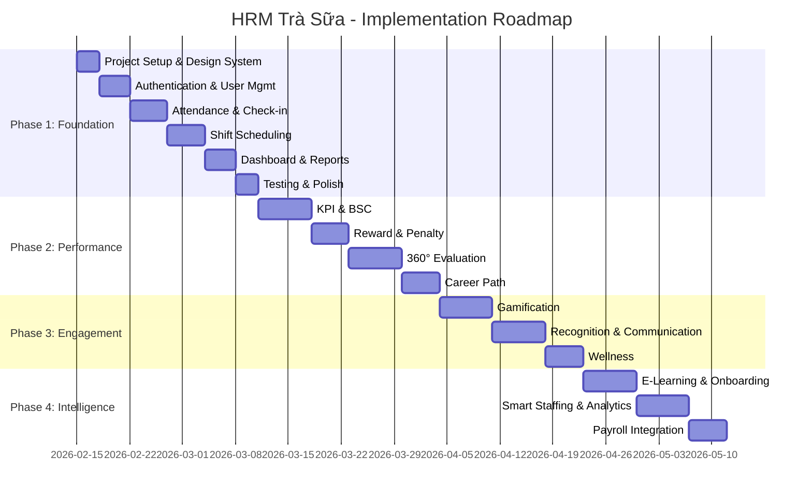

# 01_PRD — HRM Trà Sữa 🧋

## Product Requirements Document v1.0

**Ngày**: 2026-02-15
**Tác giả**: Genesis v1
**Trạng thái**: Draft → Chờ duyệt

---

## 1. Tổng quan sản phẩm

### 1.1 Vấn đề cần giải quyết

Chuỗi trà sữa đang quản lý nhân sự bằng Excel và Zalo group — dẫn đến:

- Chấm công không chính xác (nhờ người chấm hộ, quên check-in)
- Xếp lịch mất thời gian, hay xung đột ca
- Không theo dõi được KPI nhân viên real-time
- Không có career path, nhân viên Gen Z nghỉ nhiều
- CEO không có data tổng quan để ra quyết định

### 1.2 Giải pháp

Xây dựng hệ thống HRM dạng PWA, mobile-first, cho phép:

- Chấm công GPS + selfie (chống gian lận)
- Xếp lịch kéo thả, đổi ca online
- Tự động tính KPI, thưởng phạt
- Gamification giữ chân nhân viên Gen Z
- Dashboard real-time cho CEO

### 1.3 Phạm vi MVP

| Thông số        | MVP                           | Scale   |
| --------------- | ----------------------------- | ------- |
| Cửa hàng        | 2-5                           | 20+     |
| Nhân viên       | 20-50                         | 200+    |
| Đối tượng chính | 80% Gen Z (18-30), smartphone | Mở rộng |

---

## 2. Personas & User Stories

### 2.1 Persona: CEO / Chủ doanh nghiệp

**Nhu cầu**: Data real-time, báo cáo đẹp, ít thao tác.

| ID          | User Story                                                                  | Acceptance Criteria                                                                                                                                     |
| ----------- | --------------------------------------------------------------------------- | ------------------------------------------------------------------------------------------------------------------------------------------------------- |
| [US-CEO-01] | Là CEO, tôi muốn xem dashboard tổng quan toàn chuỗi, để ra quyết định nhanh | **Given** CEO đăng nhập, **When** vào trang chủ, **Then** hiển thị: tổng nhân viên, % chuyên cần hôm nay, doanh thu, store comparison chart. Load < 2s. |
| [US-CEO-02] | Là CEO, tôi muốn xem KPI từng cửa hàng, để biết store nào cần cải thiện     | **Given** CEO ở dashboard, **When** chọn store, **Then** hiển thị KPI breakdown theo nhân viên, so sánh với target.                                     |
| [US-CEO-03] | Là CEO, tôi muốn phê duyệt thăng tiến, để phát triển nhân sự                | **Given** hệ thống đề xuất thăng tiến, **When** CEO nhận notification, **Then** xem profile + KPI + 360 score → Approve/Reject.                         |
| [US-CEO-04] | Là CEO, tôi muốn gửi thông báo toàn chuỗi, để truyền thông nhanh            | **Given** CEO ở announcement, **When** tạo thông báo priority=urgent, **Then** push tới tất cả nhân viên trong < 30s.                                   |
| [US-CEO-05] | Là CEO, tôi muốn export báo cáo Excel, để gửi cho kế toán/đối tác           | **Given** CEO ở báo cáo, **When** chọn Export Excel, **Then** tải file .xlsx với data chấm công + lương + thưởng phạt.                                  |

### 2.2 Persona: Quản lý cửa hàng (Manager)

**Nhu cầu**: Thao tác nhanh, notification kịp thời.

| ID          | User Story                                                                  | Acceptance Criteria                                                                                                                                                     |
| ----------- | --------------------------------------------------------------------------- | ----------------------------------------------------------------------------------------------------------------------------------------------------------------------- |
| [US-MGR-01] | Là Manager, tôi muốn xếp lịch tuần bằng drag & drop, để tiết kiệm thời gian | **Given** Manager mở schedule, **When** kéo employee vào ô ngày/ca, **Then** schedule được tạo, employee nhận notification. Phải detect conflict (1 NV 2 ca cùng ngày). |
| [US-MGR-02] | Là Manager, tôi muốn xem ai đang làm/ai trễ real-time, để xử lý kịp thời    | **Given** Manager mở today dashboard, **When** có NV check-in trễ, **Then** hiển thị badge đỏ "Trễ X phút" + push notification.                                         |
| [US-MGR-03] | Là Manager, tôi muốn duyệt yêu cầu đổi ca/nghỉ phép, để quản lý linh hoạt   | **Given** NV gửi request, **When** Manager nhận notification, **Then** xem chi tiết → Approve/Reject với ghi chú. Lịch tự cập nhật.                                     |
| [US-MGR-04] | Là Manager, tôi muốn thêm/sửa nhân viên, để quản lý nhân sự                 | **Given** Manager mở employee list, **When** thêm NV mới, **Then** form: tên, phone, email, vị trí, store, ảnh. NV nhận SMS/email mời đăng nhập.                        |
| [US-MGR-05] | Là Manager, tôi muốn đánh giá nhân viên, để phát triển team                 | **Given** đợt đánh giá active, **When** Manager chọn NV, **Then** hiển thị form đánh giá theo vị trí, lưu score + comments.                                             |
| [US-MGR-06] | Là Manager, tôi muốn xem báo cáo chấm công, để xác nhận lương               | **Given** cuối tháng, **When** mở attendance report, **Then** hiển thị: tổng giờ, OT, trễ, nghỉ theo từng NV. Export Excel.                                             |
| [US-MGR-07] | Là Manager, tôi muốn ghi sổ bàn giao ca, để ca sau biết tình hình           | **Given** Manager kết thúc ca, **When** tạo log, **Then** form: tóm tắt, vấn đề, ghi chú bàn giao, tasks cho ca sau.                                                    |
| [US-MGR-08] | Là Manager, tôi muốn thưởng/phạt manual, để xử lý trường hợp đặc biệt       | **Given** Manager mở NV profile, **When** tạo reward/penalty, **Then** chọn loại + số tiền/điểm + lý do → lưu vào lịch sử.                                              |

### 2.3 Persona: Nhân viên (Pha chế, Thu ngân, Phục vụ)

**Nhu cầu**: UI đẹp, gamification, dễ dùng 1 tay.

| ID          | User Story                                                            | Acceptance Criteria                                                                                                                                                                                                     |
| ----------- | --------------------------------------------------------------------- | ----------------------------------------------------------------------------------------------------------------------------------------------------------------------------------------------------------------------- |
| [US-EMP-01] | Là NV, tôi muốn check-in bằng 1 nút, để chấm công nhanh               | **Given** NV ở trong bán kính 100m cửa hàng, **When** bấm Check-in → chụp selfie, **Then** hệ thống ghi nhận: thời gian, GPS, ảnh, trạng thái (đúng giờ/trễ). Confetti animation + "+10 điểm" nổi lên. Toàn bộ < 3 tap. |
| [US-EMP-02] | Là NV, tôi muốn xem lịch làm việc, để biết mình làm ca nào            | **Given** NV mở schedule, **When** xem tuần, **Then** hiển thị calendar với ca đã xếp (màu sắc theo ca). Hỗ trợ swipe sang tuần trước/sau.                                                                              |
| [US-EMP-03] | Là NV, tôi muốn xin đổi ca, để linh hoạt                              | **Given** NV muốn đổi ca, **When** chọn ca → chọn NV muốn đổi + lý do, **Then** gửi request → NV kia + Manager nhận notification.                                                                                       |
| [US-EMP-04] | Là NV, tôi muốn xin nghỉ phép, để nghỉ có kế hoạch                    | **Given** NV cần nghỉ, **When** chọn ngày + lý do, **Then** gửi request → Manager nhận notification → Approve/Reject.                                                                                                   |
| [US-EMP-05] | Là NV, tôi muốn xem KPI của mình, để biết mình làm tốt chưa           | **Given** NV mở profile, **When** xem KPI tab, **Then** hiển thị radar chart + điểm + so sánh với target + trend.                                                                                                       |
| [US-EMP-06] | Là NV, tôi muốn xem lương dự kiến, để quản lý tài chính               | **Given** NV mở payroll, **When** xem tháng hiện tại, **Then** hiển thị: giờ làm × rate + OT + thưởng - phạt = tổng.                                                                                                    |
| [US-EMP-07] | Là NV, tôi muốn thu thập điểm và badge, để có động lực                | **Given** NV check-in đúng giờ 30 ngày, **When** đạt streak, **Then** nhận badge "Siêu đúng giờ" + full-screen celebration + điểm bonus.                                                                                |
| [US-EMP-08] | Là NV, tôi muốn đổi điểm lấy quà, để được thưởng xứng đáng            | **Given** NV có đủ điểm, **When** mở rewards store → chọn item, **Then** đổi → trừ điểm → Manager duyệt → nhận quà.                                                                                                     |
| [US-EMP-09] | Là NV, tôi muốn học khóa đào tạo, để phát triển bản thân              | **Given** NV mở learning, **When** chọn course, **Then** xem video/tài liệu → làm quiz → nhận certificate + điểm.                                                                                                       |
| [US-EMP-10] | Là NV, tôi muốn chat với team, để phối hợp công việc                  | **Given** NV mở chat, **When** gửi tin trong store group, **Then** tất cả NV cùng store thấy real-time. Hỗ trợ text + ảnh.                                                                                              |
| [US-EMP-11] | Là NV, tôi muốn ghi nhận tâm trạng hàng ngày, để được hỗ trợ kịp thời | **Given** NV check-in, **When** chọn emoji mood (1-5), **Then** ghi nhận. Nếu mood thấp 3 ngày liên tiếp → alert Manager.                                                                                               |
| [US-EMP-12] | Là NV, tôi muốn xem career path, để biết cần làm gì để thăng tiến     | **Given** NV mở career, **When** xem progress, **Then** hiển thị: vị trí hiện tại → tiếp theo, điều kiện (thâm niên, KPI, training, 360), % hoàn thành.                                                                 |

---

## 3. Yêu cầu chức năng (Functional Requirements)

### 3.1 Phase 1 — Foundation (Tuần 1-4)

#### Module 1.1: Authentication & User Management

| ID            | Requirement                                                                   | Priority | Testable Criteria                                                                  |
| ------------- | ----------------------------------------------------------------------------- | -------- | ---------------------------------------------------------------------------------- |
| [REQ-AUTH-01] | Đăng nhập bằng số điện thoại + OTP (6 số, hết hạn 5 phút)                     | P0       | OTP gửi trong < 5s, verify < 1s                                                    |
| [REQ-AUTH-02] | Đăng nhập bằng email + OTP                                                    | P1       | Email OTP gửi trong < 10s                                                          |
| [REQ-AUTH-03] | Phân quyền 3 roles: CEO, Manager, Employee                                    | P0       | Mỗi role chỉ thấy menu/data tương ứng                                              |
| [REQ-AUTH-04] | Auto redirect theo role sau login                                             | P0       | CEO → /dashboard/ceo, Manager → /dashboard/manager, Employee → /dashboard/employee |
| [REQ-AUTH-05] | Session management: JWT token, auto refresh, logout                           | P0       | Token expire 1h, refresh token 7d                                                  |
| [REQ-AUTH-06] | Profile nhân viên: ảnh, tên đầy đủ, SĐT, email, ngày sinh, giới tính, địa chỉ | P0       | Upload ảnh < 2MB, crop, compress                                                   |
| [REQ-AUTH-07] | Quản lý cửa hàng (store): tên, địa chỉ, GPS, bán kính check-in                | P0       | Bán kính mặc định 100m, có thể config                                              |

#### Module 1.2: Attendance & Check-in

| ID           | Requirement                                            | Priority | Testable Criteria                                                                       |
| ------------ | ------------------------------------------------------ | -------- | --------------------------------------------------------------------------------------- |
| [REQ-ATT-01] | Check-in bằng GPS: verify vị trí trong bán kính store  | P0       | Tính khoảng cách Haversine, hiển thị "X m từ cửa hàng"                                  |
| [REQ-ATT-02] | Chụp selfie khi check-in (camera front)                | P0       | Capture ảnh, compress < 200KB, upload Supabase Storage                                  |
| [REQ-ATT-03] | Auto tính trạng thái: đúng giờ / trễ / sớm             | P0       | So sánh check-in time vs shift start time. Buffer 5 phút. Trễ = check-in > start + 5min |
| [REQ-ATT-04] | Check-out: ghi nhận thời gian, tính tổng giờ làm       | P0       | total_hours = check_out - check_in, round 2 decimal                                     |
| [REQ-ATT-05] | Tự động tính overtime (OT)                             | P1       | OT = actual hours - shift hours nếu > 0                                                 |
| [REQ-ATT-06] | Tính phút trễ                                          | P0       | late_minutes = check_in_time - shift_start (nếu trễ)                                    |
| [REQ-ATT-07] | Lịch sử chấm công: xem theo ngày/tuần/tháng            | P0       | Calendar view + list view, filter by date range                                         |
| [REQ-ATT-08] | Manager: xem attendance hôm nay toàn store             | P0       | Danh sách: NV đã check-in, chưa check-in, đang trễ                                      |
| [REQ-ATT-09] | Confetti animation khi check-in thành công             | P1       | Burst 3s + "+10 điểm" float up                                                          |
| [REQ-ATT-10] | Offline queue: check-in khi mất mạng, sync khi có mạng | P2       | Lưu localStorage/IndexedDB, retry khi online                                            |

#### Module 1.3: Shift Scheduling

| ID           | Requirement                                                  | Priority | Testable Criteria                                             |
| ------------ | ------------------------------------------------------------ | -------- | ------------------------------------------------------------- |
| [REQ-SCH-01] | Tạo ca làm template: tên, giờ bắt đầu, giờ kết thúc, màu sắc | P0       | Có sẵn 3 ca mặc định: Sáng (8-14), Chiều (14-21), Tối (18-23) |
| [REQ-SCH-02] | Xếp lịch tuần: Manager gán NV vào ca/ngày (drag & drop)      | P0       | Drag NV vào cell (ngày × ca), auto save                       |
| [REQ-SCH-03] | Phát hiện xung đột: NV 2 ca cùng ngày, ca quá sát nhau       | P0       | Warning nếu overlap, block nếu cùng thời gian                 |
| [REQ-SCH-04] | NV xem lịch: calendar view tuần/tháng                        | P0       | Color-coded theo ca, swipe tuần trước/sau                     |
| [REQ-SCH-05] | NV đăng ký availability                                      | P1       | Chọn ngày/ca có thể làm → Manager thấy khi xếp lịch           |
| [REQ-SCH-06] | Request đổi ca: NV chọn ca → chọn NV đổi → lý do → gửi       | P0       | Notification cho NV target + Manager                          |
| [REQ-SCH-07] | Request nghỉ phép: chọn ngày → lý do → gửi                   | P0       | Notification cho Manager, Manager Approve/Reject              |
| [REQ-SCH-08] | Bulk tạo schedule: Manager copy lịch tuần trước              | P1       | 1 click copy → paste, sửa nếu cần                             |

#### Module 1.4: Basic Dashboard & Reports

| ID            | Requirement                                                         | Priority | Testable Criteria                           |
| ------------- | ------------------------------------------------------------------- | -------- | ------------------------------------------- |
| [REQ-DASH-01] | Employee dashboard: giờ làm tuần này, lịch hôm nay, điểm, thông báo | P0       | Load < 2s, data real-time                   |
| [REQ-DASH-02] | Manager dashboard: NV đang làm, NV trễ, requests pending, tổng giờ  | P0       | Auto refresh, push on changes               |
| [REQ-DASH-03] | CEO dashboard: tổng NV, % chuyên cần, store comparison chart        | P0       | Recharts bar + line chart                   |
| [REQ-DASH-04] | Export Excel: attendance report theo tháng/store                    | P1       | .xlsx file, download < 5s cho < 200 records |

---

### 3.2 Phase 2 — Performance (Tuần 5-8)

#### Module 2.1: KPI & BSC

| ID           | Requirement                                                           | Priority | Testable Criteria                                    |
| ------------ | --------------------------------------------------------------------- | -------- | ---------------------------------------------------- |
| [REQ-KPI-01] | Tạo KPI template theo vị trí: metric name, type, weight, target, unit | P0       | Tổng weight = 100%                                   |
| [REQ-KPI-02] | Giao KPI target theo tuần/tháng cho NV                                | P0       | Auto từ template hoặc manual adjust                  |
| [REQ-KPI-03] | Nhập actual: manual hoặc auto từ attendance data                      | P0       | Attendance → chuyên cần KPI auto; doanh số manual    |
| [REQ-KPI-04] | Auto tính điểm KPI: (actual/target × 100) × weight                    | P0       | Score 0-100 per metric, weighted total               |
| [REQ-KPI-05] | BSC 4 góc: Tài chính, Khách hàng, Quy trình, Học hỏi                  | P1       | Mỗi góc có metrics riêng, dashboard show 4 quadrants |
| [REQ-KPI-06] | Dashboard KPI cá nhân + team                                          | P0       | Radar chart, trend line, so sánh với target          |

#### Module 2.2: Reward & Penalty

| ID           | Requirement                                                      | Priority | Testable Criteria                             |
| ------------ | ---------------------------------------------------------------- | -------- | --------------------------------------------- |
| [REQ-RWD-01] | Config rules: điều kiện + hành động (VD: trễ 3 lần/tháng = -50k) | P0       | CRUD rules, support >, <, =, >=, <= operators |
| [REQ-RWD-02] | Auto apply rules từ attendance + KPI data                        | P0       | Chạy end of period (tuần/tháng), log kết quả  |
| [REQ-RWD-03] | Manual thưởng/phạt từ Manager                                    | P0       | Chọn NV + loại + amount + reason              |
| [REQ-RWD-04] | Lịch sử thưởng phạt                                              | P0       | Filter by NV, kỳ, loại                        |
| [REQ-RWD-05] | Tổng hợp vào payroll                                             | P1       | Sum bonus - penalty → payroll report          |

#### Module 2.3: 360° Evaluation

| ID            | Requirement                                            | Priority | Testable Criteria                              |
| ------------- | ------------------------------------------------------ | -------- | ---------------------------------------------- |
| [REQ-EVAL-01] | Tạo đợt đánh giá: quarterly, deadline                  | P0       | Status: draft → active → completed             |
| [REQ-EVAL-02] | Form đánh giá theo vị trí: questions JSONB, rating 1-5 | P0       | Separate forms cho self/manager/peer           |
| [REQ-EVAL-03] | Tự đánh giá                                            | P0       | NV trả lời form self, 1 lần duy nhất           |
| [REQ-EVAL-04] | Cấp trên đánh giá                                      | P0       | Manager chấm điểm + comments                   |
| [REQ-EVAL-05] | Đồng nghiệp đánh giá ẩn danh                           | P0       | Random assign 2-3 peers, ẩn danh               |
| [REQ-EVAL-06] | Radar chart tổng hợp                                   | P0       | Combine self + manager + peer scores, weighted |

#### Module 2.4: Career Path

| ID           | Requirement                                                           | Priority | Testable Criteria                |
| ------------ | --------------------------------------------------------------------- | -------- | -------------------------------- |
| [REQ-CAR-01] | Define levels: Thử việc → NV → Senior → Phó QL → QL                   | P0       | Map to positions table level 0-4 |
| [REQ-CAR-02] | Điều kiện thăng tiến: thâm niên, KPI avg, 360 score, required courses | P0       | Configurable per path            |
| [REQ-CAR-03] | Hiển thị tiến độ cá nhân: % hoàn thành mỗi điều kiện                  | P0       | Progress bars, checklist         |
| [REQ-CAR-04] | Gợi ý cải thiện: "Cần hoàn thành 2 khóa học nữa"                      | P1       | Auto generate from gap analysis  |
| [REQ-CAR-05] | Auto đề xuất thăng tiến khi đủ điều kiện                              | P1       | Notification CEO + Manager       |

---

### 3.3 Phase 3 — Engagement (Tuần 9-12)

#### Module 3.1: Gamification

| ID           | Requirement                                                                                     | Priority | Testable Criteria                      |
| ------------ | ----------------------------------------------------------------------------------------------- | -------- | -------------------------------------- |
| [REQ-GAM-01] | Points system: check-in +10, no complaint/week +50, top sales +30, training +100                | P0       | Auto award, transaction log            |
| [REQ-GAM-02] | Badges: "Siêu đúng giờ" (30d streak), "Vua bán hàng" (top 1 month), "Zero Complaint" (3 months) | P0       | Auto detect criteria met → award badge |
| [REQ-GAM-03] | Leaderboard tuần/tháng: theo store + toàn chain                                                 | P0       | Rank by total points, show top 10      |
| [REQ-GAM-04] | Level system: Bronze → Silver → Gold → Platinum                                                 | P0       | Thresholds: 0/500/2000/5000 points     |
| [REQ-GAM-05] | Rewards store: đổi điểm → voucher/ngày nghỉ/quà                                                 | P1       | Catalog + redemption flow + approval   |

#### Module 3.2: Recognition

| ID           | Requirement                                          | Priority | Testable Criteria                                          |
| ------------ | ---------------------------------------------------- | -------- | ---------------------------------------------------------- |
| [REQ-REC-01] | Peer kudos: gửi "Thank you" + points cho đồng nghiệp | P0       | Chọn NV + type (thank_you/great_job/team_player) + message |
| [REQ-REC-02] | Manager shout-out: highlight NV xuất sắc             | P1       | Post to store wall                                         |
| [REQ-REC-03] | Wall of Fame: hiển thị top NV                        | P1       | Monthly auto + manual select                               |
| [REQ-REC-04] | Monthly highlights: auto từ data                     | P2       | Top attendance, top KPI, most kudos                        |

#### Module 3.3: Communication

| ID           | Requirement                              | Priority | Testable Criteria                          |
| ------------ | ---------------------------------------- | -------- | ------------------------------------------ |
| [REQ-COM-01] | Team chat theo store: realtime messaging | P0       | Supabase Realtime, < 500ms latency         |
| [REQ-COM-02] | Direct message: 1-on-1                   | P1       | Create DM room, message history            |
| [REQ-COM-03] | Announcement channel: CEO → all/store    | P0       | Priority levels, push notification         |
| [REQ-COM-04] | Manager log book: bàn giao ca            | P0       | Structured form, shift-linked              |
| [REQ-COM-05] | Push notifications: Firebase FCM         | P0       | Foreground + background, click → deep link |

#### Module 3.4: Wellness

| ID           | Requirement                                   | Priority | Testable Criteria                                  |
| ------------ | --------------------------------------------- | -------- | -------------------------------------------------- |
| [REQ-WEL-01] | Mood check-in hàng ngày: emoji 1-5            | P0       | 1/day limit, optional note                         |
| [REQ-WEL-02] | Weekly wellness pulse survey                  | P1       | 3-5 quick questions weekly                         |
| [REQ-WEL-03] | Anonymous feedback box                        | P0       | Category + content, admin review                   |
| [REQ-WEL-04] | Burnout risk detection: mood trend + overtime | P1       | Alert nếu avg mood < 2.5 + OT > 10h/week × 2 weeks |
| [REQ-WEL-05] | Wellness tips & resources                     | P2       | Static content library                             |

---

### 3.4 Phase 4 — Intelligence (Tuần 13-16)

#### Module 4.1: E-Learning

| ID           | Requirement                                     | Priority | Testable Criteria                     |
| ------------ | ----------------------------------------------- | -------- | ------------------------------------- |
| [REQ-LRN-01] | Course library: video + PDF + quiz              | P0       | Upload to Supabase Storage            |
| [REQ-LRN-02] | Courses theo vị trí + career level              | P0       | Filter by position/level              |
| [REQ-LRN-03] | Progress tracking: % hoàn thành, current module | P0       | Auto save progress                    |
| [REQ-LRN-04] | Quiz & Certificate                              | P0       | Passing score configurable, auto cert |
| [REQ-LRN-05] | Learning path gắn career progression            | P1       | Required courses for promotion        |

#### Module 4.2: Onboarding

| ID           | Requirement           | Priority | Testable Criteria              |
| ------------ | --------------------- | -------- | ------------------------------ |
| [REQ-ONB-01] | Checklist theo vị trí | P0       | Tasks + completion tracking    |
| [REQ-ONB-02] | Mentor assignment     | P1       | Assign senior NV as mentor     |
| [REQ-ONB-03] | Progress dashboard    | P0       | Manager view onboarding status |
| [REQ-ONB-04] | Probation evaluation  | P1       | Auto trigger at probation end  |

#### Module 4.3: Smart Staffing

| ID           | Requirement                      | Priority | Testable Criteria                         |
| ------------ | -------------------------------- | -------- | ----------------------------------------- |
| [REQ-STF-01] | AI suggest optimal schedule      | P1       | Based on availability + skills + fairness |
| [REQ-STF-02] | Demand forecast: busy days/hours | P1       | Historical data → prediction              |
| [REQ-STF-03] | Under/Over staffed alerts        | P0       | Compare scheduled vs recommended          |
| [REQ-STF-04] | Labor cost optimization          | P2       | Minimize cost while meeting demand        |

#### Module 4.4: Analytics & Insights

| ID           | Requirement                | Priority | Testable Criteria                              |
| ------------ | -------------------------- | -------- | ---------------------------------------------- |
| [REQ-ANL-01] | Turnover prediction        | P2       | Low mood + low KPI + high absence → risk score |
| [REQ-ANL-02] | Performance trend analysis | P1       | Line charts over 3-6 months                    |
| [REQ-ANL-03] | Store comparison           | P0       | Side-by-side metrics                           |
| [REQ-ANL-04] | Custom report builder      | P2       | Drag-drop fields, filters, export              |

#### Module 4.5: Payroll Integration

| ID           | Requirement                          | Priority | Testable Criteria                        |
| ------------ | ------------------------------------ | -------- | ---------------------------------------- |
| [REQ-PAY-01] | Tổng hợp: giờ làm + OT + thưởng phạt | P0       | Auto calculate from attendance + rewards |
| [REQ-PAY-02] | Tip pooling                          | P2       | Split tips by hours worked               |
| [REQ-PAY-03] | Payslip generation                   | P0       | PDF payslip per employee                 |
| [REQ-PAY-04] | Export to accounting software        | P1       | CSV/Excel format                         |

---

## 4. Yêu cầu phi chức năng (Non-Functional Requirements)

| ID       | Category     | Requirement            | Target                                  |
| -------- | ------------ | ---------------------- | --------------------------------------- |
| [NFR-01] | Performance  | Page load time         | < 2s on 4G                              |
| [NFR-02] | Performance  | API response time      | < 500ms p95                             |
| [NFR-03] | Performance  | Check-in flow complete | < 5s (3 taps max)                       |
| [NFR-04] | Availability | Uptime                 | 99.5% (Supabase free tier SLA)          |
| [NFR-05] | Scalability  | Concurrent users       | 50 (MVP), 500 (scale)                   |
| [NFR-06] | Security     | Authentication         | Supabase Auth + RLS per org             |
| [NFR-07] | Security     | Data isolation         | Multi-tenant via org_id RLS             |
| [NFR-08] | Security     | GPS spoofing           | Photo verification + device fingerprint |
| [NFR-09] | UX           | Mobile-first           | Touch targets ≥ 48px, 1-thumb friendly  |
| [NFR-10] | UX           | Accessibility          | WCAG 2.1 AA (contrast, labels)          |
| [NFR-11] | PWA          | Offline support        | Check-in queue, schedule cache          |
| [NFR-12] | PWA          | Installable            | manifest.json, service worker           |
| [NFR-13] | Localization | Language               | Vietnamese (primary), English (future)  |
| [NFR-14] | Browser      | Support                | Chrome 90+, Safari 15+, Firefox 90+     |

---

## 5. Non-Goals (Không nằm trong phạm vi)

| ID      | Non-Goal                              | Lý do                                       |
| ------- | ------------------------------------- | ------------------------------------------- |
| [NG-01] | Native iOS/Android app                | PWA đủ cho MVP, tiết kiệm chi phí           |
| [NG-02] | Tích hợp POS/máy tính tiền            | Phase sau, cần API từ POS vendor            |
| [NG-03] | Tích hợp phần mềm kế toán (MISA, SAP) | Phase 4+ khi có nhu cầu rõ ràng             |
| [NG-04] | AI face recognition check-in          | Quá phức tạp cho MVP, selfie + GPS đủ       |
| [NG-05] | Đa ngôn ngữ (i18n)                    | MVP chỉ Tiếng Việt, i18n Phase 4+           |
| [NG-06] | Custom domain setup                   | Dùng .vercel.app free trước                 |
| [NG-07] | SMS gateway tự host                   | Dùng Supabase Auth OTP (có limit free tier) |
| [NG-08] | Video call                            | Dùng app ngoài (Zalo, Telegram)             |

---

## 6. Tech Stack

| Layer         | Technology                                        | Lý do chọn                                      |
| ------------- | ------------------------------------------------- | ----------------------------------------------- |
| Platform      | PWA (Progressive Web App)                         | Mobile-first, installable, offline, free deploy |
| Frontend      | Next.js 14 (App Router) + TypeScript              | SSR/SSG, routing, API routes, DX tốt            |
| Styling       | TailwindCSS + shadcn/ui                           | Responsive, component library, design system    |
| State         | Zustand                                           | Simple, nhẹ, DevTools                           |
| Data Fetching | TanStack Query                                    | Cache, refetch, optimistic updates              |
| Charts        | Recharts                                          | React-native, responsive, free                  |
| Icons         | Lucide React                                      | Consistent, tree-shakeable                      |
| PWA           | @ducanh2912/next-pwa                              | Maintained fork, compatible App Router          |
| Backend       | Supabase (PostgreSQL + Auth + Storage + Realtime) | Free tier, realtime, RLS, full stack            |
| Push          | Firebase Cloud Messaging                          | Free, reliable, PWA support                     |
| Deploy        | Vercel                                            | Free tier, auto deploy, edge, analytics         |

---

## 7. Database Schema

> Schema đầy đủ xem tại `genesis/v1/04_SYSTEM_DESIGN/database_schema.sql` (sẽ được tạo trong bước tiếp theo).
> Đã được định nghĩa trong blueprint gốc với đầy đủ bảng cho cả 4 phases.

---

## 8. API Structure

> API endpoints đầy đủ xem blueprint gốc, section "PHẦN 6: API STRUCTURE".
> Base URL: `/api/v1`
> Tổng cộng: **~50 endpoints** across 11 resource groups.

---

## 9. Lộ trình triển khai (Implementation Roadmap)

---

## 10. Metrics thành công

| Metric              | Target                             | Cách đo                         |
| ------------------- | ---------------------------------- | ------------------------------- |
| Adoption rate       | 100% NV dùng check-in trong 2 tuần | % NV check-in qua app vs manual |
| Check-in accuracy   | < 5% gian lận                      | GPS verify + photo audit        |
| Manager time saved  | Giảm 50% thời gian xếp lịch        | Survey + time tracking          |
| Employee engagement | NPS > 40                           | Monthly pulse survey            |
| Turnover reduction  | Giảm 20% sau 6 tháng               | HR data comparison              |

---

## 11. Rủi ro & Giảm thiểu

| Rủi ro                        | Xác suất   | Impact     | Giảm thiểu                           |
| ----------------------------- | ---------- | ---------- | ------------------------------------ |
| GPS không chính xác trong nhà | Cao        | Trung bình | Tăng bán kính + selfie verify        |
| Supabase free tier giới hạn   | Trung bình | Cao        | Monitor usage, prepare upgrade plan  |
| NV không chịu dùng app        | Trung bình | Cao        | Gamification, UI đẹp, training       |
| Mất mạng khi check-in         | Trung bình | Trung bình | Offline queue (PWA)                  |
| Photo storage full            | Thấp       | Trung bình | Compress ảnh, auto cleanup > 90 ngày |
