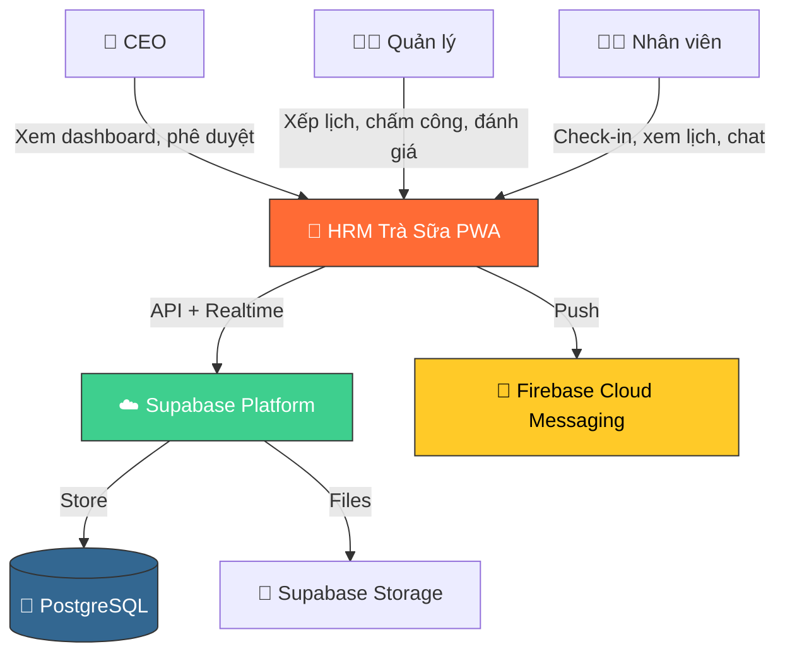
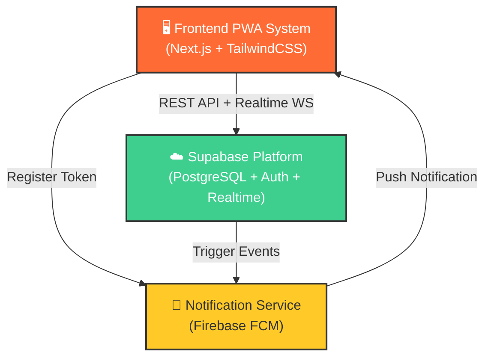

# Kiến trúc hệ thống tổng quan (Architecture Overview)

**Dự án**: HRM Trà Sữa 🧋
**Phiên bản**: 1.0
**Ngày**: 2026-02-15

---

## 1. Bối cảnh hệ thống (System Context)

### 1.1 C4 Level 1 — Sơ đồ ngữ cảnh



### 1.2 Người dùng chính (Key Users)

| Persona                | Số lượng    | Thiết bị       | Tần suất dùng           |
| ---------------------- | ----------- | -------------- | ----------------------- |
| CEO / Chủ doanh nghiệp | 1-2         | Phone + Laptop | 1-2 lần/ngày            |
| Quản lý cửa hàng       | 2-5 (MVP)   | Phone          | Liên tục trong ca       |
| Nhân viên              | 20-50 (MVP) | Phone (90%)    | Check-in/out + xem lịch |

### 1.3 Hệ thống bên ngoài (External Systems)

| Service            | Vai trò                           | Free Tier                      |
| ------------------ | --------------------------------- | ------------------------------ |
| **Supabase**       | Database, Auth, Realtime, Storage | 500MB DB, 1GB storage, 50K MAU |
| **Firebase (FCM)** | Push notifications                | Không giới hạn                 |
| **Vercel**         | Frontend hosting + CDN            | 100GB bandwidth/month          |
| **Google Fonts**   | Typography (Inter)                | Unlimited                      |

---

## 2. Danh sách hệ thống (System Inventory)

### System 1: Frontend PWA System

**System ID**: `frontend-pwa`

**Trách nhiệm**:

- Giao diện người dùng, responsive mobile-first
- PWA: offline cache, install prompt, push notifications
- Client-side state management (Zustand)
- Server-side rendering (Next.js SSR/SSG)
- GPS geolocation API
- Camera capture API (MediaDevices)

**Ranh giới (Boundary)**:

- **Đầu vào**: User interactions (touch, tap, swipe), GPS coordinates, camera stream
- **Đầu ra**: Supabase API calls, FCM token registration
- **Phụ thuộc**: `supabase-platform`, `fcm-service`

**Yêu cầu liên quan**: [REQ-AUTH-01~07], [REQ-ATT-01~10], [REQ-SCH-01~08], [REQ-DASH-01~04], All UI requirements

**Tech Stack**:

- Framework: Next.js 14 (App Router)
- Language: TypeScript
- Styling: TailwindCSS + shadcn/ui
- State: Zustand (client), TanStack Query (server state)
- Charts: Recharts
- Icons: Lucide React
- PWA: @ducanh2912/next-pwa

**Thiết kế chi tiết**: `04_SYSTEM_DESIGN/frontend-pwa.md` (sẽ tạo)

---

### System 2: Supabase Platform (Backend)

**System ID**: `supabase-platform`

**Trách nhiệm**:

- PostgreSQL database (data persistence)
- Authentication (email/phone OTP)
- Row Level Security (multi-tenant isolation)
- Realtime subscriptions (chat, attendance updates)
- File storage (selfie photos, avatars, course content)
- Edge Functions (complex business logic, scheduled jobs)

**Ranh giới (Boundary)**:

- **Đầu vào**: HTTP requests (REST API), WebSocket subscriptions
- **Đầu ra**: JSON responses, Realtime events, File URLs
- **Phụ thuộc**: Không (hạ tầng nền)

**Yêu cầu liên quan**: All data persistence requirements, [REQ-AUTH-01~05], [REQ-COM-01]

**Tech Stack**:

- Database: PostgreSQL 15
- Auth: Supabase Auth (GoTrue)
- Realtime: Supabase Realtime (Phoenix)
- Storage: Supabase Storage (S3-compatible)
- Functions: Supabase Edge Functions (Deno)
- Security: Row Level Security (RLS)

**Thiết kế chi tiết**: `04_SYSTEM_DESIGN/supabase-platform.md` (sẽ tạo)

---

### System 3: Notification Service

**System ID**: `notification-service`

**Trách nhiệm**:

- Push notification delivery (FCM)
- Service Worker management
- In-app notification queue
- Deep linking from notification

**Ranh giới (Boundary)**:

- **Đầu vào**: Event triggers (check-in, request, announcement)
- **Đầu ra**: Push notifications to devices
- **Phụ thuộc**: `supabase-platform` (event source), `frontend-pwa` (service worker)

**Yêu cầu liên quan**: [REQ-COM-05], [US-MGR-02], [US-MGR-03]

**Tech Stack**:

- Firebase Cloud Messaging (FCM)
- Web Push API
- Service Worker (PWA)

**Thiết kế chi tiết**: Tích hợp trong `frontend-pwa` và `supabase-platform` Edge Functions

---

## 3. Ma trận ranh giới hệ thống (System Boundary Matrix)

| Hệ thống             | Đầu vào            | Đầu ra                | Phụ thuộc     | Được phụ thuộc bởi         | Yêu cầu liên quan |
| -------------------- | ------------------ | --------------------- | ------------- | -------------------------- | ----------------- |
| Frontend PWA         | Touch, GPS, Camera | API calls, FCM token  | Supabase, FCM | —                          | All UI reqs       |
| Supabase Platform    | HTTP/WS requests   | JSON, Realtime events | — (infra)     | Frontend PWA, Notification | All data reqs     |
| Notification Service | Event triggers     | Push to devices       | Supabase      | Frontend PWA               | [REQ-COM-05]      |

---

## 4. Sơ đồ phụ thuộc hệ thống (Dependency Graph)



**Giải thích**:

- Frontend giao tiếp trực tiếp với Supabase (không cần API layer riêng)
- Supabase Edge Functions trigger push notifications khi có sự kiện
- Không có circular dependency

---

## 5. Tổng quan tech stack

| Layer         | Technology                                     | Dùng bởi             |
| ------------- | ---------------------------------------------- | -------------------- |
| **Frontend**  | Next.js 14, TypeScript, TailwindCSS, shadcn/ui | Frontend PWA         |
| **State**     | Zustand (client), TanStack Query (server)      | Frontend PWA         |
| **Charts**    | Recharts                                       | Frontend PWA         |
| **Icons**     | Lucide React                                   | Frontend PWA         |
| **PWA**       | @ducanh2912/next-pwa, Workbox                  | Frontend PWA         |
| **Database**  | PostgreSQL 15                                  | Supabase Platform    |
| **Auth**      | Supabase Auth (GoTrue)                         | Supabase Platform    |
| **Realtime**  | Supabase Realtime (Phoenix)                    | Supabase Platform    |
| **Storage**   | Supabase Storage                               | Supabase Platform    |
| **Functions** | Supabase Edge Functions (Deno)                 | Supabase Platform    |
| **Push**      | Firebase Cloud Messaging                       | Notification Service |
| **Deploy**    | Vercel (frontend), Supabase (backend)          | All                  |

---

## 6. Lý do phân tách (Decomposition Rationale)

### Tại sao tách thành 3 hệ thống?

**Theo tech stack**:

- Frontend (TypeScript/React) vs Backend (PostgreSQL/Deno) → Tech stack khác nhau hoàn toàn

**Theo deployment**:

- Frontend → Vercel (static + SSR)
- Backend → Supabase Cloud (managed)
- Push → Firebase (managed)

**Theo trách nhiệm**:

- Frontend: UI rendering, user interaction, offline cache
- Backend: Data persistence, auth, business logic
- Notification: Push delivery, event routing

### Tại sao không tách thêm?

**Tại sao nguyên khối (monolith) cho Frontend?**

- Tất cả pages dùng chung components, theme, auth context
- Next.js App Router hỗ trợ code-splitting tự động
- Tách thành micro-frontends quá phức tạp cho MVP 20-50 users

**Tại sao không tách Backend API riêng khỏi Supabase?**

- Supabase cung cấp auto-generated REST API từ PostgreSQL schema
- RLS policies thay thế middleware auth
- Edge Functions cho business logic phức tạp
- Không cần Express/NestJS server riêng → giảm chi phí, tăng tốc độ phát triển

**Tại sao Notification Service không tách thành hệ thống riêng hoàn toàn?**

- Logic nhỏ (chỉ send push), tích hợp trong Edge Functions
- Nhưng FCM là external service nên đánh dấu riêng để theo dõi

---

## 7. Đánh giá phức tạp (Complexity Assessment)

**Số lượng hệ thống**: 3 (Frontend + Backend + Notification)

**Đánh giá**:

- ✅ Số lượng hợp lý (< 10)
- ✅ Ranh giới rõ ràng
- ✅ Không có circular dependency
- ✅ Phù hợp team nhỏ (1-3 developers)

**Rủi ro tiềm ẩn**:

- Supabase free tier limits (500MB DB, 1GB storage) → Cần monitor
- PWA limitations trên iOS (push notification) → Workaround needed
- Edge Functions cold start → Chấp nhận cho MVP

---

## 8. Cấu trúc thư mục mã nguồn (Project Structure)

```text
hrm-tra-sua/
├── genesis/v1/                    # Tài liệu kiến trúc
│   ├── 00_MANIFEST.md
│   ├── 01_PRD.md
│   ├── 02_ARCHITECTURE_OVERVIEW.md
│   ├── 03_ADR/
│   ├── 04_SYSTEM_DESIGN/
│   └── 06_CHANGELOG.md
│
├── src/                           # Frontend PWA System
│   ├── app/                       # Next.js App Router
│   │   ├── (auth)/                # Auth pages (login, verify)
│   │   ├── (dashboard)/           # Dashboard pages
│   │   │   ├── employees/         # Employee management
│   │   │   ├── attendance/        # Attendance tracking
│   │   │   ├── schedule/          # Scheduling
│   │   │   ├── checkin/           # Check-in flow
│   │   │   ├── requests/          # Shift requests
│   │   │   ├── profile/           # Employee profile
│   │   │   └── page.tsx           # Home dashboard
│   │   ├── layout.tsx             # Root layout
│   │   └── globals.css            # Design system
│   │
│   ├── components/                # Reusable components
│   │   ├── ui/                    # shadcn/ui components
│   │   ├── layout/                # Layout components (BottomNav, AppShell)
│   │   ├── attendance/            # Attendance-specific
│   │   ├── schedule/              # Schedule-specific
│   │   └── dashboard/             # Dashboard widgets
│   │
│   ├── lib/                       # Utilities
│   │   ├── supabase.ts            # Supabase client
│   │   ├── utils.ts               # Helpers
│   │   ├── gps.ts                 # GPS utilities
│   │   └── mock-data.ts           # Demo data (Phase 1)
│   │
│   ├── store/                     # Zustand stores
│   │   ├── auth-store.ts
│   │   ├── employee-store.ts
│   │   ├── attendance-store.ts
│   │   └── schedule-store.ts
│   │
│   ├── hooks/                     # Custom React hooks
│   │   ├── use-geolocation.ts
│   │   ├── use-camera.ts
│   │   └── use-supabase.ts
│   │
│   └── types/                     # TypeScript types
│       ├── database.ts            # DB schema types
│       └── index.ts
│
├── supabase/                      # Supabase Platform System
│   ├── schema.sql                 # Database schema
│   ├── seed.sql                   # Demo data
│   ├── rls-policies.sql           # Row Level Security
│   └── functions/                 # Edge Functions
│       ├── check-in/              # Check-in logic
│       └── notifications/         # Push notification trigger
│
├── public/                        # Static assets
│   ├── manifest.json              # PWA manifest
│   ├── icons/                     # App icons
│   └── sw.js                      # Service worker (auto-generated)
│
├── next.config.js                 # Next.js config + PWA
├── tailwind.config.ts             # TailwindCSS + design system
├── tsconfig.json
├── package.json
└── .env.local                     # Supabase + Firebase keys
```

---

## 9. Bước tiếp theo (Next Steps)

### Cần thiết kế chi tiết từng hệ thống:

1. `04_SYSTEM_DESIGN/frontend-pwa.md` — Component tree, routing, state flow
2. `04_SYSTEM_DESIGN/supabase-platform.md` — Schema, RLS, Edge Functions
3. `04_SYSTEM_DESIGN/database_schema.sql` — Full SQL từ blueprint

### Sau khi thiết kế xong:

Chạy `/blueprint` để tạo task list chi tiết.
