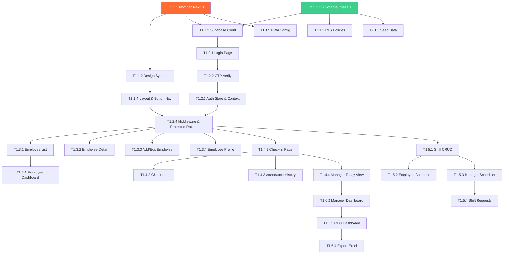

# 05_TASKS — Danh sách tác vụ HRM Trà Sữa 🧋

**Phiên bản**: Genesis v1
**Ngày tạo**: 2026-02-15
**Tổng task**: 52 tasks
**Tổng giờ ước lượng**: ~248h (~31 ngày làm việc)

---

## Sơ đồ phụ thuộc tổng quan

---

## System 1: Frontend PWA (`frontend-pwa`)

### Phase 1.1: Foundation — Khởi tạo dự án

---

- [ ] **T1.1.1** [Cơ sở]: Khởi tạo dự án Next.js 14 + TypeScript
  - **Mô tả**: Tạo project Next.js 14 với App Router, TypeScript, cài đặt tất cả dependencies
  - **Đầu vào**: PRD tech stack, ADR_001
  - **Đầu ra**: Project có thể chạy `npm run dev`, hiển thị trang trắng
  - **Tiêu chí nghiệm thu**:
    - [ ] `npm run dev` khởi động thành công tại localhost:3000
    - [ ] TypeScript compile không lỗi
    - [ ] Dependencies: TailwindCSS, shadcn/ui, Zustand, TanStack Query, Recharts, Lucide React đã cài
  - **Xác nhận**: Mở browser, verify trang hiển thị. Chạy `npx tsc --noEmit` verify TypeScript.
  - **Ước lượng**: 3h
  - **Phụ thuộc**: Không
  - **Độ ưu tiên**: P0

---

- [ ] **T1.1.2** [NFR-09]: Thiết lập Design System
  - **Mô tả**: Cấu hình TailwindCSS với bảng màu, typography (Inter), spacing, shadows theo PRD Section 5
  - **Đầu vào**: PRD Design System (colors, fonts, spacing, shadows, border radius)
  - **Đầu ra**: `tailwind.config.ts`, `globals.css` với CSS variables, Google Fonts Inter import
  - **Tiêu chí nghiệm thu**:
    - [ ] Màu primary (#FF6B35), secondary (#004E64) hoạt động qua class `bg-primary`
    - [ ] Font Inter load đúng, weights 400-700
    - [ ] Shadow sm/md/lg, border-radius sm/md/lg/full hoạt động
  - **Xác nhận**: Tạo component test dùng các design tokens, kiểm tra visual trên browser.
  - **Ước lượng**: 2h
  - **Phụ thuộc**: T1.1.1
  - **Độ ưu tiên**: P0

---

- [ ] **T1.1.3** [REQ-AUTH-05]: Cấu hình Supabase Client
  - **Mô tả**: Tạo Supabase browser client và server client, setup env variables
  - **Đầu vào**: Supabase project URL & anon key
  - **Đầu ra**: `src/lib/supabase.ts` (browser), `src/lib/supabase-server.ts` (server), `.env.local`
  - **Tiêu chí nghiệm thu**:
    - [ ] Client khởi tạo không lỗi
    - [ ] Có thể gọi `supabase.auth.getSession()` không lỗi
  - **Xác nhận**: Import Supabase client trong component, verify không lỗi runtime.
  - **Ước lượng**: 2h
  - **Phụ thuộc**: T1.1.1, T2.1.1
  - **Độ ưu tiên**: P0

---

- [ ] **T1.1.4** [NFR-09]: Layout cơ bản & Bottom Navigation
  - **Mô tả**: Tạo AppShell layout (header + content + bottom nav), BottomNav 5 items: Home, Schedule, Check-in, Chat, Profile
  - **Đầu vào**: Design System (heights, colors, icons)
  - **Đầu ra**: `src/components/layout/AppShell.tsx`, `BottomNav.tsx`, `src/app/(dashboard)/layout.tsx`
  - **Tiêu chí nghiệm thu**:
    - [ ] Bottom nav hiển thị 5 items với icon + label
    - [ ] Active state highlight màu primary
    - [ ] Height 64px + safe area bottom
    - [ ] Touch target ≥ 48px
    - [ ] Route navigation hoạt động
  - **Xác nhận**: Mở trên mobile viewport (375px), kiểm tra nav hoạt động, active state đúng.
  - **Ước lượng**: 4h
  - **Phụ thuộc**: T1.1.2
  - **Độ ưu tiên**: P0

---

- [ ] **T1.1.5** [NFR-11, NFR-12]: Cấu hình PWA
  - **Mô tả**: Setup @ducanh2912/next-pwa, manifest.json, app icons, service worker
  - **Đầu vào**: Brand colors, app name "HRM Trà Sữa"
  - **Đầu ra**: `next.config.js` (PWA config), `public/manifest.json`, `public/icons/`
  - **Tiêu chí nghiệm thu**:
    - [ ] manifest.json valid (name, icons, theme_color, display: standalone)
    - [ ] Chrome DevTools > Application > Manifest hiển thị đúng
    - [ ] Install prompt xuất hiện (hoặc Add to Home Screen khả dụng)
  - **Xác nhận**: Chạy Lighthouse PWA audit, kiểm tra installability.
  - **Ước lượng**: 3h
  - **Phụ thuộc**: T1.1.1
  - **Độ ưu tiên**: P1

---

### Phase 1.2: Authentication — Xác thực người dùng

---

- [ ] **T1.2.1** [REQ-AUTH-01, REQ-AUTH-02]: Trang đăng nhập
  - **Mô tả**: Tạo login page mobile-first với phone/email input, nút gửi OTP, brand illustration
  - **Đầu vào**: Design System, Supabase Auth API
  - **Đầu ra**: `src/app/(auth)/login/page.tsx`
  - **Tiêu chí nghiệm thu**:
    - [ ] Form hiển thị input phone/email, nút "Gửi OTP"
    - [ ] Validate phone format (10 chữ số VN) hoặc email
    - [ ] Gọi Supabase `signInWithOtp()` thành công
    - [ ] Loading state hiển thị khi đang gửi
    - [ ] UI mobile-first, 1-thumb friendly
  - **Xác nhận**: Test trên mobile viewport, nhập phone → verify OTP gửi (hoặc mock).
  - **Ước lượng**: 4h
  - **Phụ thuộc**: T1.1.3
  - **Độ ưu tiên**: P0

---

- [ ] **T1.2.2** [REQ-AUTH-01]: Trang xác thực OTP
  - **Mô tả**: OTP input 6 digit, auto-focus, countdown timer 60s, resend button
  - **Đầu vào**: Phone/email từ login page
  - **Đầu ra**: `src/app/(auth)/verify/page.tsx`
  - **Tiêu chí nghiệm thu**:
    - [ ] 6 ô input, auto-focus ô tiếp theo khi nhập
    - [ ] Countdown 60s, nút "Gửi lại" khi hết countdown
    - [ ] Verify OTP qua Supabase `verifyOtp()`
    - [ ] Redirect dashboard sau verify thành công
    - [ ] Error message khi OTP sai
  - **Xác nhận**: Nhập OTP đúng → redirect. Nhập sai → hiển thị lỗi.
  - **Ước lượng**: 4h
  - **Phụ thuộc**: T1.2.1
  - **Độ ưu tiên**: P0

---

- [ ] **T1.2.3** [REQ-AUTH-03, REQ-AUTH-04]: Auth Store & Role Routing
  - **Mô tả**: Zustand store cho auth state (user, employee, role, loading). Fetch employee record sau login. Route theo role.
  - **Đầu vào**: Supabase Auth session, employees table
  - **Đầu ra**: `src/store/auth-store.ts`, `src/hooks/use-auth.ts`
  - **Tiêu chí nghiệm thu**:
    - [ ] Store lưu: user, employee data, role, isLoading, isAuthenticated
    - [ ] Sau login, fetch employee record bằng auth_user_id
    - [ ] Role xác định từ `employees.role` (ceo/manager/employee)
    - [ ] Auto redirect: CEO → /dashboard/ceo, Manager → /dashboard/manager, Employee → /
  - **Xác nhận**: Login → verify role mapping đúng → redirect đúng dashboard.
  - **Ước lượng**: 4h
  - **Phụ thuộc**: T1.2.2
  - **Độ ưu tiên**: P0

---

- [ ] **T1.2.4** [REQ-AUTH-03, NFR-06]: Middleware & Protected Routes
  - **Mô tả**: Next.js middleware bảo vệ routes, redirect unauthenticated → /login, role-gate cho pages
  - **Đầu vào**: Auth store, route config
  - **Đầu ra**: `src/middleware.ts`, `src/components/auth/RoleGuard.tsx`
  - **Tiêu chí nghiệm thu**:
    - [ ] Truy cập / khi chưa login → redirect /login
    - [ ] Truy cập /login khi đã login → redirect dashboard
    - [ ] Employee truy cập /employees → ẩn hoặc redirect
    - [ ] Manager truy cập CEO pages → redirect
  - **Xác nhận**: Test các scenario: chưa login, đã login đúng role, đã login sai role.
  - **Ước lượng**: 4h
  - **Phụ thuộc**: T1.2.3, T1.1.4
  - **Độ ưu tiên**: P0

---

### Phase 1.3: Employee Module — Quản lý nhân viên

---

- [ ] **T1.3.1** [REQ-AUTH-06, US-MGR-04]: Trang danh sách nhân viên
  - **Mô tả**: Employee list với avatar, tên, vị trí, store. Search, filter theo store/position. Manager/CEO view.
  - **Đầu vào**: employees, positions, stores tables
  - **Đầu ra**: `src/app/(dashboard)/employees/page.tsx`
  - **Tiêu chí nghiệm thu**:
    - [ ] Danh sách hiển thị avatar, full_name, position, store
    - [ ] Search by name hoạt động (client-side filter)
    - [ ] Filter by store, position hoạt động
    - [ ] Click → navigate to detail page
    - [ ] Nút "Thêm nhân viên" (Manager+)
  - **Xác nhận**: Load page → list hiển thị → search + filter hoạt động.
  - **Ước lượng**: 5h
  - **Phụ thuộc**: T1.2.4
  - **Độ ưu tiên**: P0

---

- [ ] **T1.3.2** [REQ-AUTH-06]: Trang chi tiết nhân viên
  - **Mô tả**: Employee detail với tabs: Thông tin, Chấm công, KPI (placeholder Phase 2)
  - **Đầu vào**: employee record, attendance records
  - **Đầu ra**: `src/app/(dashboard)/employees/[id]/page.tsx`
  - **Tiêu chí nghiệm thu**:
    - [ ] Header: avatar lớn, tên, vị trí, mã NV
    - [ ] Tab Info: thông tin cá nhân đầy đủ
    - [ ] Tab Chấm công: summary giờ làm tháng này
    - [ ] Nút Edit (Manager+)
  - **Xác nhận**: Navigate từ list → detail → tabs chuyển đổi đúng.
  - **Ước lượng**: 4h
  - **Phụ thuộc**: T1.2.4
  - **Độ ưu tiên**: P0

---

- [ ] **T1.3.3** [US-MGR-04]: Form thêm/sửa nhân viên
  - **Mô tả**: Form: tên, phone, email, ngày sinh, giới tính, vị trí, store, upload ảnh
  - **Đầu vào**: positions, stores tables
  - **Đầu ra**: `src/app/(dashboard)/employees/new/page.tsx`, `src/app/(dashboard)/employees/[id]/edit/page.tsx`
  - **Tiêu chí nghiệm thu**:
    - [ ] Form fields: full_name, phone, email, dob, gender, position_id, store_id
    - [ ] Upload avatar (compress < 2MB, preview)
    - [ ] Validate: phone 10 số, email format, required fields
    - [ ] Submit → insert/update employee → redirect to list
    - [ ] Auto generate employee_code
  - **Xác nhận**: Fill form → submit → kiểm tra record trong DB (hoặc mock state).
  - **Ước lượng**: 5h
  - **Phụ thuộc**: T1.2.4
  - **Độ ưu tiên**: P0

---

- [ ] **T1.3.4** [REQ-AUTH-06]: Trang profile cá nhân
  - **Mô tả**: Self-view profile cho employee: avatar, thông tin, edit cơ bản (phone, address)
  - **Đầu vào**: Current employee từ auth store
  - **Đầu ra**: `src/app/(dashboard)/profile/page.tsx`
  - **Tiêu chí nghiệm thu**:
    - [ ] Hiển thị thông tin cá nhân đầy đủ
    - [ ] Avatar lớn + nút đổi ảnh
    - [ ] Edit: chỉ được sửa phone, address, avatar
    - [ ] Hiển thị: mã NV, vị trí, store, ngày vào, level gamification
  - **Xác nhận**: Mở profile → verify data hiển thị đúng → edit → save thành công.
  - **Ước lượng**: 4h
  - **Phụ thuộc**: T1.2.4
  - **Độ ưu tiên**: P0

---

### Phase 1.4: Attendance Module — Chấm công

---

- [ ] **T1.4.1** [REQ-ATT-01, REQ-ATT-02, REQ-ATT-03, REQ-ATT-09]: Trang Check-in
  - **Mô tả**: Check-in flow: GPS verify (bán kính store) → Camera selfie → Submit → Confetti + points
  - **Đầu vào**: Store GPS, shift schedule, Supabase Storage
  - **Đầu ra**: `src/app/(dashboard)/checkin/page.tsx`, `src/hooks/use-geolocation.ts`, `src/hooks/use-camera.ts`
  - **Tiêu chí nghiệm thu**:
    - [ ] Lấy GPS → tính khoảng cách Haversine đến store
    - [ ] Hiển thị "X m từ cửa hàng" + status (trong/ngoài bán kính)
    - [ ] Camera front mở → chụp selfie → preview
    - [ ] Submit: ghi attendance (time, GPS, photo_url, status)
    - [ ] Auto tính: on_time / late / early (buffer 5 phút)
    - [ ] Confetti animation 3s + "+10 điểm" float up
    - [ ] Toàn bộ flow ≤ 3 taps
  - **Xác nhận**: Giả lập GPS → check-in → verify record tạo đúng → confetti hiển thị.
  - **Ước lượng**: 8h
  - **Phụ thuộc**: T1.2.4
  - **Độ ưu tiên**: P0

---

- [ ] **T1.4.2** [REQ-ATT-04, REQ-ATT-05, REQ-ATT-06]: Trang Check-out
  - **Mô tả**: Check-out: ghi nhận thời gian, tính total_hours, overtime_hours, late_minutes
  - **Đầu vào**: Attendance record chưa check-out hôm nay
  - **Đầu ra**: Check-out UI trong `checkin/page.tsx` hoặc page riêng
  - **Tiêu chí nghiệm thu**:
    - [ ] Nút Check-out hiển thị khi đã check-in hôm nay
    - [ ] Ghi nhận check_out_time, GPS
    - [ ] Tính total_hours = (check_out - check_in), round 2 decimal
    - [ ] Tính overtime = total_hours - shift_hours nếu > 0
    - [ ] Hiển thị tóm tắt: giờ vào, giờ ra, tổng giờ, OT
  - **Xác nhận**: Check-out → verify total_hours tính đúng → hiển thị summary.
  - **Ước lượng**: 4h
  - **Phụ thuộc**: T1.4.1
  - **Độ ưu tiên**: P0

---

- [ ] **T1.4.3** [REQ-ATT-07]: Lịch sử chấm công
  - **Mô tả**: Attendance history: calendar view + list view, filter by date range, status badges
  - **Đầu vào**: attendances table
  - **Đầu ra**: `src/app/(dashboard)/attendance/page.tsx`
  - **Tiêu chí nghiệm thu**:
    - [ ] Calendar view: ngày có chấm công highlight (xanh = đúng giờ, đỏ = trễ)
    - [ ] List view: ngày, ca, giờ vào/ra, tổng giờ, status badge
    - [ ] Filter: tuần/tháng, date range picker
    - [ ] Click ngày → xem chi tiết (ảnh selfie, GPS, notes)
  - **Xác nhận**: Load page → calendar hiển thị → chuyển list view → filter hoạt động.
  - **Ước lượng**: 5h
  - **Phụ thuộc**: T1.4.1
  - **Độ ưu tiên**: P0

---

- [ ] **T1.4.4** [REQ-ATT-08, US-MGR-02]: Dashboard chấm công hôm nay (Manager)
  - **Mô tả**: Manager view: ai đang làm, ai trễ, ai chưa check-in, summary stats
  - **Đầu vào**: attendances today, schedules today, employees by store
  - **Đầu ra**: `src/app/(dashboard)/attendance/today/page.tsx`
  - **Tiêu chí nghiệm thu**:
    - [ ] 3 sections: Đã check-in, Chưa check-in, Đang trễ
    - [ ] Employee card: avatar, tên, giờ check-in, status badge
    - [ ] Stat cards: tổng NV hôm nay, đã check-in, trễ, chưa đến
    - [ ] Real-time update (hoặc pull-to-refresh)
  - **Xác nhận**: Mở page → verify danh sách phân loại đúng → stats tính đúng.
  - **Ước lượng**: 5h
  - **Phụ thuộc**: T1.4.1
  - **Độ ưu tiên**: P0

---

### Phase 1.5: Scheduling Module — Xếp lịch

---

- [ ] **T1.5.1** [REQ-SCH-01]: CRUD ca làm (Shifts)
  - **Mô tả**: Quản lý ca làm template: tạo/sửa/xóa ca (tên, start_time, end_time, color)
  - **Đầu vào**: shifts table
  - **Đầu ra**: `src/app/(dashboard)/schedule/shifts/page.tsx`
  - **Tiêu chí nghiệm thu**:
    - [ ] List ca: tên, giờ, color preview
    - [ ] Tạo: tên, start_time, end_time, chọn color
    - [ ] Sửa/Xóa ca
    - [ ] 3 ca mặc định seed: Sáng (8-14), Chiều (14-21), Tối (18-23)
  - **Xác nhận**: CRUD flow hoàn chỉnh → verify data lưu đúng.
  - **Ước lượng**: 4h
  - **Phụ thuộc**: T1.2.4
  - **Độ ưu tiên**: P0

---

- [ ] **T1.5.2** [REQ-SCH-04, US-EMP-02]: Calendar lịch làm (Employee)
  - **Mô tả**: Employee xem lịch tuần/tháng: ca đã xếp color-coded, swipe tuần trước/sau
  - **Đầu vào**: schedules table, shifts table
  - **Đầu ra**: `src/app/(dashboard)/schedule/page.tsx`
  - **Tiêu chí nghiệm thu**:
    - [ ] Calendar tuần: 7 cột (T2 → CN), rows theo ca
    - [ ] Block ca color-coded (màu theo shift.color)
    - [ ] Swipe hoặc nút tuần trước/sau
    - [ ] Click block → xem detail (store, giờ, notes)
    - [ ] Empty state: "Chưa có lịch tuần này"
  - **Xác nhận**: Load → verify ca hiển thị đúng tuần → swipe hoạt động.
  - **Ước lượng**: 6h
  - **Phụ thuộc**: T1.5.1
  - **Độ ưu tiên**: P0

---

- [ ] **T1.5.3** [REQ-SCH-02, REQ-SCH-03, REQ-SCH-08, US-MGR-01]: Xếp lịch (Manager)
  - **Mô tả**: Manager drag-and-drop scheduler: week view, drag NV vào cell (ngày × ca), conflict detection, copy tuần trước
  - **Đầu vào**: employees, shifts, schedules tables
  - **Đầu ra**: `src/app/(dashboard)/schedule/manage/page.tsx`
  - **Tiêu chí nghiệm thu**:
    - [ ] Grid: rows = employees, cols = days of week
    - [ ] Cell hiển thị shift block (color-coded)
    - [ ] Drag NV (hoặc tap-to-assign) vào cell → tạo schedule
    - [ ] Conflict detection: cùng NV 2 ca overlap → warning
    - [ ] Nút "Copy tuần trước" → paste → editable
    - [ ] Auto save hoặc nút Save
  - **Xác nhận**: Drag assign → verify schedule tạo → conflict warning xuất hiện khi overlap.
  - **Ước lượng**: 8h
  - **Phụ thuộc**: T1.5.1
  - **Độ ưu tiên**: P0

---

- [ ] **T1.5.4** [REQ-SCH-06, REQ-SCH-07, US-EMP-03, US-EMP-04, US-MGR-03]: Yêu cầu đổi ca & nghỉ phép
  - **Mô tả**: Employee tạo request (swap ca / nghỉ phép), Manager duyệt/từ chối
  - **Đầu vào**: shift_requests table, schedules
  - **Đầu ra**: `src/app/(dashboard)/requests/page.tsx`, form tạo request
  - **Tiêu chí nghiệm thu**:
    - [ ] Tạo swap request: chọn ca mình → chọn NV đổi → lý do
    - [ ] Tạo time-off request: chọn ngày → lý do
    - [ ] List requests: tabs (Pending, Approved, Rejected)
    - [ ] Manager: nút Approve/Reject + ghi chú
    - [ ] Cập nhật schedule tự động khi approve swap
    - [ ] Status badge (pending=vàng, approved=xanh, rejected=đỏ)
  - **Xác nhận**: Tạo request → manager approve → verify lịch cập nhật.
  - **Ước lượng**: 6h
  - **Phụ thuộc**: T1.5.3
  - **Độ ưu tiên**: P0

---

### Phase 1.6: Dashboard & Reports

---

- [ ] **T1.6.1** [REQ-DASH-01, US-EMP-01]: Employee Dashboard
  - **Mô tả**: Trang chủ NV: giờ làm tuần này, lịch hôm nay, điểm, check-in button, thông báo mới nhất
  - **Đầu vào**: attendance, schedule, employee data
  - **Đầu ra**: `src/app/(dashboard)/page.tsx` (employee view)
  - **Tiêu chí nghiệm thu**:
    - [ ] Card: giờ làm tuần này (bar chart nhỏ)
    - [ ] Card: lịch hôm nay (ca, giờ, store)
    - [ ] Card: tổng điểm + level badge
    - [ ] Quick action: Check-in button lớn
    - [ ] Danh sách thông báo mới nhất
    - [ ] Mood check-in prompt (placeholder)
  - **Xác nhận**: Login as employee → dashboard hiển thị data đúng.
  - **Ước lượng**: 5h
  - **Phụ thuộc**: T1.3.1
  - **Độ ưu tiên**: P0

---

- [ ] **T1.6.2** [REQ-DASH-02, US-MGR-02]: Manager Dashboard
  - **Mô tả**: Manager home: NV đang làm/trễ, requests pending, stats hôm nay, quick actions
  - **Đầu vào**: attendance today, requests pending, schedules today
  - **Đầu ra**: Manager view trong `page.tsx` (role-switch)
  - **Tiêu chí nghiệm thu**:
    - [ ] Stat cards: NV có mặt, trễ, chưa đến, requests chờ duyệt
    - [ ] List: NV trễ (tên, phút trễ, ảnh)
    - [ ] Quick actions: Xếp lịch, Duyệt yêu cầu, Xem chấm công
    - [ ] Auto refresh khi có update
  - **Xác nhận**: Login as manager → verify stats đúng → quick actions navigate đúng.
  - **Ước lượng**: 5h
  - **Phụ thuộc**: T1.4.4
  - **Độ ưu tiên**: P0

---

- [ ] **T1.6.3** [REQ-DASH-03, US-CEO-01]: CEO Dashboard
  - **Mô tả**: CEO overview: tổng NV, % chuyên cần, store comparison bar chart, top/bottom performers
  - **Đầu vào**: All stores data, attendance aggregation
  - **Đầu ra**: CEO view trong `page.tsx` (role-switch)
  - **Tiêu chí nghiệm thu**:
    - [ ] Stat cards: tổng NV, tổng stores, % chuyên cần hôm nay
    - [ ] Bar chart: so sánh attendance rate giữa các store (Recharts)
    - [ ] List: top 5 NV xuất sắc, 5 NV cần cải thiện
    - [ ] Load < 2s
  - **Xác nhận**: Login as CEO → charts render → data aggregate đúng.
  - **Ước lượng**: 5h
  - **Phụ thuộc**: T1.6.2
  - **Độ ưu tiên**: P0

---

- [ ] **T1.6.4** [REQ-DASH-04, US-CEO-05]: Export Excel
  - **Mô tả**: Export attendance report Excel (.xlsx) theo tháng/store
  - **Đầu vào**: Attendance data aggregated
  - **Đầu ra**: .xlsx file download
  - **Tiêu chí nghiệm thu**:
    - [ ] Chọn tháng + store → nút Export
    - [ ] File .xlsx: columns = NV, ngày 1-31, tổng giờ, OT, ngày trễ
    - [ ] Download < 5s cho < 200 records
  - **Xác nhận**: Export → mở file Excel → verify data đúng format.
  - **Ước lượng**: 4h
  - **Phụ thuộc**: T1.6.3
  - **Độ ưu tiên**: P1

---

## System 2: Supabase Platform (`supabase-platform`)

### Phase 2.1: Foundation — Database & Security

---

- [ ] **T2.1.1** [Cơ sở]: Tạo Database Schema Phase 1
  - **Mô tả**: Tạo SQL schema cho Phase 1: organizations, stores, positions, employees, shifts, schedules, attendances, shift_requests + indexes
  - **Đầu vào**: PRD Section 4 (Database Schema), concept_model.json
  - **Đầu ra**: `supabase/schema.sql`
  - **Tiêu chí nghiệm thu**:
    - [ ] Tất cả bảng Phase 1 tạo thành công trong Supabase
    - [ ] Foreign keys, constraints đúng
    - [ ] Indexes tạo đúng (idx_employees_org, idx_attendances_employee_date, v.v.)
    - [ ] UNIQUE constraints hoạt động
  - **Xác nhận**: Chạy SQL trong Supabase SQL Editor → verify tables trong Table Editor.
  - **Ước lượng**: 3h
  - **Phụ thuộc**: Không
  - **Độ ưu tiên**: P0

---

- [ ] **T2.1.2** [NFR-06, NFR-07]: Row Level Security (RLS) Policies
  - **Mô tả**: Tạo RLS policies cho multi-tenant isolation: employees chỉ thấy data org mình, manager quản lý store mình
  - **Đầu vào**: ADR_002 Authentication strategy
  - **Đầu ra**: `supabase/rls-policies.sql`
  - **Tiêu chí nghiệm thu**:
    - [ ] Employee chỉ SELECT data cùng org_id
    - [ ] Manager có thể INSERT/UPDATE employees cùng store
    - [ ] CEO có thể SELECT/UPDATE tất cả trong org
    - [ ] Employee chỉ UPDATE attendance/schedule của mình
  - **Xác nhận**: Login với từng role → verify chỉ thấy data đúng quyền.
  - **Ước lượng**: 4h
  - **Phụ thuộc**: T2.1.1
  - **Độ ưu tiên**: P0

---

- [ ] **T2.1.3** [Cơ sở]: Seed Data demo
  - **Mô tả**: Tạo seed data: 1 org, 3 stores, 5 positions, 15 employees, shifts, 2 tuần schedules, 1 tuần attendances
  - **Đầu vào**: Schema tables
  - **Đầu ra**: `supabase/seed.sql`
  - **Tiêu chí nghiệm thu**:
    - [ ] 1 org "Trà Sữa ABC"
    - [ ] 3 stores với GPS coordinates TP.HCM
    - [ ] 5 positions (Pha chế, Thu ngân, Phục vụ, Phó QL, QL)
    - [ ] 15 employees (3 roles: 1 CEO, 3 managers, 11 employees)
    - [ ] 3 shifts (Sáng, Chiều, Tối)
    - [ ] 2 tuần schedules + 1 tuần attendances với variety status
  - **Xác nhận**: Run seed → verify data trong Supabase Table Editor.
  - **Ước lượng**: 3h
  - **Phụ thuộc**: T2.1.1
  - **Độ ưu tiên**: P0

---

### Phase 2.2: Database Schema — Phases 2-4 (Chuẩn bị trước)

---

- [ ] **T2.2.1** [Cơ sở]: Tạo Database Schema Phase 2 (KPI, Reward, Evaluation, Career)
  - **Mô tả**: SQL cho: kpi_templates, kpi_scores, reward_rules, reward_logs, evaluation_periods, evaluation_forms, evaluations, career_paths
  - **Đầu vào**: PRD Section 3.2
  - **Đầu ra**: `supabase/schema-phase2.sql`
  - **Tiêu chí nghiệm thu**:
    - [ ] Tất cả bảng Phase 2 tạo thành công
    - [ ] Foreign keys references đúng
  - **Xác nhận**: Chạy SQL → verify tables.
  - **Ước lượng**: 2h
  - **Phụ thuộc**: T2.1.1
  - **Độ ưu tiên**: P1

---

- [ ] **T2.2.2** [Cơ sở]: Tạo Database Schema Phase 3 (Gamification, Communication, Wellness)
  - **Mô tả**: SQL cho: points_transactions, badges, employee_badges, recognitions, rewards_store, reward_redemptions, chat_rooms, chat_members, messages, announcements, manager_logs, mood_checkins, anonymous_feedbacks
  - **Đầu vào**: PRD Section 3.3
  - **Đầu ra**: `supabase/schema-phase3.sql`
  - **Tiêu chí nghiệm thu**:
    - [ ] Tất cả bảng Phase 3 tạo thành công
  - **Xác nhận**: Chạy SQL → verify tables.
  - **Ước lượng**: 2h
  - **Phụ thuộc**: T2.1.1
  - **Độ ưu tiên**: P2

---

- [ ] **T2.2.3** [Cơ sở]: Tạo Database Schema Phase 4 (Learning, Staffing, Payroll)
  - **Mô tả**: SQL cho: courses, course_modules, quizzes, course_enrollments, skill_matrix, staffing_forecasts
  - **Đầu vào**: PRD Section 3.4
  - **Đầu ra**: `supabase/schema-phase4.sql`
  - **Tiêu chí nghiệm thu**:
    - [ ] Tất cả bảng Phase 4 tạo thành công
  - **Xác nhận**: Chạy SQL → verify tables.
  - **Ước lượng**: 2h
  - **Phụ thuộc**: T2.1.1
  - **Độ ưu tiên**: P2

---

## System 1 (cont.): Frontend — Phase 2 (Performance)

### Phase 1.7: KPI & BSC Module

---

- [ ] **T1.7.1** [REQ-KPI-01, REQ-KPI-02]: Quản lý KPI Templates
  - **Mô tả**: CRUD KPI templates theo vị trí: metric name, type, weight, target, unit. Giao target cho NV.
  - **Đầu vào**: kpi_templates table, positions
  - **Đầu ra**: KPI template management UI
  - **Tiêu chí nghiệm thu**:
    - [ ] Tạo template: metric, weight, target, unit
    - [ ] Weight validation: tổng = 100%
    - [ ] Giao target tuần/tháng
  - **Xác nhận**: CRUD template → verify tổng weight = 100%.
  - **Ước lượng**: 5h
  - **Phụ thuộc**: T2.2.1, T1.2.4
  - **Độ ưu tiên**: P0

---

- [ ] **T1.7.2** [REQ-KPI-03, REQ-KPI-04, REQ-KPI-06]: Dashboard KPI & Nhập điểm
  - **Mô tả**: KPI dashboard cá nhân + team: radar chart, nhập actual, auto tính score
  - **Đầu vào**: kpi_scores, kpi_templates
  - **Đầu ra**: KPI dashboard page
  - **Tiêu chí nghiệm thu**:
    - [ ] Radar chart hiển thị KPI (Recharts)
    - [ ] Nhập actual value (manual)
    - [ ] Auto tính: score = (actual/target × 100) × weight
    - [ ] Trend line qua các kỳ
  - **Xác nhận**: Nhập actual → verify score tính đúng → chart render.
  - **Ước lượng**: 6h
  - **Phụ thuộc**: T1.7.1
  - **Độ ưu tiên**: P0

---

### Phase 1.8: Reward & Penalty Module

---

- [ ] **T1.8.1** [REQ-RWD-01, REQ-RWD-03, REQ-RWD-04]: Thưởng phạt
  - **Mô tả**: Config rules thưởng/phạt, manual thưởng/phạt từ manager, lịch sử
  - **Đầu vào**: reward_rules, reward_logs tables
  - **Đầu ra**: Reward management pages
  - **Tiêu chí nghiệm thu**:
    - [ ] CRUD rules: điều kiện + amount
    - [ ] Manual: manager chọn NV + loại + amount + lý do
    - [ ] Lịch sử: filter by NV, kỳ, loại
  - **Xác nhận**: Tạo rule → manual thưởng → verify lịch sử.
  - **Ước lượng**: 5h
  - **Phụ thuộc**: T2.2.1, T1.2.4
  - **Độ ưu tiên**: P0

---

### Phase 1.9: 360° Evaluation Module

---

- [ ] **T1.9.1** [REQ-EVAL-01 ~ REQ-EVAL-06]: Đánh giá 360°
  - **Mô tả**: Tạo đợt đánh giá, form theo vị trí, self/manager/peer evaluation, radar chart tổng hợp
  - **Đầu vào**: evaluation_periods, evaluation_forms, evaluations tables
  - **Đầu ra**: Evaluation pages (list, form, summary)
  - **Tiêu chí nghiệm thu**:
    - [ ] Tạo evaluation period (quarterly)
    - [ ] Self-evaluation form: questions + rating 1-5
    - [ ] Manager evaluation form
    - [ ] Peer evaluation (ẩn danh)
    - [ ] Radar chart tổng hợp 3 nguồn
  - **Xác nhận**: Tạo đợt → fill forms → verify radar chart tổng hợp.
  - **Ước lượng**: 8h
  - **Phụ thuộc**: T2.2.1, T1.2.4
  - **Độ ưu tiên**: P0

---

### Phase 1.10: Career Path Module

---

- [ ] **T1.10.1** [REQ-CAR-01 ~ REQ-CAR-05, US-EMP-12]: Career Path & Thăng tiến
  - **Mô tả**: Define levels, điều kiện thăng tiến, hiển thị tiến độ, gợi ý cải thiện, auto đề xuất
  - **Đầu vào**: career_paths, positions, kpi_scores, evaluations tables
  - **Đầu ra**: Career path pages
  - **Tiêu chí nghiệm thu**:
    - [ ] Hiển thị: vị trí hiện tại → tiếp theo
    - [ ] Progress bars: thâm niên %, KPI %, 360 %, training %
    - [ ] Gợi ý: "Cần hoàn thành X"
    - [ ] Auto notify khi đủ điều kiện
  - **Xác nhận**: Mở career path → verify progress bars đúng → gợi ý hiển thị.
  - **Ước lượng**: 6h
  - **Phụ thuộc**: T1.9.1, T1.7.2
  - **Độ ưu tiên**: P1

---

## System 1 (cont.): Frontend — Phase 3 (Engagement)

### Phase 1.11: Gamification Module

---

- [ ] **T1.11.1** [REQ-GAM-01 ~ REQ-GAM-05]: Gamification System
  - **Mô tả**: Points system, badges, leaderboard, level system, rewards store
  - **Đầu vào**: points_transactions, badges, employee_badges, rewards_store tables
  - **Đầu ra**: Gamification pages (leaderboard, badges, rewards store)
  - **Tiêu chí nghiệm thu**:
    - [ ] Points history: danh sách +/- điểm
    - [ ] Badges: earned badges collection, criteria
    - [ ] Leaderboard: top 10 tuần/tháng, by store/toàn chain
    - [ ] Level: Bronze/Silver/Gold/Platinum visual
    - [ ] Rewards store: catalog, đổi điểm flow
  - **Xác nhận**: Verify points tính đúng → leaderboard sorted → redeem flow.
  - **Ước lượng**: 8h
  - **Phụ thuộc**: T2.2.2, T1.2.4
  - **Độ ưu tiên**: P0

---

### Phase 1.12: Recognition Module

---

- [ ] **T1.12.1** [REQ-REC-01 ~ REQ-REC-04]: Peer Recognition
  - **Mô tả**: Gửi kudos, manager shout-out, Wall of Fame, monthly highlights
  - **Đầu vào**: recognitions table
  - **Đầu ra**: Recognition page, kudos form
  - **Tiêu chí nghiệm thu**:
    - [ ] Gửi kudos: chọn NV + type + message
    - [ ] Wall of Fame: top NV tháng
    - [ ] Monthly highlights auto
  - **Xác nhận**: Gửi kudos → NV nhận → wall of fame update.
  - **Ước lượng**: 5h
  - **Phụ thuộc**: T1.11.1
  - **Độ ưu tiên**: P1

---

### Phase 1.13: Communication Module

---

- [ ] **T1.13.1** [REQ-COM-01, REQ-COM-02]: Team Chat
  - **Mô tả**: Realtime chat theo store + DM, sử dụng Supabase Realtime
  - **Đầu vào**: chat_rooms, messages tables, Supabase Realtime
  - **Đầu ra**: Chat page, message UI
  - **Tiêu chí nghiệm thu**:
    - [ ] Store chat room: realtime messages
    - [ ] DM: 1-on-1 conversation
    - [ ] Message: text + image
    - [ ] Latency < 500ms
  - **Xác nhận**: Gửi tin → NV khác nhận realtime → verify latency.
  - **Ước lượng**: 8h
  - **Phụ thuộc**: T2.2.2, T1.2.4
  - **Độ ưu tiên**: P0

---

- [ ] **T1.13.2** [REQ-COM-03, REQ-COM-04]: Announcements & Manager Log
  - **Mô tả**: CEO tạo thông báo (priority levels), Manager bàn giao ca
  - **Đầu vào**: announcements, manager_logs tables
  - **Đầu ra**: Announcement page, log book page
  - **Tiêu chí nghiệm thu**:
    - [ ] Tạo announcement: title, content, priority, target stores
    - [ ] Manager log: summary, issues, handover notes
    - [ ] Push notification cho urgent announcements
  - **Xác nhận**: Tạo announcement → verify list → manager log bàn giao.
  - **Ước lượng**: 5h
  - **Phụ thuộc**: T1.13.1
  - **Độ ưu tiên**: P0

---

### Phase 1.14: Wellness Module

---

- [ ] **T1.14.1** [REQ-WEL-01 ~ REQ-WEL-05, US-EMP-11]: Wellness & Mood
  - **Mô tả**: Mood check-in emoji, anonymous feedback, burnout risk detection
  - **Đầu vào**: mood_checkins, anonymous_feedbacks tables
  - **Đầu ra**: Wellness pages
  - **Tiêu chí nghiệm thu**:
    - [ ] Daily mood: emoji 1-5, optional note
    - [ ] Anonymous feedback: category + content
    - [ ] Manager view: mood trend chart
    - [ ] Alert nếu avg mood < 2.5 + OT > 10h/week
  - **Xác nhận**: Submit mood → verify trend chart → test burnout alert.
  - **Ước lượng**: 5h
  - **Phụ thuộc**: T2.2.2, T1.2.4
  - **Độ ưu tiên**: P1

---

## System 1 (cont.): Frontend — Phase 4 (Intelligence)

### Phase 1.15: E-Learning Module

---

- [ ] **T1.15.1** [REQ-LRN-01 ~ REQ-LRN-05, US-EMP-09]: E-Learning
  - **Mô tả**: Course library, modules (video/PDF/quiz), progress tracking, quiz & certificate
  - **Đầu vào**: courses, course_modules, quizzes, course_enrollments tables
  - **Đầu ra**: Learning pages (course list, detail, quiz, certificate)
  - **Tiêu chí nghiệm thu**:
    - [ ] Course list: filter by position/level
    - [ ] Module player: video/PDF viewer
    - [ ] Quiz: multiple choice, score calculation
    - [ ] Progress bar: % hoàn thành
    - [ ] Certificate generation on completion
  - **Xác nhận**: Enroll course → complete modules → pass quiz → verify certificate.
  - **Ước lượng**: 8h
  - **Phụ thuộc**: T2.2.3, T1.2.4
  - **Độ ưu tiên**: P0

---

### Phase 1.16: Onboarding Module

---

- [ ] **T1.16.1** [REQ-ONB-01 ~ REQ-ONB-04]: Onboarding
  - **Mô tả**: Checklist theo vị trí, mentor assignment, progress dashboard, probation eval
  - **Đầu vào**: employees (probation status), courses
  - **Đầu ra**: Onboarding pages
  - **Tiêu chí nghiệm thu**:
    - [ ] Checklist: tasks + completion tracking
    - [ ] Mentor: assign senior NV
    - [ ] Manager dashboard: onboarding status all probation NV
    - [ ] Auto trigger probation evaluation
  - **Xác nhận**: New employee flow → checklist → verify progress.
  - **Ước lượng**: 5h
  - **Phụ thuộc**: T1.15.1
  - **Độ ưu tiên**: P1

---

### Phase 1.17: Smart Staffing

---

- [ ] **T1.17.1** [REQ-STF-01 ~ REQ-STF-04]: Smart Staffing & Forecast
  - **Mô tả**: AI suggest schedule, demand forecast, under/over staffed alerts, labor cost
  - **Đầu vào**: staffing_forecasts, historical attendance & schedule data
  - **Đầu ra**: Staffing dashboard, alerts
  - **Tiêu chí nghiệm thu**:
    - [ ] Forecast chart: predicted traffic vs scheduled staff
    - [ ] Alerts: understaffed/overstaffed visual warnings
    - [ ] AI suggestion (simple heuristic MVP): based on historical patterns
  - **Xác nhận**: View forecast → verify alerts trigger when mismatch.
  - **Ước lượng**: 6h
  - **Phụ thuộc**: T2.2.3, T1.5.3
  - **Độ ưu tiên**: P1

---

### Phase 1.18: Analytics & Insights

---

- [ ] **T1.18.1** [REQ-ANL-01 ~ REQ-ANL-04, US-CEO-02]: Analytics Dashboard
  - **Mô tả**: Turnover prediction, performance trends, store comparison, custom report builder
  - **Đầu vào**: All aggregated data
  - **Đầu ra**: Analytics pages with Recharts
  - **Tiêu chí nghiệm thu**:
    - [ ] Store comparison: side-by-side metrics chart
    - [ ] Performance trend: line charts over months
    - [ ] Turnover risk: score per employee
    - [ ] Report builder (simplified): select metrics + export
  - **Xác nhận**: Load analytics → verify charts render → export works.
  - **Ước lượng**: 6h
  - **Phụ thuộc**: T1.6.3
  - **Độ ưu tiên**: P1

---

### Phase 1.19: Payroll Module

---

- [ ] **T1.19.1** [REQ-PAY-01 ~ REQ-PAY-04, US-EMP-06]: Payroll & Payslip
  - **Mô tả**: Tổng hợp giờ + OT + thưởng phạt, payslip PDF, export
  - **Đầu vào**: attendance, reward_logs, positions (base_salary)
  - **Đầu ra**: Payroll pages, PDF generation
  - **Tiêu chí nghiệm thu**:
    - [ ] Summary: giờ × rate + OT × 1.5 + bonus - penalty = total
    - [ ] Payslip PDF per employee
    - [ ] Export CSV/Excel for accounting
  - **Xác nhận**: Generate payroll → verify calculation → download payslip.
  - **Ước lượng**: 6h
  - **Phụ thuộc**: T1.8.1, T1.4.3
  - **Độ ưu tiên**: P0

---

## System 3: Notification Service (`notification-service`)

### Phase 3.1: Push Notifications

---

- [ ] **T3.1.1** [REQ-COM-05]: Firebase FCM Integration
  - **Mô tả**: Setup Firebase project, FCM trong PWA, service worker, token registration
  - **Đầu vào**: Firebase project config
  - **Đầu ra**: `src/lib/firebase.ts`, FCM service worker config
  - **Tiêu chí nghiệm thu**:
    - [ ] FCM token generated và lưu vào employee record
    - [ ] Foreground notification hiển thị
    - [ ] Background notification hiển thị (service worker)
    - [ ] Click notification → deep link đến page tương ứng
  - **Xác nhận**: Send test notification → verify foreground + background + deep link.
  - **Ước lượng**: 5h
  - **Phụ thuộc**: T1.1.5, T1.2.4
  - **Độ ưu tiên**: P1

---

## Cross-cutting: Polish & Testing

---

- [ ] **T99.1** [NFR-01 ~ NFR-14]: Testing & Performance Polish
  - **Mô tả**: End-to-end testing toàn bộ Phase 1 flows, performance optimization, mobile testing
  - **Đầu vào**: All Phase 1 pages
  - **Đầu ra**: Bug fixes, performance improvements
  - **Tiêu chí nghiệm thu**:
    - [ ] All pages load < 2s trên 4G
    - [ ] Mobile viewport (375px) hiển thị đúng
    - [ ] Touch targets ≥ 48px
    - [ ] Lighthouse Performance > 80, Accessibility > 90
    - [ ] All core flows hoạt động E2E
  - **Xác nhận**: Run Lighthouse → fix issues → retest → pass.
  - **Ước lượng**: 8h
  - **Phụ thuộc**: T1.6.4
  - **Độ ưu tiên**: P0

---

## Tóm tắt thống kê

| Hệ thống      | Phase              | Số tasks | Giờ      |
| ------------- | ------------------ | -------- | -------- |
| Frontend PWA  | Foundation (setup) | 5        | 14h      |
| Frontend PWA  | Auth               | 4        | 16h      |
| Frontend PWA  | Employee           | 4        | 18h      |
| Frontend PWA  | Attendance         | 4        | 22h      |
| Frontend PWA  | Scheduling         | 4        | 24h      |
| Frontend PWA  | Dashboard          | 4        | 19h      |
| Frontend PWA  | KPI & BSC          | 2        | 11h      |
| Frontend PWA  | Reward & Penalty   | 1        | 5h       |
| Frontend PWA  | 360 Evaluation     | 1        | 8h       |
| Frontend PWA  | Career Path        | 1        | 6h       |
| Frontend PWA  | Gamification       | 1        | 8h       |
| Frontend PWA  | Recognition        | 1        | 5h       |
| Frontend PWA  | Communication      | 2        | 13h      |
| Frontend PWA  | Wellness           | 1        | 5h       |
| Frontend PWA  | E-Learning         | 1        | 8h       |
| Frontend PWA  | Onboarding         | 1        | 5h       |
| Frontend PWA  | Smart Staffing     | 1        | 6h       |
| Frontend PWA  | Analytics          | 1        | 6h       |
| Frontend PWA  | Payroll            | 1        | 6h       |
| Supabase      | DB Schema & RLS    | 6        | 16h      |
| Notification  | FCM                | 1        | 5h       |
| Cross-cutting | Testing            | 1        | 8h       |
| **TỔNG**      |                    | **48**   | **254h** |

### Theo Priority

| Priority            | Tasks | Giờ   |
| ------------------- | ----- | ----- |
| **P0** — Bắt buộc   | 35    | ~188h |
| **P1** — Nên có     | 10    | ~50h  |
| **P2** — Tốt nếu có | 3     | ~16h  |
