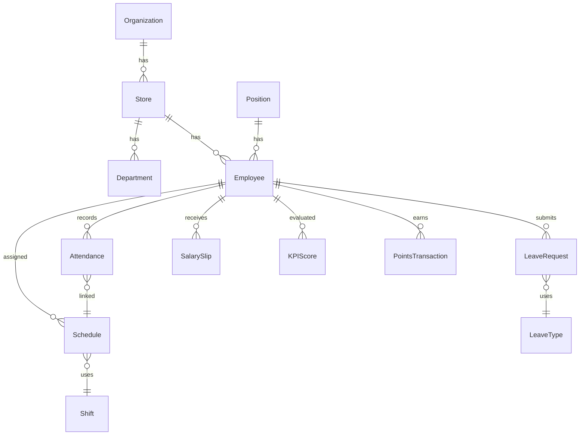

# HRM Trà Sữa — Product Requirements Document (PRD)

# Genesis v2.2 — Full Spec

**Version**: 2.2
**Date**: 2026-02-15
**Author**: Genesis Workflow
**Status**: Complete

---

## 1. Product Overview

### 1.1 Vision

Hệ thống HRM (Human Resource Management) dạng PWA dành cho chuỗi trà sữa tại Việt Nam. Quản lý toàn diện: nhân sự, chấm công, lịch làm, giao việc, nghỉ phép, lương, KPI, đánh giá, gamification, học tập, onboarding, wellness, tài sản.

### 1.2 Target Users

| Role              | Mô tả                                  | Số lượng dự kiến |
| ----------------- | -------------------------------------- | ---------------- |
| **CEO**           | Chủ chuỗi, overview toàn hệ thống      | 1-3              |
| **HR Admin**      | Quản lý nhân sự, lương, cấu hình       | 2-5              |
| **Store Manager** | Quản lý 1 cửa hàng                     | 3-10             |
| **Shift Leader**  | Trưởng ca, giám sát ca làm             | 5-15             |
| **Employee**      | Nhân viên (pha chế, phục vụ, thu ngân) | 50-200           |

### 1.3 Tech Stack

- **Frontend**: Next.js 14, React 19, TypeScript, TailwindCSS
- **Backend**: Supabase (Auth, Database, Storage, Edge Functions)
- **Platform**: PWA (Progressive Web App), mobile-first
- **Database**: PostgreSQL (via Supabase)

### 1.4 Non-Goals

- [NG-001] Không build native mobile app (chỉ PWA)
- [NG-002] Không tích hợp POS/máy bán hàng (v2)
- [NG-003] Không xử lý kế toán/thuế chi tiết (chỉ tính lương cơ bản)
- [NG-004] Không hỗ trợ multi-language ở v2 (chỉ tiếng Việt)
- [NG-005] Không tích hợp Zalo/SMS OTP thật (v2 mock, v3 real)
- [NG-006] Không hỗ trợ tablet layout riêng (responsive only)

---

## 2. User Stories & Requirements

### Module 1: Authentication [AUTH]

**[REQ-AUTH-001]** Phone OTP Login

- _As a_ User, _I want to_ đăng nhập bằng SĐT + OTP, _so that_ không cần nhớ password.
- **Acceptance Criteria**:
  - Given: User nhập SĐT (format 0xxx, 10-11 số)
  - When: Nhấn "Gửi mã OTP"
  - Then: OTP 6 số gửi qua SMS, hết hạn sau 60 giây
  - And: Nhập đúng OTP → Đăng nhập thành công
  - And: Sai OTP 3 lần → Lock 5 phút

**[REQ-AUTH-002]** Role-based Redirect

- _As a_ System, _I want to_ redirect user theo role, _so that_ họ thấy đúng dashboard.
- **Acceptance Criteria**:
  - Given: User đăng nhập thành công
  - When: Check role
  - Then: EMPLOYEE → /employee/home, STORE_MANAGER → /manager/home, HR_ADMIN → /hr/home, CEO → /ceo/home

**[REQ-AUTH-003]** Session Management

- Token refresh tự động
- Remember me: 30 ngày
- Force logout khi đổi password
- Single session hoặc multi-session (configurable)

**[REQ-AUTH-004]** First Login / Profile Update

- _As a_ New Employee, _I want to_ được yêu cầu cập nhật thông tin lần đầu, _so that_ tài khoản được bảo mật.
- **Acceptance Criteria**:
  - Given: First login
  - When: Đăng nhập thành công
  - Then: Redirect đến màn hình cập nhật thông tin cơ bản
  - And: Bắt buộc hoàn thành trước khi dùng app

---

### Module 2: Home Dashboard [DASH]

**[REQ-DASH-001]** Employee Dashboard

- Ca làm hôm nay, nút Check-in nhanh, thông báo gần đây
- Quick actions: Check-in, Xem lịch, Xem lương

**[REQ-DASH-002]** Manager Dashboard

- Stats cửa hàng hôm nay, pending approvals, attendance team
- Quick actions: Xếp lịch, Chấm công, Quản lý NV, Duyệt yêu cầu

**[REQ-DASH-003]** CEO Dashboard

- Overview tất cả cửa hàng, tổng NV, alerts quan trọng
- Charts: So sánh cửa hàng, KPI, doanh thu

---

### Module 3: Scheduling [SCH]

**[REQ-SCH-001]** Schedule By Shift — Grid hàng=ca, cột=ngày, ô=NV. Filter store, tuần/tháng
**[REQ-SCH-002]** Schedule By Employee — Chọn NV → calendar cá nhân. Xuất/in lịch
**[REQ-SCH-003]** Schedule Approval — Pending requests, Approve/Reject/Bulk, NV+ca+ngày+lý do
**[REQ-SCH-004]** Auto-Schedule — Input constraints → Generate → Preview → Accept/Modify/Regenerate
**[REQ-SCH-005]** Work Locations — CRUD vị trí + GPS lat/lng + bán kính check-in + map

---

### Module 4: Attendance [ATT]

**[REQ-ATT-001]** Attendance By Store — Grid NV×ngày 1-31, cell: ✓/½/X/M, tổng ngày+giờ. Export
**[REQ-ATT-002]** Attendance By Date — List 1 ngày: NV, giờ vào/ra, status (green/yellow/red)
**[REQ-ATT-003]** Attendance Request — Employee: form bổ sung (ngày, giờ, lý do, ảnh). Manager: duyệt
**[REQ-ATT-004]** Duplicate Device Alert — Cảnh báo nhiều NV check-in cùng device. Mark valid/fraud
**[REQ-ATT-005]** Late/Early Report — NV, ngày, giờ lịch vs thực tế, phút chênh. Summary tháng
**[REQ-ATT-006]** Device Management — CRUD devices: ID, name, OS, owner. Add/Remove/Block. Max/NV
**[REQ-ATT-007]** Check-In — GPS + selfie → verify radius → submit. Success animation, errors

**[REQ-ATT-008]** Overtime Request (Đăng ký OT)

- _As an_ Employee, _I want to_ đăng ký làm thêm giờ, _so that_ OT được ghi nhận chính thức.
- **Acceptance Criteria**:
  - Given: Employee muốn làm OT
  - When: Gửi form: ngày, giờ bắt đầu OT, giờ kết thúc dự kiến, lý do
  - Then: Manager duyệt trước hoặc sau khi làm
  - And: OT được ghi nhận vào payroll

**[REQ-ATT-009]** Attendance Calendar (Employee View)

- _As an_ Employee, _I want to_ xem lịch sử chấm công, _so that_ theo dõi ngày công.
- **Acceptance Criteria**:
  - Given: Employee xem Attendance
  - When: Mở calendar view
  - Then: Hiển thị tháng với màu sắc theo status
  - And: Tap ngày → xem chi tiết check-in/out

**[REQ-ATT-010]** Manual Attendance (Admin Override)

- _As an_ Admin, _I want to_ chỉnh sửa chấm công thủ công, _so that_ fix trường hợp đặc biệt.
- **Acceptance Criteria**:
  - Given: Cần chỉnh sửa attendance record
  - When: Admin edit
  - Then: Ghi log: ai sửa, sửa gì, lý do
  - And: Cần approval từ cấp cao hơn (optional)

---

### Module 5: Tasks [TASK]

**[REQ-TASK-001]** Task Templates — CRUD mẫu: tên, position, ca, task items (mô tả, bắt buộc?, ảnh?)
**[REQ-TASK-002]** Daily Tasks — Employee: checklist+progress. Manager: completion rate

**[REQ-TASK-003]** Task Handover (Bàn giao ca)

- _As a_ Shift Leader, _I want to_ ghi nhận bàn giao ca, _so that_ ca sau biết tình hình.
- **Acceptance Criteria**:
  - Given: Kết thúc ca
  - When: Điền form bàn giao
  - Then: Nội dung: Tình hình chung, Vấn đề cần lưu ý, Hàng tồn, Tiền quỹ
  - And: Ca sau xác nhận đã nhận bàn giao

**[REQ-TASK-004]** Incident Report (Báo cáo sự cố)

- _As an_ Employee, _I want to_ báo cáo sự cố nhanh, _so that_ quản lý nắm được ngay.
- **Acceptance Criteria**:
  - Given: Có sự cố (khách phàn nàn, hỏng thiết bị, thiếu hàng...)
  - When: Gửi report: loại sự cố, mô tả, ảnh, mức độ nghiêm trọng
  - Then: Push notification đến Manager
  - And: Tracking trạng thái xử lý

---

### Module 6: Communication [COM]

**[REQ-COM-001]** NewsFeed — Tin tức nội bộ: title, image, summary, content, like/comment
**[REQ-COM-002]** Notifications — System auto + manual. Mark read/unread, filter
**[REQ-COM-003]** Announcements — Banner/popup, priority levels, target audience, expiry
**[REQ-COM-004]** Policies — Nội quy: title, category, version, "Đã đọc" tracking

**[REQ-COM-005]** Team Chat (Chat nhóm)

- _As an_ Employee, _I want to_ chat với team cửa hàng, _so that_ trao đổi công việc.
- **Acceptance Criteria**:
  - Given: Employee thuộc 1 store
  - When: Mở chat
  - Then: Auto-join store group chat
  - And: Gửi text, image, file. @mention. Pin message (Manager)

**[REQ-COM-006]** Direct Message (Tin nhắn riêng)

- 1-1 chat, private, select employee → send message

---

### Module 7: Payroll [PAY]

**[REQ-PAY-001]** PayrollByStore — Summary table, drill-down, compare vs tháng trước/budget
**[REQ-PAY-002]** PayrollCompany — Company-wide summary, breakdown, trend chart
**[REQ-PAY-003]** SalaryHold — NV thử việc: hold %, amount, release date, release early
**[REQ-PAY-004]** BonusSlip — Form: NV, amount, reason, month. Approval flow
**[REQ-PAY-005]** DeductionSlip — Trừ tiền: Phạt, Trả tạm ứng, Bồi thường
**[REQ-PAY-006]** SalaryAdvance — Employee: xem earned, yêu cầu ứng (max%). Manager: duyệt
**[REQ-PAY-007]** SalarySlip — Employee: breakdown earnings+deductions=net. PDF
**[REQ-PAY-008]** InsuranceReport — BHXH/BHYT/BHTN contributions, monthly total

**[REQ-PAY-009]** Payroll Calculation (Tính lương)

- _As an_ HR, _I want to_ chạy tính lương tự động, _so that_ giảm thời gian thủ công.
- **Acceptance Criteria**:
  - Given: Chọn kỳ lương (tháng)
  - When: Nhấn "Tính lương"
  - Then: Hệ thống: Lấy ngày công, hệ số lương, cộng thưởng, trừ phạt, trừ tạm ứng, tính BHXH, thuế TNCN, tạo Salary Slip
  - And: Review → Approve → Lock kỳ lương

**[REQ-PAY-010]** Payroll History — Employee: xem lương các tháng trước. Download PDF
**[REQ-PAY-011]** Allowance Management — Danh sách phụ cấp (ăn trưa, xăng xe, ĐT, nhà ở). Gán cho NV, tự động cộng lương

---

### Module 8: Reports [RPT]

**[REQ-RPT-001]** HR Overview — Cards + Charts, compare periods
**[REQ-RPT-002]** StaffByHour — Bar/Line chart: giờ × số NV
**[REQ-RPT-003]** AttendanceReport — Summary + Detail, export Excel
**[REQ-RPT-004]** SalaryStructure — Pie + Stacked bar, compare position/store
**[REQ-RPT-005]** PayrollBudget — Budget vs Actual, alert over budget
**[REQ-RPT-006]** AutoRaiseReport — Eligible NV, suggested raise, approve/defer
**[REQ-RPT-007]** TaskReport — Completion rate, skipped tasks, rankings

---

### Module 9: Settings [SET]

#### 9.1 Payroll Settings

**[REQ-SET-001]** Standard Work Days — 22/26/actual
**[REQ-SET-002]** Salary Coefficients — position, seniority, night, holiday
**[REQ-SET-003]** Payroll Budget Config — by month/store, alert threshold
**[REQ-SET-004]** Salary Hold Config — probation %, duration, auto-release
**[REQ-SET-005]** Auto Raise Config — conditions, amount, limit

#### 9.2 Master Data

**[REQ-SET-006]** Stores CRUD
**[REQ-SET-007]** Departments CRUD (hierarchy)
**[REQ-SET-008]** Shifts CRUD
**[REQ-SET-009]** Leave Types CRUD
**[REQ-SET-010]** Positions CRUD
**[REQ-SET-011]** Employee Levels
**[REQ-SET-012]** Approval Workflows

#### 9.3 System Settings

**[REQ-SET-013]** Company Info
**[REQ-SET-014]** Employee Settings (code format, fields)
**[REQ-SET-015]** Attendance Settings (GPS, selfie, late threshold)
**[REQ-SET-016]** Schedule Settings (max hours, rest rules)
**[REQ-SET-017]** Payroll General Settings (pay cycle, insurance, tax)

#### 9.4 Additional Settings (NEW)

**[REQ-SET-018]** Notification Settings — Push/Email bật/tắt, quiet hours
**[REQ-SET-019]** Data Backup & Export — Manual/Scheduled backup, JSON/Excel export, GDPR delete
**[REQ-SET-020]** Audit Log Settings — Retention period, log level, export
**[REQ-SET-021]** Integration Settings — POS (iPOS, KiotViet), Accounting (MISA), Zalo OA (future)

---

### Module 10: Employee Management [EMP]

**[REQ-EMP-001]** Employee List — table/card view, filter, search, CRUD
**[REQ-EMP-002]** Employee Detail — tabs: Personal, Contact, Employment, Attendance, KPI, Salary, Documents
**[REQ-EMP-003]** Employee Add — form, photo, create account, assign store+position
**[REQ-EMP-004]** Employee Profile (self) — view own info, edit limited fields

**[REQ-EMP-005]** Employee Import (Nhập hàng loạt)

- Upload Excel template → validate → hiển thị errors → confirm → import

**[REQ-EMP-006]** Employee Export

- Export danh sách NV ra Excel, filter trước khi export, chọn columns

**[REQ-EMP-007]** Employee Offboarding (Nghỉ việc)

- _As an_ HR, _I want to_ xử lý NV nghỉ việc, _so that_ quy trình đầy đủ.
- **Acceptance Criteria**:
  - Given: NV nghỉ việc
  - When: Initiate offboarding
  - Then: Checklist: Thu hồi tài sản, Tính lương còn lại, Trả lương giữ, Deactivate account
  - And: Exit interview (optional), Lưu hồ sơ archive

---

### Module 11: KPI [KPI]

**[REQ-KPI-001]** KPI Templates — by position, BSC perspectives, weights
**[REQ-KPI-002]** KPI Scoring — period, actual values, auto-grade (A/B/C/D)
**[REQ-KPI-003]** KPI Dashboard — Employee/Manager/CEO views

---

### Module 12: Reward & Penalty [RWD]

**[REQ-RWD-001]** Reward Rules — IF condition THEN reward
**[REQ-RWD-002]** Penalty Rules — IF condition THEN penalty
**[REQ-RWD-003]** Reward Logs — history, filter, export

---

### Module 13: 360° Evaluation [EVL]

**[REQ-EVL-001]** Evaluation Periods
**[REQ-EVL-002]** Evaluation Forms (weighted by evaluator type)
**[REQ-EVL-003]** Do Evaluation
**[REQ-EVL-004]** Evaluation Results (radar chart)

---

### Module 14: Career Path [CAR]

**[REQ-CAR-001]** Career Ladder
**[REQ-CAR-002]** Promotion Criteria
**[REQ-CAR-003]** My Career Path (Employee)
**[REQ-CAR-004]** Promotion Candidates (HR)

---

### Module 15: Gamification [GAM]

**[REQ-GAM-001]** Point Rules
**[REQ-GAM-002]** Badges
**[REQ-GAM-003]** Leaderboard
**[REQ-GAM-004]** Rewards Store
**[REQ-GAM-005]** Recognition (kudos)

---

### Module 16: Learning [LRN]

**[REQ-LRN-001]** Course Library
**[REQ-LRN-002]** Course Detail (modules, quiz, certificate)
**[REQ-LRN-003]** My Learning (progress, certificates)
**[REQ-LRN-004]** Training Assignment (manager → employee)

---

### Module 17: Onboarding [ONB]

**[REQ-ONB-001]** Onboarding Templates (by position, phases)
**[REQ-ONB-002]** Onboarding Progress (checklist, alerts overdue)

---

### Module 18: Wellness [WEL]

**[REQ-WEL-001]** Mood Check-in (emoji + note)
**[REQ-WEL-002]** Wellness Report (Manager, anonymous)
**[REQ-WEL-003]** Anonymous Feedback

---

### Module 19: Leave Management [LVE] — NEW

**[REQ-LVE-001]** Leave Balance (Số ngày phép còn lại)

- _As an_ Employee, _I want to_ xem số ngày phép còn lại, _so that_ biết để đăng ký.
- **Acceptance Criteria**:
  - Given: Employee xem Leave
  - When: Mở balance view
  - Then: Phép năm (used/total), Ốm, Việc riêng... + chi tiết ngày đã dùng

**[REQ-LVE-002]** Leave Request (Đăng ký nghỉ)

- _As an_ Employee, _I want to_ đăng ký nghỉ phép, _so that_ được approved chính thức.
- **Acceptance Criteria**:
  - Given: Employee cần nghỉ
  - When: Gửi form: loại nghỉ, từ ngày, đến ngày, lý do
  - Then: Gửi đến Manager duyệt
  - And: Notification khi approved/rejected
  - And: Tự động trừ vào balance khi approved

**[REQ-LVE-003]** Leave Approval (Duyệt nghỉ phép)

- Pending requests, conflict warning (ai khác nghỉ cùng ngày?)
- Actions: Approve/Reject + comment

**[REQ-LVE-004]** Leave Calendar (Lịch nghỉ)

- Calendar view: ai nghỉ ngày nào, màu sắc theo loại nghỉ. Filter tháng/store

**[REQ-LVE-005]** Leave Policy (Chính sách nghỉ)

- Số ngày phép theo thâm niên, carry-over, advance leave

---

### Module 20: Asset Management [AST] — NEW (Optional Wave 6+)

**[REQ-AST-001]** Asset List — Đồng phục, Thiết bị, Chìa khóa. Status: Available/Assigned/Damaged/Lost
**[REQ-AST-002]** Asset Assignment — Gán cho NV, tracking ai giữ gì, ngày giao/hẹn trả
**[REQ-AST-003]** Asset Return — Trả tài sản khi nghỉ việc, checklist offboarding

---

## 3. Navigation Structure

### Bottom Nav — Employee

| #   | Icon | Label     | Route          |
| --- | ---- | --------- | -------------- |
| 1   | 🏠   | Trang chủ | /              |
| 2   | 📅   | Lịch làm  | /schedule      |
| 3   | ✅   | Chấm công | /checkin       |
| 4   | 💬   | Thông báo | /notifications |
| 5   | 👤   | Tài khoản | /profile       |

### Bottom Nav — Manager

| #   | Icon | Label     | Route          |
| --- | ---- | --------- | -------------- |
| 1   | 🏠   | Trang chủ | /              |
| 2   | 📊   | Tác vụ    | /tasks-menu    |
| 3   | 🔔   | Thông báo | /notifications |
| 4   | 👤   | Tài khoản | /profile       |

### Bottom Nav — CEO

| #   | Icon | Label     | Route          |
| --- | ---- | --------- | -------------- |
| 1   | 🏠   | Trang chủ | /              |
| 2   | 📊   | Báo cáo   | /reports       |
| 3   | 🔔   | Thông báo | /notifications |
| 4   | ⚙️   | Cài đặt   | /settings      |

### Tác vụ Menu (Manager)

- **Lịch làm**: ScheduleByShift, ByEmployee, Approval, Auto, WorkLocations
- **Chấm công**: ByStore, ByDate, Request, DeviceAlert, LateReport, Devices, OTRequest, ManualAttendance
- **Giao việc**: Templates, DailyTasks, Handover, IncidentReport
- **Nghỉ phép**: LeaveBalance, LeaveRequest, LeaveApproval, LeaveCalendar
- **Truyền thông**: News, Announcements, Policies, TeamChat, DM
- **Lương**: ByStore, Company, Hold, Bonus, Deduction, Advance, Slip, Insurance, Calculation, History, Allowance
- **Báo cáo**: HR, StaffHour, Attendance, Salary, Budget, AutoRaise, Tasks
- **Cấu hình**: All Settings sub-screens
- **Danh mục**: Stores, Departments, Shifts, LeaveTypes, Positions, Levels, Workflows

---

## 4. Database Tables Summary

| Category      | Tables                                                                                                                                 |
| ------------- | -------------------------------------------------------------------------------------------------------------------------------------- |
| Core          | organizations, stores, departments, positions, employee_levels, employees                                                              |
| Scheduling    | shifts, schedules, shift_requests, work_locations                                                                                      |
| Attendance    | attendances, attendance_requests, device_fingerprints, overtime_requests                                                               |
| Tasks         | task_templates, task_items, daily_tasks, task_completions, shift_handovers, incident_reports                                           |
| Leave         | leave_types, leave_balances, leave_requests, leave_policies                                                                            |
| Communication | news_articles, notifications, announcements, policies, policy_acks, chat_channels, chat_messages                                       |
| Payroll       | payroll_configs, salary_slips, salary_adjustments, salary_advances, salary_holds, insurance_records, allowances, allowance_assignments |
| KPI           | kpi_templates, kpi_indicators, kpi_periods, kpi_scores                                                                                 |
| Rewards       | reward_rules, penalty_rules, bonus_slips, deduction_slips, reward_logs                                                                 |
| Evaluation    | evaluation_periods, evaluation_forms, evaluations, evaluation_responses                                                                |
| Career        | career_paths, promotion_criteria, promotion_history                                                                                    |
| Gamification  | point_rules, points_transactions, badges, employee_badges, recognitions, rewards_store, redemptions                                    |
| Learning      | courses, course_modules, quizzes, enrollments, certificates, skill_matrix                                                              |
| Onboarding    | onboarding_templates, onboarding_tasks, onboarding_progress                                                                            |
| Wellness      | mood_checkins, wellness_surveys, anonymous_feedbacks                                                                                   |
| Assets        | assets, asset_assignments, asset_returns                                                                                               |
| System        | system_settings, approval_workflows, approval_requests, approval_logs, audit_logs                                                      |

**Total: ~75 tables**

---

## 5. Design Specifications

### Colors

| Token          | Value   | Usage                  |
| -------------- | ------- | ---------------------- |
| Primary        | #3B82F6 | Buttons, links, active |
| Success        | #22C55E | On-time, completed     |
| Warning        | #F59E0B | Late, pending          |
| Error          | #EF4444 | Absent, rejected       |
| Text Primary   | #1F2937 | Main text              |
| Text Secondary | #6B7280 | Labels                 |
| Background     | #F3F4F6 | Page bg                |
| Card           | #FFFFFF | Cards                  |

### Design Style

- Clean white background, card-based, mobile-first
- Rounded square icons with light colored backgrounds
- Vietnamese labels, bottom nav 4-5 items

---

## 6. Implementation Priority

### Wave 1 — Core (đã có v1)

Auth, Dashboard, Employee CRUD, Basic Attendance, Basic Schedule

### Wave 2 — Operations (đã có v1)

KPI, Rewards, Evaluation, Career, Gamification, Recognition, Wellness

### Wave 3 — Expansion

Scheduling (5), Attendance mở rộng (10), Tasks (4), Leave Management (5)

### Wave 4 — Business

Payroll đầy đủ (11), Communication (6)

### Wave 5 — Intelligence

Reports (7), Learning (4), Onboarding (2), Employee mở rộng (3)

### Wave 6 — Configuration

Settings (21), Asset Management (3)

---

## 7. Non-Functional Requirements [NFR]

**[NFR-001]** Performance

- Page load: < 3s trên 4G
- API response: < 500ms cho 95% requests
- Support: 200 concurrent users

**[NFR-002]** Availability

- Uptime: 99.5%
- Maintenance: 22:00 - 06:00

**[NFR-003]** Security

- HTTPS only
- JWT: 1h (access), 30d (refresh)
- Password: Min 8 chars (if used)
- Rate limiting: 100 req/min/user

**[NFR-004]** Data

- Backup: Daily automated
- Retention: 3 years (configurable)
- GDPR: Right to delete, Right to export

**[NFR-005]** Offline Support

- Check-in: Queue & sync khi online
- View schedule: Cached data
- Indicator: Hiển thị offline status

**[NFR-006]** Accessibility

- Touch target: Min 44×44px
- Color contrast: WCAG AA
- Screen reader labels

**[NFR-007]** Localization

- Language: Vietnamese (primary), English (optional)
- Timezone: Asia/Ho_Chi_Minh
- Currency: VND
- Date format: DD/MM/YYYY

---

## 8. Error Handling

**[ERR-001]** Network Errors

- Offline: Show cached data + offline indicator
- Timeout: Retry 3 lần, show error
- API Error: User-friendly message, log technical details

**[ERR-002]** Validation Errors

- Inline errors dưới mỗi field
- Highlight đỏ, disable submit until valid

**[ERR-003]** Business Logic Errors

- Check-in ngoài radius: "Bạn đang ở ngoài phạm vi cửa hàng"
- Check-in duplicate: "Bạn đã check-in hôm nay rồi"
- Leave conflict: "Ngày này đã có 2 người nghỉ, vui lòng chọn ngày khác"

**[ERR-004]** Permission Errors

- 401: Redirect to login
- 403: "Bạn không có quyền thực hiện thao tác này"

---

## 9. Glossary

| Term      | Vietnamese           | Definition                |
| --------- | -------------------- | ------------------------- |
| OT        | Làm thêm giờ         | Overtime                  |
| KPI       | Chỉ số KPI           | Key Performance Indicator |
| BSC       | Thẻ điểm cân bằng    | Balanced Scorecard        |
| BHXH      | Bảo hiểm xã hội      | Social Insurance          |
| BHYT      | Bảo hiểm y tế        | Health Insurance          |
| BHTN      | Bảo hiểm thất nghiệp | Unemployment Insurance    |
| TNCN      | Thu nhập cá nhân     | Personal Income Tax       |
| Check-in  | Chấm công vào        | Clock in                  |
| Check-out | Chấm công ra         | Clock out                 |
| Shift     | Ca làm việc          | Work shift                |
| Leave     | Nghỉ phép            | Time off                  |
| Payroll   | Bảng lương           | Salary calculation        |
| Slip      | Phiếu                | Document/Receipt          |

---

## 10. Data Model (Core Entities)

### Entity Relationships



### Key Entities

| Entity       | Key Fields                                                   | Relations             |
| ------------ | ------------------------------------------------------------ | --------------------- |
| Employee     | id, full_name, phone, position_id, store_id, status          | → Store, Position     |
| Attendance   | id, employee_id, date, check_in, check_out, status           | → Employee, Schedule  |
| Schedule     | id, employee_id, shift_id, date, status                      | → Employee, Shift     |
| LeaveRequest | id, employee_id, leave_type_id, start_date, end_date, status | → Employee, LeaveType |
| SalarySlip   | id, employee_id, period, gross, net, status                  | → Employee            |
| Store        | id, name, code, address, gps_lat, gps_lng, radius            | → Organization        |
| Shift        | id, name, start_time, end_time, break_minutes, color         | → Store               |
| KPIScore     | id, employee_id, period_id, total_score, grade               | → Employee, KPIPeriod |

---

## 11. API Structure (Overview)

### Base URL

`/api/v1` (Supabase PostgREST auto-generated + Edge Functions)

### Core Endpoints

| Module     | Endpoints                                                                                                       |
| ---------- | --------------------------------------------------------------------------------------------------------------- |
| Auth       | `POST /auth/otp/send`, `POST /auth/otp/verify`, `POST /auth/refresh`, `POST /auth/logout`                       |
| Employees  | `GET/POST /employees`, `GET/PUT/DELETE /employees/:id`, `POST /employees/import`                                |
| Attendance | `GET/POST /attendances`, `POST /attendances/check-in`, `POST /attendances/check-out`, `GET /attendances/report` |
| Schedule   | `GET/POST /schedules`, `PUT /schedules/:id`, `POST /schedules/auto-generate`, `GET /schedules/by-employee/:id`  |
| Leave      | `GET/POST /leaves`, `PUT /leaves/:id/approve`, `PUT /leaves/:id/reject`, `GET /leaves/balance/:employee_id`     |
| Payroll    | `GET /payroll/by-store`, `POST /payroll/calculate`, `GET /salary-slips/:employee_id`                            |
| Tasks      | `GET/POST /task-templates`, `GET /daily-tasks`, `POST /task-completions`                                        |
| Reports    | `GET /reports/:type?period=&store_id=`                                                                          |

### Response Format

```json
{
  "success": true,
  "data": {},
  "meta": { "page": 1, "total": 100 },
  "error": null
}
```

---

## 12. Notification Events

| Event               | Trigger                   | Recipients          | Channel      |
| ------------------- | ------------------------- | ------------------- | ------------ |
| SCHEDULE_PUBLISHED  | Manager publish lịch tuần | All NV in store     | Push, In-app |
| SCHEDULE_CHANGED    | Lịch NV bị thay đổi       | Affected employee   | Push, In-app |
| LEAVE_REQUESTED     | NV gửi yêu cầu nghỉ       | Store Manager       | Push, In-app |
| LEAVE_APPROVED      | Manager duyệt nghỉ        | Requesting employee | Push, In-app |
| LEAVE_REJECTED      | Manager từ chối nghỉ      | Requesting employee | Push, In-app |
| ATTENDANCE_REMINDER | 30 phút trước ca          | Scheduled employee  | Push         |
| LATE_ALERT          | Check-in muộn >15 phút    | Store Manager       | Push, In-app |
| PAYSLIP_READY       | Phiếu lương sẵn sàng      | Employee            | Push, In-app |
| KPI_SCORE_UPDATED   | KPI được chấm điểm        | Employee            | In-app       |
| BADGE_EARNED        | Đạt huy hiệu mới          | Employee            | Push, In-app |
| TASK_ASSIGNED       | Giao việc mới             | Employee            | Push, In-app |
| INCIDENT_REPORTED   | Báo cáo sự cố             | Store Manager       | Push, In-app |
| ANNOUNCEMENT_NEW    | Thông báo mới             | Target audience     | Push, In-app |

---

## 13. Permission Matrix

| Feature                    | Employee | Shift Leader | Store Manager | HR Admin | CEO |
| -------------------------- | -------- | ------------ | ------------- | -------- | --- |
| **Dashboard**              |          |              |               |          |     |
| View own dashboard         | ✅       | ✅           | ✅            | ✅       | ✅  |
| View store dashboard       | ❌       | 👁️           | ✅            | ✅       | ✅  |
| View all stores            | ❌       | ❌           | ❌            | ✅       | ✅  |
| **Attendance**             |          |              |               |          |     |
| Check-in/out               | ✅       | ✅           | ✅            | ✅       | ❌  |
| View own attendance        | ✅       | ✅           | ✅            | ✅       | ✅  |
| View team attendance       | ❌       | 👁️           | ✅            | ✅       | ✅  |
| Edit attendance            | ❌       | ❌           | ✅            | ✅       | ❌  |
| Approve attendance request | ❌       | ❌           | ✅            | ✅       | ❌  |
| **Schedule**               |          |              |               |          |     |
| View own schedule          | ✅       | ✅           | ✅            | ✅       | ✅  |
| View team schedule         | ❌       | 👁️           | ✅            | ✅       | ✅  |
| Create/Edit schedule       | ❌       | ❌           | ✅            | ✅       | ❌  |
| Approve shift swap         | ❌       | ❌           | ✅            | ✅       | ❌  |
| **Leave**                  |          |              |               |          |     |
| Request leave              | ✅       | ✅           | ✅            | ✅       | ✅  |
| Approve leave              | ❌       | ❌           | ✅            | ✅       | ❌  |
| **Payroll**                |          |              |               |          |     |
| View own salary            | ✅       | ✅           | ✅            | ✅       | ✅  |
| View team salary           | ❌       | ❌           | ❌            | ✅       | ✅  |
| Run payroll                | ❌       | ❌           | ❌            | ✅       | ❌  |
| Approve payroll            | ❌       | ❌           | ❌            | ✅       | ✅  |
| **Employee**               |          |              |               |          |     |
| View employee list         | ❌       | 👁️ (team)    | ✅ (store)    | ✅       | ✅  |
| Add/Edit employee          | ❌       | ❌           | ❌            | ✅       | ❌  |
| **Settings**               |          |              |               |          |     |
| View settings              | ❌       | ❌           | 👁️            | ✅       | ✅  |
| Edit settings              | ❌       | ❌           | ❌            | ✅       | ✅  |

Legend: ✅ Full access | 👁️ View only | ❌ No access

---

## 14. Key Test Scenarios

### Authentication

- [ ] TC-AUTH-001: Login SĐT hợp lệ → nhận OTP → login thành công
- [ ] TC-AUTH-002: Login SĐT không tồn tại → error message
- [ ] TC-AUTH-003: Sai OTP 3 lần → lock 5 phút
- [ ] TC-AUTH-004: Session expired → redirect login

### Attendance

- [ ] TC-ATT-001: Check-in trong radius → success
- [ ] TC-ATT-002: Check-in ngoài radius → error với message
- [ ] TC-ATT-003: Check-in duplicate cùng ngày → error
- [ ] TC-ATT-004: Check-in muộn >15 phút → alert manager

### Leave

- [ ] TC-LVE-001: Request leave khi còn balance → success
- [ ] TC-LVE-002: Request leave khi hết balance → error
- [ ] TC-LVE-003: Request leave trùng ngày với 2 người khác → warning

### Payroll

- [ ] TC-PAY-001: Tính lương đủ ngày công → đúng formula
- [ ] TC-PAY-002: Tính lương có OT → cộng đúng hệ số
- [ ] TC-PAY-003: Tính lương có khấu trừ muộn → trừ đúng

---

## 15. Audit Trail Requirements

**[REQ-SYS-001]** Audit Trail

| Action Type     | What to Log                                   | Retention |
| --------------- | --------------------------------------------- | --------- |
| AUTH_LOGIN      | user_id, IP, device, timestamp                | 1 năm     |
| AUTH_LOGOUT     | user_id, timestamp                            | 1 năm     |
| EMPLOYEE_CREATE | created_by, employee_data                     | Vĩnh viễn |
| EMPLOYEE_UPDATE | updated_by, old_value, new_value              | 3 năm     |
| EMPLOYEE_DELETE | deleted_by, employee_id, reason               | Vĩnh viễn |
| ATTENDANCE_EDIT | edited_by, old_value, new_value, reason       | 3 năm     |
| PAYROLL_APPROVE | approved_by, period, total_amount             | 5 năm     |
| SETTINGS_CHANGE | changed_by, setting_key, old_value, new_value | 3 năm     |

---

## 16. Mobile-specific Requirements

**[REQ-MOB-001]** PWA Installation

- Install prompt sau 2 lần visit
- Add to home screen với icon + splash screen
- Offline indicator khi mất kết nối

**[REQ-MOB-002]** Camera Access

- Request permission trước khi dùng
- Fallback nếu không có camera (skip selfie)
- Compress ảnh trước upload (max 500KB)

**[REQ-MOB-003]** GPS Access

- Request permission với explanation
- Fallback: check-in manual với approval
- Accuracy threshold: ±50m

**[REQ-MOB-004]** Push Notifications

- Request permission sau onboarding
- Respect quiet hours setting
- Badge count trên app icon
