# HRM Trà Sữa — Task List (Blueprint)

# Genesis v2.2 — WBS Decomposition

**Tổng quan**: 20 modules, 90+ REQs → 60 tasks
**Ước tính tổng**: ~255h (~32 ngày làm việc)
**Ngày tạo**: 2026-02-15

---

## Dependency Graph

```mermaid
graph TD
    subgraph "L0: Foundation Data"
        T1.1.1["T1.1.1 Mock Auth"]
        T2.1.1["T2.1.1 Mock Scheduling"]
        T3.1.1["T3.1.1 Mock Attendance"]
        T4.1.1["T4.1.1 Mock Tasks"]
        T5.1.1["T5.1.1 Mock Communication"]
        T6.1.1["T6.1.1 Mock Payroll"]
        T7.1.1["T7.1.1 Mock Reports"]
        T8.1.1["T8.1.1 Mock Settings"]
        T9.1.1["T9.1.1 Mock Leave"]
        T10.1.1["T10.1.1 Mock Employee Ext"]
    end

    subgraph "L1: Auth & Core"
        T1.1.1 --> T1.2.1["T1.2.1 Session+FirstLogin"]
    end

    subgraph "L1: Scheduling Screens"
        T2.1.1 --> T2.2.1["T2.2.1 ByShift"]
        T2.1.1 --> T2.2.2["T2.2.2 ByEmployee"]
        T2.1.1 --> T2.2.3["T2.2.3 Approval"]
        T2.1.1 --> T2.2.4["T2.2.4 AutoSchedule"]
        T2.1.1 --> T2.2.5["T2.2.5 WorkLocations"]
    end

    subgraph "L1: Attendance Screens"
        T3.1.1 --> T3.2.1["T3.2.1 ByStore"]
        T3.1.1 --> T3.2.2["T3.2.2 ByDate"]
        T3.1.1 --> T3.2.3["T3.2.3 Request"]
        T3.1.1 --> T3.2.4["T3.2.4 DeviceAlert"]
        T3.1.1 --> T3.2.5["T3.2.5 LateReport"]
        T3.1.1 --> T3.2.6["T3.2.6 DeviceMgmt"]
        T3.1.1 --> T3.2.7["T3.2.7 OTRequest"]
        T3.1.1 --> T3.2.8["T3.2.8 Calendar"]
        T3.1.1 --> T3.2.9["T3.2.9 ManualEdit"]
    end

    subgraph "L1: Tasks Screens"
        T4.1.1 --> T4.2.1["T4.2.1 Templates"]
        T4.1.1 --> T4.2.2["T4.2.2 DailyTasks"]
        T4.1.1 --> T4.2.3["T4.2.3 Handover"]
        T4.1.1 --> T4.2.4["T4.2.4 Incident"]
    end

    subgraph "L1: Leave Screens"
        T9.1.1 --> T9.2.1["T9.2.1 Balance"]
        T9.1.1 --> T9.2.2["T9.2.2 Request"]
        T9.1.1 --> T9.2.3["T9.2.3 Approval"]
        T9.1.1 --> T9.2.4["T9.2.4 Calendar"]
        T9.1.1 --> T9.2.5["T9.2.5 Policy"]
    end

    subgraph "L2: Integration"
        T11.1.1["T11.1.1 Tác vụ Menu"]
        T2.2.1 --> T11.1.1
        T3.2.1 --> T11.1.1
        T4.2.1 --> T11.1.1
        T11.1.1 --> T11.2.1["T11.2.1 Dashboard Nav"]
        T11.2.1 --> T11.3.1["T11.3.1 Build Verify"]
    end
```

---

## System 1: Authentication (Bổ sung)

### Phase 1: Foundation

- [ ] **T1.1.1** [REQ-AUTH-003, REQ-AUTH-004]: Tạo mock data Auth mở rộng
  - **Mô tả**: Tạo `mock-data-auth.ts` — session states, first-login flag, role redirect map
  - **Đầu vào**: PRD REQ-AUTH-001~004, ADR_002
  - **Đầu ra**: `src/lib/mock-data-auth.ts`
  - **Nghiệm thu**:
    - Given: File được tạo
    - When: Import vào login/middleware
    - Then: Có session config (30d remember, refresh), first-login flag, role→route map
  - **Xác nhận**: Build không lỗi; TypeScript types đúng; data cover 5 roles
  - **Ước tính**: 2h
  - **Phụ thuộc**: Không
  - **Ưu tiên**: P0

### Phase 2: Screens

- [ ] **T1.2.1** [REQ-AUTH-003, REQ-AUTH-004]: Session Management + First Login
  - **Mô tả**: (1) Session auto-refresh logic, remember-me 30d. (2) First login → redirect to profile update page bắt buộc hoàn thành trước khi dùng app
  - **Đầu vào**: mock-data-auth.ts, existing login page
  - **Đầu ra**: `src/lib/auth-session.ts`, `src/app/first-login/page.tsx`
  - **Nghiệm thu**:
    - Given: NV đăng nhập lần đầu
    - When: Login thành công
    - Then: Redirect đến /first-login, bắt buộc điền form, sau đó vào dashboard
  - **Xác nhận**: Kiểm tra first-login redirect; session refresh hoạt động; remember-me persist
  - **Ước tính**: 4h
  - **Phụ thuộc**: T1.1.1
  - **Ưu tiên**: P1

---

## System 2: Scheduling Module

### Phase 1: Foundation

- [ ] **T2.1.1** [REQ-SCH-001~005]: Tạo mock data scheduling
  - **Mô tả**: Tạo `mock-data-scheduling.ts` — shift grid data, employee schedules, pending requests, auto-schedule output, work locations with GPS
  - **Đầu vào**: PRD REQ-SCH-001~005
  - **Đầu ra**: `src/lib/mock-data-scheduling.ts`
  - **Nghiệm thu**:
    - Given: File mới được tạo
    - When: Import vào pages
    - Then: Data cho 5 screens: grid (ca×ngày), employee calendar, requests list, auto output, locations GPS
  - **Xác nhận**: Build pass; types chính xác; data cover các ca Sáng/Chiều/Tối
  - **Ước tính**: 3h
  - **Phụ thuộc**: Không
  - **Ưu tiên**: P0

### Phase 2: Core Screens

- [ ] **T2.2.1** [REQ-SCH-001]: ScheduleByShift (`/schedule/by-shift`)
  - **Mô tả**: Grid lịch: hàng=ca, cột=ngày, ô=danh sách NV. Filter theo store, tuần/tháng. Tap ô → chi tiết/chỉnh sửa
  - **Đầu vào**: mock-data-scheduling.ts
  - **Đầu ra**: `src/app/schedule/by-shift/page.tsx`
  - **Nghiệm thu**:
    - Given: Manager đăng nhập, chọn store + tuần
    - When: Xem /schedule/by-shift
    - Then: Grid hiển thị đúng ca × ngày, NV trong ô, filter thay đổi data
  - **Xác nhận**: Render grid đúng cấu trúc; filter hoạt động; tap cell mở detail; responsive trên mobile
  - **Ước tính**: 5h
  - **Phụ thuộc**: T2.1.1
  - **Ưu tiên**: P0

- [ ] **T2.2.2** [REQ-SCH-002]: ScheduleByEmployee (`/schedule/by-employee`)
  - **Mô tả**: Dropdown chọn NV → calendar cá nhân với ca làm. Nút xuất/in
  - **Đầu vào**: mock-data-scheduling.ts
  - **Đầu ra**: `src/app/schedule/by-employee/page.tsx`
  - **Nghiệm thu**:
    - Given: Chọn 1 NV từ dropdown
    - When: Xem lịch
    - Then: Calendar hiển thị ca của NV đó, có nút xuất/in
  - **Xác nhận**: Dropdown hiển thị NV list; calendar render đúng ca; nút export tạo file
  - **Ước tính**: 4h
  - **Phụ thuộc**: T2.1.1
  - **Ưu tiên**: P1

- [ ] **T2.2.3** [REQ-SCH-003]: ScheduleApproval (`/schedule/approval`)
  - **Mô tả**: Pending requests list: NV, ca, ngày, lý do. Approve/Reject từng item hoặc bulk
  - **Đầu vào**: mock-data-scheduling.ts
  - **Đầu ra**: `src/app/schedule/approval/page.tsx`
  - **Nghiệm thu**:
    - Given: Có ≥3 pending requests
    - When: Manager xem danh sách, approve 1, reject 1, bulk approve phần còn
    - Then: State cập nhật, count badge giảm
  - **Xác nhận**: Actions thay đổi state; bulk actions hoạt động; empty state khi hết requests
  - **Ước tính**: 4h
  - **Phụ thuộc**: T2.1.1
  - **Ưu tiên**: P1

- [ ] **T2.2.4** [REQ-SCH-004]: AutoSchedule (`/schedule/auto`)
  - **Mô tả**: Input date range + min staff + constraints → Generate → Preview → Accept/Modify/Regenerate
  - **Đầu vào**: mock-data-scheduling.ts
  - **Đầu ra**: `src/app/schedule/auto/page.tsx`
  - **Nghiệm thu**:
    - Given: Input constraints (ngày, min staff/ca)
    - When: Nhấn Generate
    - Then: Preview lịch hiển thị, 3 actions: Accept/Modify/Regenerate
  - **Xác nhận**: Form validate; generate tạo output; preview hiển thị grid format; 3 action buttons hoạt động
  - **Ước tính**: 5h
  - **Phụ thuộc**: T2.1.1
  - **Ưu tiên**: P2

- [ ] **T2.2.5** [REQ-SCH-005]: WorkLocations (`/schedule/locations`)
  - **Mô tả**: CRUD vị trí: tên, địa chỉ, GPS lat/lng, bán kính check-in, toggle active. Mock map
  - **Đầu vào**: mock-data-scheduling.ts
  - **Đầu ra**: `src/app/schedule/locations/page.tsx`
  - **Nghiệm thu**:
    - Given: Danh sách locations
    - When: Add/Edit/Delete/Toggle
    - Then: CRUD hoạt động, GPS info hiển thị, radius indicator
  - **Xác nhận**: CRUD thay đổi state; GPS lat/lng hiển thị; radius display dạng "100m"
  - **Ước tính**: 4h
  - **Phụ thuộc**: T2.1.1
  - **Ưu tiên**: P1

---

## System 3: Attendance Module

### Phase 1: Foundation

- [ ] **T3.1.1** [REQ-ATT-001~010]: Tạo mock data attendance
  - **Mô tả**: Tạo `mock-data-attendance.ts` cho 9 screens: grid 31 ngày, by-date records, requests, device alerts, late report, devices, OT requests, calendar, manual edits
  - **Đầu vào**: PRD REQ-ATT-001~010
  - **Đầu ra**: `src/lib/mock-data-attendance.ts`
  - **Xác nhận**: Build pass; data cover 9 screen types; types export đúng
  - **Ước tính**: 4h
  - **Phụ thuộc**: Không
  - **Ưu tiên**: P0

### Phase 2: Core Screens

- [ ] **T3.2.1** [REQ-ATT-001]: AttendanceByStore (`/attendance/by-store`)
  - **Mô tả**: Grid chấm công: hàng=NV, cột=ngày 1-31 + Tổng ngày + Tổng giờ. Cell: ✓/½/X/M. Filter tháng, store. Export Excel/PDF
  - **Đầu vào**: mock-data-attendance.ts
  - **Đầu ra**: `src/app/attendance/by-store/page.tsx`
  - **Nghiệm thu**:
    - Given: Chọn tháng 01/2026 + Store A
    - When: Xem grid
    - Then: Grid hiển thị đúng trạng thái symbols, tổng ngày/giờ tính đúng, export buttons có mặt
  - **Xác nhận**: Grid render NV×31 cells; cell symbols đúng; tổng cột cuối = sum; filter thay đổi data; export button trigger download
  - **Ước tính**: 6h
  - **Phụ thuộc**: T3.1.1
  - **Ưu tiên**: P0

- [ ] **T3.2.2** [REQ-ATT-002]: AttendanceByDate (`/attendance/by-date`)
  - **Mô tả**: Danh sách chấm công 1 ngày: NV, giờ vào/ra, trạng thái (green/yellow/red)
  - **Đầu vào**: mock-data-attendance.ts
  - **Đầu ra**: `src/app/attendance/by-date/page.tsx`
  - **Nghiệm thu**:
    - Given: Chọn ngày + ca + store
    - When: Xem list
    - Then: Status colors đúng (green=đúng giờ, yellow=muộn, red=vắng), filter hoạt động
  - **Xác nhận**: Status badge colors; filter 3 fields; list sorted by time
  - **Ước tính**: 4h
  - **Phụ thuộc**: T3.1.1
  - **Ưu tiên**: P0

- [ ] **T3.2.3** [REQ-ATT-003]: AttendanceRequest (`/attendance/requests`)
  - **Mô tả**: Employee: form bổ sung (ngày, giờ, loại in/out, lý do, ảnh). Manager: danh sách duyệt + comment
  - **Đầu vào**: mock-data-attendance.ts
  - **Đầu ra**: `src/app/attendance/requests/page.tsx`
  - **Nghiệm thu**:
    - Given: NV gửi form bổ sung
    - When: Manager duyệt
    - Then: Approve/Reject + comment hoạt động, trạng thái cập nhật
  - **Xác nhận**: Form validation (required fields); image upload zone; manager view: approve/reject buttons; comment field
  - **Ước tính**: 5h
  - **Phụ thuộc**: T3.1.1
  - **Ưu tiên**: P1

- [ ] **T3.2.4** [REQ-ATT-004]: DuplicateDeviceAlert (`/attendance/alerts`)
  - **Mô tả**: Danh sách check-in trùng device: device ID, nhiều NV, timestamps. Mark valid/fraud
  - **Đầu vào**: mock-data-attendance.ts
  - **Đầu ra**: `src/app/attendance/alerts/page.tsx`
  - **Nghiệm thu**:
    - Given: Phát hiện 2+ NV cùng device
    - When: Manager xem danh sách
    - Then: Alert items hiển thị, mark valid/fraud hoạt động
  - **Xác nhận**: Alert list render; mark buttons thay đổi state; device info hiển thị
  - **Ước tính**: 3h
  - **Phụ thuộc**: T3.1.1
  - **Ưu tiên**: P2

- [ ] **T3.2.5** [REQ-ATT-005]: LateEarlyReport (`/attendance/late-report`)
  - **Mô tả**: Báo cáo đi muộn/về sớm: NV, ngày, giờ lịch vs thực tế, phút chênh. Summary tháng
  - **Đầu vào**: mock-data-attendance.ts
  - **Đầu ra**: `src/app/attendance/late-report/page.tsx`
  - **Nghiệm thu**:
    - Given: Filter date range + store
    - When: Xem report
    - Then: Danh sách late/early + summary tổng muộn/NV
  - **Xác nhận**: Date range filter; summary card tổng đúng; table sorted by minutes late
  - **Ước tính**: 4h
  - **Phụ thuộc**: T3.1.1
  - **Ưu tiên**: P1

- [ ] **T3.2.6** [REQ-ATT-006]: DeviceManagement (`/attendance/devices`)
  - **Mô tả**: CRUD thiết bị: device ID, name, OS, owner. Add/Remove/Block. Max X devices/NV
  - **Đầu vào**: mock-data-attendance.ts
  - **Đầu ra**: `src/app/attendance/devices/page.tsx`
  - **Nghiệm thu**:
    - Given: Danh sách 5 devices
    - When: Add/Remove/Block
    - Then: CRUD hoạt động, max limit cảnh báo khi vượt
  - **Xác nhận**: CRUD thay đổi state; block toggle; max limit warning hiển thị
  - **Ước tính**: 3h
  - **Phụ thuộc**: T3.1.1
  - **Ưu tiên**: P1

- [ ] **T3.2.7** [REQ-ATT-008]: OvertimeRequest (`/attendance/overtime`)
  - **Mô tả**: Employee: đăng ký OT (ngày, giờ bắt đầu, giờ kết thúc dự kiến, lý do). Manager: duyệt
  - **Đầu vào**: mock-data-attendance.ts
  - **Đầu ra**: `src/app/attendance/overtime/page.tsx`
  - **Nghiệm thu**:
    - Given: Employee muốn làm OT
    - When: Gửi form + Manager duyệt
    - Then: OT request tạo, approval flow hoạt động
  - **Xác nhận**: Form validate datetime; manager approve/reject; OT hours hiển thị đúng
  - **Ước tính**: 4h
  - **Phụ thuộc**: T3.1.1
  - **Ưu tiên**: P0

- [ ] **T3.2.8** [REQ-ATT-009]: AttendanceCalendar (`/attendance/calendar`)
  - **Mô tả**: Employee view: calendar tháng, màu sắc theo status. Tap ngày → chi tiết check-in/out
  - **Đầu vào**: mock-data-attendance.ts
  - **Đầu ra**: `src/app/attendance/calendar/page.tsx`
  - **Nghiệm thu**:
    - Given: Employee xem tháng 01/2026
    - When: Mở calendar
    - Then: Ngày có màu: green(đúng), yellow(muộn), red(vắng), gray(chưa tới)
    - And: Tap ngày → modal chi tiết
  - **Xác nhận**: Calendar render 28-31 cells; màu đúng status; tap mở detail modal
  - **Ước tính**: 4h
  - **Phụ thuộc**: T3.1.1
  - **Ưu tiên**: P1

- [ ] **T3.2.9** [REQ-ATT-010]: ManualAttendance (`/attendance/manual`)
  - **Mô tả**: Admin override: chỉnh sửa attendance record, ghi log (ai sửa, sửa gì, lý do)
  - **Đầu vào**: mock-data-attendance.ts
  - **Đầu ra**: `src/app/attendance/manual/page.tsx`
  - **Nghiệm thu**:
    - Given: Cần sửa 1 record
    - When: Admin edit + nhập lý do
    - Then: Record cập nhật, audit log ghi nhận
  - **Xác nhận**: Edit form; required reason field; audit log entry tạo ra; old vs new values hiển thị
  - **Ước tính**: 4h
  - **Phụ thuộc**: T3.1.1
  - **Ưu tiên**: P1

---

## System 4: Tasks Module (Mới)

### Phase 1: Foundation

- [ ] **T4.1.1** [REQ-TASK-001~004]: Tạo mock data Tasks
  - **Mô tả**: Tạo `mock-data-tasks.ts` cho 4 screens: templates, daily tasks, handover forms, incident reports
  - **Đầu vào**: PRD REQ-TASK-001~004
  - **Đầu ra**: `src/lib/mock-data-tasks.ts`
  - **Xác nhận**: Build pass; 4 data types export; ≥3 items mỗi loại
  - **Ước tính**: 3h
  - **Phụ thuộc**: Không
  - **Ưu tiên**: P0

### Phase 2: Core Screens

- [ ] **T4.2.1** [REQ-TASK-001]: TaskTemplates (`/tasks/templates`)
  - **Mô tả**: CRUD mẫu giao việc: tên, position, ca, danh sách task items (mô tả, bắt buộc?, ảnh?). Duplicate template
  - **Đầu vào**: mock-data-tasks.ts
  - **Đầu ra**: `src/app/tasks/templates/page.tsx`
  - **Nghiệm thu**:
    - Given: Danh sách 3 templates
    - When: CRUD + Duplicate
    - Then: Add/Edit/Delete/Duplicate hoạt động, task items sortable
  - **Xác nhận**: CRUD operations; duplicate tạo bản sao; items có toggle bắt buộc/ảnh
  - **Ước tính**: 5h
  - **Phụ thuộc**: T4.1.1
  - **Ưu tiên**: P0

- [ ] **T4.2.2** [REQ-TASK-002]: DailyTasks (`/tasks`)
  - **Mô tả**: Employee: checklist hôm nay, mark complete, upload ảnh. Progress bar X/Y. Manager: completion rate
  - **Đầu vào**: mock-data-tasks.ts
  - **Đầu ra**: `src/app/tasks/page.tsx`
  - **Nghiệm thu**:
    - Given: NV bắt đầu ca, có 5 tasks
    - When: Toggle done 3/5, upload ảnh cho 1 task required
    - Then: Progress bar = 60%, ảnh attached
  - **Xác nhận**: Checklist toggle; progress bar animate; ảnh upload zone cho required items; manager view tab
  - **Ước tính**: 5h
  - **Phụ thuộc**: T4.1.1
  - **Ưu tiên**: P0

- [ ] **T4.2.3** [REQ-TASK-003]: TaskHandover (`/tasks/handover`)
  - **Mô tả**: Bàn giao ca: form (tình hình chung, vấn đề lưu ý, hàng tồn, tiền quỹ). Ca sau xác nhận nhận bàn giao
  - **Đầu vào**: mock-data-tasks.ts
  - **Đầu ra**: `src/app/tasks/handover/page.tsx`
  - **Nghiệm thu**:
    - Given: Shift Leader kết thúc ca
    - When: Điền form bàn giao
    - Then: Record tạo, ca sau thấy và xác nhận nhận
  - **Xác nhận**: Form 4 sections; submit tạo record; ca sau có "Xác nhận" button; history list
  - **Ước tính**: 4h
  - **Phụ thuộc**: T4.1.1
  - **Ưu tiên**: P0

- [ ] **T4.2.4** [REQ-TASK-004]: IncidentReport (`/tasks/incident`)
  - **Mô tả**: Báo cáo sự cố: loại (dropdown), mô tả, ảnh, mức độ severity. Push notification đến Manager. Tracking trạng thái
  - **Đầu vào**: mock-data-tasks.ts
  - **Đầu ra**: `src/app/tasks/incident/page.tsx`
  - **Nghiệm thu**:
    - Given: Sự cố xảy ra
    - When: NV gửi report
    - Then: Report tạo, severity badge, Manager thấy trong list, status tracking
  - **Xác nhận**: Dropdown categories; image upload; severity badges (Low/Med/High/Critical); status flow: Open→InProgress→Resolved
  - **Ước tính**: 5h
  - **Phụ thuộc**: T4.1.1
  - **Ưu tiên**: P0

---

## System 5: Communication Module

### Phase 1: Foundation

- [ ] **T5.1.1** [REQ-COM-001~006]: Tạo mock data Communication
  - **Mô tả**: Tạo `mock-data-communication.ts` cho 5 screens: news articles, announcements, policies, chat messages, DM
  - **Đầu ra**: `src/lib/mock-data-communication.ts`
  - **Xác nhận**: Build pass; 5 data types; chat messages có timestamps + sender
  - **Ước tính**: 3h
  - **Phụ thuộc**: Không
  - **Ưu tiên**: P1

### Phase 2: Core Screens

- [ ] **T5.2.1** [REQ-COM-001]: NewsFeed (`/communication/news`)
  - **Mô tả**: Tin nội bộ: list articles + detail view + like
  - **Đầu ra**: `src/app/communication/news/page.tsx`
  - **Nghiệm thu**: List view → tap → detail; like counter toggle
  - **Xác nhận**: List render; detail mở đúng article; like button toggle state
  - **Ước tính**: 4h
  - **Phụ thuộc**: T5.1.1
  - **Ưu tiên**: P1

- [ ] **T5.2.2** [REQ-COM-003]: Announcements (`/communication/announcements`)
  - **Mô tả**: Banner/popup messages, priority (Normal/Important/Urgent), target audience, expiry
  - **Đầu ra**: `src/app/communication/announcements/page.tsx`
  - **Xác nhận**: Priority colors; target filter; expired items grayed out
  - **Ước tính**: 3h
  - **Phụ thuộc**: T5.1.1
  - **Ưu tiên**: P1

- [ ] **T5.2.3** [REQ-COM-004]: Policies (`/communication/policies`)
  - **Mô tả**: Nội quy: list, detail, "Đã đọc" button, tracking ai đọc/chưa
  - **Đầu ra**: `src/app/communication/policies/page.tsx`
  - **Xác nhận**: "Đã đọc" button marks read; read count hiển thị; detail view
  - **Ước tính**: 3h
  - **Phụ thuộc**: T5.1.1
  - **Ưu tiên**: P1

- [ ] **T5.2.4** [REQ-COM-005]: TeamChat (`/communication/chat`)
  - **Mô tả**: Store group chat: text, image, @mention, pin message (Manager only). Auto-join store group
  - **Đầu ra**: `src/app/communication/chat/page.tsx`
  - **Nghiệm thu**:
    - Given: Employee thuộc Store A
    - When: Mở chat
    - Then: Store A group auto-join, gửi text/image, @mention autocomplete, pin (Manager)
  - **Xác nhận**: Chat bubble UI; input box; image attach; @mention dropdown; pin indicator
  - **Ước tính**: 6h
  - **Phụ thuộc**: T5.1.1
  - **Ưu tiên**: P1

- [ ] **T5.2.5** [REQ-COM-006]: DirectMessage (`/communication/dm`)
  - **Mô tả**: 1-1 private chat. Chọn employee → send text
  - **Đầu ra**: `src/app/communication/dm/page.tsx`
  - **Xác nhận**: Employee picker; chat history; unread badge
  - **Ước tính**: 4h
  - **Phụ thuộc**: T5.1.1
  - **Ưu tiên**: P2

---

## System 6: Payroll Module

### Phase 1: Foundation

- [ ] **T6.1.1** [REQ-PAY-001~011]: Tạo mock data Payroll
  - **Mô tả**: Tạo `mock-data-payroll.ts` cho 11 screens: store summary, company, hold, bonus, deduction, advance, slip, insurance, calculation, history, allowance
  - **Đầu ra**: `src/lib/mock-data-payroll.ts`
  - **Xác nhận**: Build pass; 11 data types; salary slip có earnings+deductions breakdown
  - **Ước tính**: 4h
  - **Phụ thuộc**: Không
  - **Ưu tiên**: P0

### Phase 2: Core Screens

- [ ] **T6.2.1** [REQ-PAY-001]: PayrollByStore (`/payroll/by-store`)
  - **Mô tả**: Summary table: Store, NV count, Base, Allowance, Bonus, Deduction, Net. Drill-down + compare
  - **Đầu ra**: `src/app/payroll/by-store/page.tsx`
  - **Xác nhận**: Table render; drill-down click; compare vs tháng trước; totals đúng
  - **Ước tính**: 5h | **Phụ thuộc**: T6.1.1 | **Ưu tiên**: P0

- [ ] **T6.2.2** [REQ-PAY-002]: PayrollCompany (`/payroll/company`)
  - **Mô tả**: Company-wide summary, breakdown by dept/position, monthly trend chart
  - **Xác nhận**: Summary cards; breakdown table; chart render; export button
  - **Ước tính**: 5h | **Phụ thuộc**: T6.1.1 | **Ưu tiên**: P0

- [ ] **T6.2.3** [REQ-PAY-003]: SalaryHold (`/payroll/hold`)
  - **Mô tả**: NV thử việc: hold %, amount, release date. Release early action (approval)
  - **Xác nhận**: Hold list; release button with confirm; amount calculation
  - **Ước tính**: 3h | **Phụ thuộc**: T6.1.1 | **Ưu tiên**: P1

- [ ] **T6.2.4** [REQ-PAY-004]: BonusSlip (`/payroll/bonus`)
  - **Mô tả**: Form: NV, amount, reason, month. Approval flow. List + filter
  - **Xác nhận**: Form validation; approval status; list filter by month/status
  - **Ước tính**: 4h | **Phụ thuộc**: T6.1.1 | **Ưu tiên**: P0

- [ ] **T6.2.5** [REQ-PAY-005]: DeductionSlip (`/payroll/deduction`)
  - **Mô tả**: Trừ tiền: types (Phạt, Trả ứng, Bồi thường). Giống BonusSlip UI
  - **Xác nhận**: Type dropdown; amount; approval flow; list view
  - **Ước tính**: 3h | **Phụ thuộc**: T6.1.1 | **Ưu tiên**: P0

- [ ] **T6.2.6** [REQ-PAY-006]: SalaryAdvance (`/payroll/advance`)
  - **Mô tả**: Employee: xem earned, yêu cầu ứng (max %). Manager: duyệt
  - **Xác nhận**: Earned display; max% calculation; request form; manager approve
  - **Ước tính**: 4h | **Phụ thuộc**: T6.1.1 | **Ưu tiên**: P1

- [ ] **T6.2.7** [REQ-PAY-007]: SalarySlip (`/payroll/slip`)
  - **Mô tả**: Employee phiếu lương: Earnings + Deductions = Net. Export PDF
  - **Xác nhận**: Breakdown table; net = earnings - deductions; PDF export button
  - **Ước tính**: 5h | **Phụ thuộc**: T6.1.1 | **Ưu tiên**: P0

- [ ] **T6.2.8** [REQ-PAY-008]: InsuranceReport (`/payroll/insurance`)
  - **Mô tả**: BHXH/BHYT/BHTN: NV + Company contribution, monthly total
  - **Xác nhận**: Contribution table; totals; monthly filter
  - **Ước tính**: 3h | **Phụ thuộc**: T6.1.1 | **Ưu tiên**: P1

- [ ] **T6.2.9** [REQ-PAY-009]: PayrollCalculation (`/payroll/calculate`)
  - **Mô tả**: Tính lương tự động: ngày công + hệ số + thưởng/phạt + tạm ứng + BHXH + thuế → Salary Slip. Review → Approve → Lock
  - **Đầu ra**: `src/app/payroll/calculate/page.tsx`
  - **Nghiệm thu**:
    - Given: Chọn kỳ lương tháng 01/2026
    - When: Nhấn "Tính lương"
    - Then: Preview bảng lương, Review → Approve → Lock
  - **Xác nhận**: Calculate button; preview table; 3-step flow (Review→Approve→Lock); locked state prevents edit
  - **Ước tính**: 6h | **Phụ thuộc**: T6.1.1 | **Ưu tiên**: P0

- [ ] **T6.2.10** [REQ-PAY-010]: PayrollHistory (`/payroll/history`)
  - **Mô tả**: Employee: xem lương các tháng trước. Download PDF
  - **Xác nhận**: Month list; tap → slip view; PDF download
  - **Ước tính**: 3h | **Phụ thuộc**: T6.1.1 | **Ưu tiên**: P1

- [ ] **T6.2.11** [REQ-PAY-011]: AllowanceManagement (`/payroll/allowance`)
  - **Mô tả**: CRUD phụ cấp (ăn trưa, xăng, ĐT, nhà ở). Gán cho NV, tự động cộng lương
  - **Xác nhận**: CRUD allowance types; assign to employees; display in slip preview
  - **Ước tính**: 4h | **Phụ thuộc**: T6.1.1 | **Ưu tiên**: P1

---

## System 7: Reports Module

### Phase 1: Foundation

- [ ] **T7.1.1** [REQ-RPT-001~007]: Tạo mock data Reports
  - **Đầu ra**: `src/lib/mock-data-reports.ts`
  - **Xác nhận**: Build pass; 7 report data types; chart-ready structure
  - **Ước tính**: 3h | **Ưu tiên**: P1

### Phase 2: Screens

- [ ] **T7.2.1** [REQ-RPT-001]: HROverview (`/reports/hr`) — Cards + charts — **4h** | P0
- [ ] **T7.2.2** [REQ-RPT-002]: StaffByHour (`/reports/staff-hour`) — Bar/Line chart — **3h** | P1
- [ ] **T7.2.3** [REQ-RPT-003]: AttendanceReport (`/reports/attendance`) — Summary+detail — **4h** | P0
- [ ] **T7.2.4** [REQ-RPT-004]: SalaryStructure (`/reports/salary`) — Pie+stacked — **3h** | P1
- [ ] **T7.2.5** [REQ-RPT-005]: PayrollBudget (`/reports/budget`) — Budget vs actual — **3h** | P1
- [ ] **T7.2.6** [REQ-RPT-006]: AutoRaiseReport (`/reports/auto-raise`) — Eligible NV — **3h** | P2
- [ ] **T7.2.7** [REQ-RPT-007]: TaskReport (`/reports/tasks`) — Completion rate — **3h** | P2

All T7.2.x: **Phụ thuộc** T7.1.1 | **Xác nhận**: Data render; charts hiển thị; filter hoạt động

---

## System 8: Settings Module

### Phase 1: Foundation

- [ ] **T8.1.1** [REQ-SET-001~021]: Tạo mock data Settings
  - **Đầu ra**: `src/lib/mock-data-settings.ts`
  - **Xác nhận**: Build pass; 21 config types; default values hợp lý
  - **Ước tính**: 4h | **Ưu tiên**: P1

### Phase 2: Payroll Settings (5 screens)

- [ ] **T8.2.1** [REQ-SET-001~005]: 5 trang Payroll Settings
  - **Mô tả**: StandardWorkDays, SalaryCoefficients, PayrollBudget, SalaryHold, AutoRaise configs
  - **Đầu ra**: `src/app/settings/payroll/` (5 pages)
  - **Xác nhận**: Form fields đúng cho từng config; save action; success toast
  - **Ước tính**: 6h | **Phụ thuộc**: T8.1.1 | **Ưu tiên**: P1

### Phase 3: Master Data (7 screens)

- [ ] **T8.2.2** [REQ-SET-006~012]: 7 trang Master Data CRUD
  - **Mô tả**: Stores, Departments, Shifts, LeaveTypes, Positions, EmployeeLevels, ApprovalWorkflows
  - **Đầu ra**: `src/app/settings/master/` (7 pages)
  - **Xác nhận**: Full CRUD per screen; list refresh after action; validation
  - **Ước tính**: 8h | **Phụ thuộc**: T8.1.1 | **Ưu tiên**: P1

### Phase 4: System + Additional Settings (9 screens)

- [ ] **T8.2.3** [REQ-SET-013~021]: 9 trang System & Additional Settings
  - **Mô tả**: CompanyInfo, EmployeeSettings, AttendanceSettings, ScheduleSettings, PayrollGeneral, NotificationSettings, DataBackup, AuditLog, IntegrationSettings
  - **Đầu ra**: `src/app/settings/system/` (9 pages)
  - **Xác nhận**: Forms render; save; company info reflected in app header; notification toggles; backup trigger
  - **Ước tính**: 8h | **Phụ thuộc**: T8.1.1 | **Ưu tiên**: P1

---

## System 9: Leave Management (Mới)

### Phase 1: Foundation

- [ ] **T9.1.1** [REQ-LVE-001~005]: Tạo mock data Leave
  - **Mô tả**: Tạo `mock-data-leave.ts` cho 5 screens: leave balances, requests, approvals, calendar, policies
  - **Đầu ra**: `src/lib/mock-data-leave.ts`
  - **Xác nhận**: Build pass; leave types (phép năm, ốm, việc riêng); balance has used/total
  - **Ước tính**: 3h | **Ưu tiên**: P0

### Phase 2: Core Screens

- [ ] **T9.2.1** [REQ-LVE-001]: LeaveBalance (`/leave`)
  - **Mô tả**: Số phép còn lại: Phép năm (used/total), Ốm, Việc riêng. Chi tiết ngày đã dùng
  - **Đầu ra**: `src/app/leave/page.tsx`
  - **Nghiệm thu**:
    - Given: Employee có 12 ngày phép, đã dùng 3
    - When: Xem balance
    - Then: Hiển thị 3/12 used, danh sách 3 ngày đã dùng
  - **Xác nhận**: Balance cards per type; progress bar; detail expand
  - **Ước tính**: 3h | **Phụ thuộc**: T9.1.1 | **Ưu tiên**: P0

- [ ] **T9.2.2** [REQ-LVE-002]: LeaveRequest (`/leave/request`)
  - **Mô tả**: Form: loại nghỉ, từ ngày, đến ngày, lý do. Gửi Manager. Auto-trừ balance khi approved
  - **Đầu ra**: `src/app/leave/request/page.tsx`
  - **Nghiệm thu**:
    - Given: Employee chọn "Phép năm", 15-16/01
    - When: Submit
    - Then: Request tạo, pending state, notification sent
  - **Xác nhận**: Date range picker; leave type dropdown; validation (check balance); submit creates request
  - **Ước tính**: 4h | **Phụ thuộc**: T9.1.1 | **Ưu tiên**: P0

- [ ] **T9.2.3** [REQ-LVE-003]: LeaveApproval (`/leave/approval`)
  - **Mô tả**: Pending requests list. Conflict warning (ai khác nghỉ cùng ngày). Approve/Reject + comment
  - **Đầu ra**: `src/app/leave/approval/page.tsx`
  - **Nghiệm thu**:
    - Given: 3 pending requests, 2 trùng ngày
    - When: Manager xem
    - Then: Conflict warning hiển thị, approve/reject hoạt động
  - **Xác nhận**: Conflict badge on overlapping days; approve/reject buttons; comment field; empty state
  - **Ước tính**: 4h | **Phụ thuộc**: T9.1.1 | **Ưu tiên**: P0

- [ ] **T9.2.4** [REQ-LVE-004]: LeaveCalendar (`/leave/calendar`)
  - **Mô tả**: Calendar: ai nghỉ ngày nào, màu theo loại nghỉ. Filter tháng/store
  - **Đầu ra**: `src/app/leave/calendar/page.tsx`
  - **Xác nhận**: Calendar grid; color per leave type; filter tháng/store; day tooltips
  - **Ước tính**: 4h | **Phụ thuộc**: T9.1.1 | **Ưu tiên**: P1

- [ ] **T9.2.5** [REQ-LVE-005]: LeavePolicy (`/leave/policy`)
  - **Mô tả**: Config: số ngày phép theo thâm niên, carry-over (yes/no, max days), advance leave
  - **Đầu ra**: `src/app/leave/policy/page.tsx`
  - **Xác nhận**: Seniority table editable; carry-over toggle; advance toggle; save action
  - **Ước tính**: 3h | **Phụ thuộc**: T9.1.1 | **Ưu tiên**: P1

---

## System 10: Employee Module (Bổ sung)

### Phase 1: Foundation

- [ ] **T10.1.1** [REQ-EMP-005~007]: Mock data Employee mở rộng
  - **Mô tả**: Tạo `mock-data-employee-ext.ts`: import template, export fields, offboarding checklist
  - **Đầu ra**: `src/lib/mock-data-employee-ext.ts`
  - **Xác nhận**: Build pass; Excel template structure; offboarding steps list
  - **Ước tính**: 2h | **Ưu tiên**: P1

### Phase 2: Screens

- [ ] **T10.2.1** [REQ-EMP-005]: EmployeeImport (`/employees/import`)
  - **Mô tả**: Upload Excel → validate → hiển thị errors → confirm → import
  - **Đầu ra**: `src/app/employees/import/page.tsx`
  - **Nghiệm thu**:
    - Given: Upload Excel có 10 NV, 2 lỗi
    - When: Validate
    - Then: 8 valid, 2 errors highlighted, confirm import 8
  - **Xác nhận**: Upload area; file parse; error table; confirm dialog; success count
  - **Ước tính**: 5h | **Phụ thuộc**: T10.1.1 | **Ưu tiên**: P1

- [ ] **T10.2.2** [REQ-EMP-006]: EmployeeExport
  - **Mô tả**: Export NV ra Excel. Pre-filter, chọn columns
  - **Đầu ra**: Updated `/employees` page with export button
  - **Xác nhận**: Column picker modal; filter applied; download triggered
  - **Ước tính**: 3h | **Phụ thuộc**: T10.1.1 | **Ưu tiên**: P1

- [ ] **T10.2.3** [REQ-EMP-007]: EmployeeOffboarding (`/employees/offboarding`)
  - **Mô tả**: Checklist nghỉ việc: thu hồi tài sản, tính lương, trả lương giữ, deactivate, exit interview (optional), archive
  - **Đầu ra**: `src/app/employees/offboarding/page.tsx`
  - **Nghiệm thu**:
    - Given: NV nghỉ việc
    - When: Initiate offboarding
    - Then: Checklist 6 items, toggle done, final deactivate
  - **Xác nhận**: Checklist items toggleable; progress tracker; deactivate confirmation dialog
  - **Ước tính**: 4h | **Phụ thuộc**: T10.1.1 | **Ưu tiên**: P1

---

## System 11: Navigation & Integration

- [ ] **T11.1.1** [REQ-DASH-002]: Tác vụ Menu (`/tasks-menu`)
  - **Mô tả**: Menu grid icon cho Manager: 9 nhóm (Lịch, Chấm công, Giao việc, Nghỉ phép, Truyền thông, Lương, Báo cáo, Cấu hình, Danh mục). Mỗi nhóm có sub-items
  - **Đầu ra**: `src/app/tasks-menu/page.tsx`
  - **Xác nhận**: 9 group icons; sub-items expandable; links route đúng; CEO nav: Reports/Notifications/Settings
  - **Ước tính**: 4h | **Ưu tiên**: P0

- [ ] **T11.2.1** [Cơ sở]: Dashboard nav links update
  - **Mô tả**: Thêm links cho tất cả screens mới vào dashboard grids (Employee/Manager/CEO). CEO bottom nav: Reports, Notifications, Settings
  - **Đầu ra**: `src/app/page.tsx` (updated)
  - **Xác nhận**: All new pages accessible from dashboard; CEO nav rendered; no dead links
  - **Ước tính**: 3h | **Phụ thuộc**: T11.1.1 | **Ưu tiên**: P0

- [ ] **T11.3.1** [Cơ sở]: Build verification tổng
  - **Mô tả**: `next build` pass 0 errors. All routes accessible. TypeScript clean
  - **Đầu ra**: Build pass
  - **Xác nhận**: `npm run build` → 0 errors; spot-check 10 routes render; no TypeScript errors
  - **Ước tính**: 3h | **Phụ thuộc**: T11.2.1 | **Ưu tiên**: P0

---

## System 12: Asset Management (Optional)

- [ ] **T12.1.1** [REQ-AST-001~003]: Asset Management 3-in-1 (`/assets`)
  - **Mô tả**: Tab UI: Asset List (CRUD, status), Assignment (gán NV, tracking), Return (offboarding checklist)
  - **Đầu ra**: `src/app/assets/page.tsx`
  - **Nghiệm thu**:
    - Given: 5 assets (đồng phục, thiết bị, chìa khóa...)
    - When: Assign to NV, return from another
    - Then: Status updates: Available→Assigned, Assigned→Available
  - **Xác nhận**: 3 tabs; CRUD; status transitions; assignment history; link from offboarding
  - **Ước tính**: 5h | **Ưu tiên**: P2

---

## Thống kê tổng

| Ưu tiên  | Số tasks | Ước tính             |
| -------- | -------- | -------------------- |
| **P0**   | 26       | ~115h                |
| **P1**   | 26       | ~114h                |
| **P2**   | 8        | ~26h                 |
| **Tổng** | **60**   | **~255h (~32 ngày)** |

### Complexity Audit ✅

- ✅ Mọi task ≤ 8h (max = 8h cho Master Data CRUD 7 screens)
- ✅ Dependency depth tối đa = 3 (Mock → Screen → Integration → Build)
- ✅ Không có circular dependency
- ✅ Mỗi task có verification instructions

### Thứ tự thực hiện (Wave Plan)

| Wave  | Tasks                                                          | Giờ  | Mô tả                                |
| ----- | -------------------------------------------------------------- | ---- | ------------------------------------ |
| **1** | T1.1.1, T2.1.1, T3.1.1, T4.1.1, T6.1.1, T9.1.1                 | ~19h | Mock data foundation (P0)            |
| **2** | T2.2.1, T3.2.1-2, T3.2.7, T4.2.1-4, T6.2.1-2,4-5,7,9, T9.2.1-3 | ~75h | P0 core screens                      |
| **3** | T11.1.1, T11.2.1, T11.3.1                                      | ~10h | Integration + Build verify           |
| **4** | T5.1.1-T5.2.5, T7.1.1-T7.2.7, T8.1.1-T8.2.3                    | ~85h | P1: Communication, Reports, Settings |
| **5** | T1.2.1, T10.1.1-T10.2.3, remaining P1                          | ~40h | P1: Auth ext, Employee ext, Leave P1 |
| **6** | T2.2.4, T3.2.4, T5.2.5, T7.2.6-7, T12.1.1                      | ~26h | P2: Optional/Future                  |
