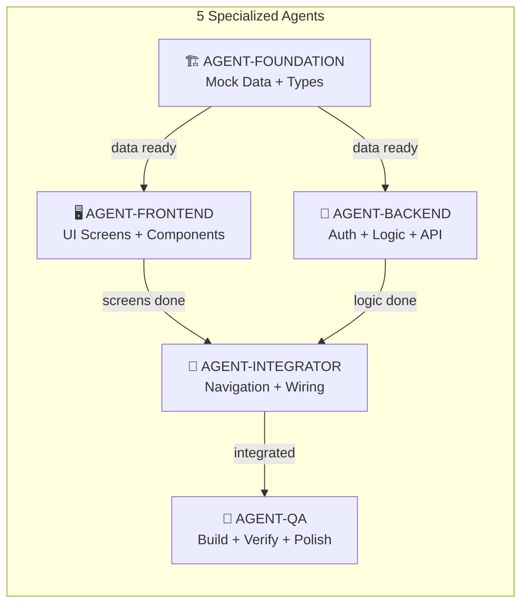
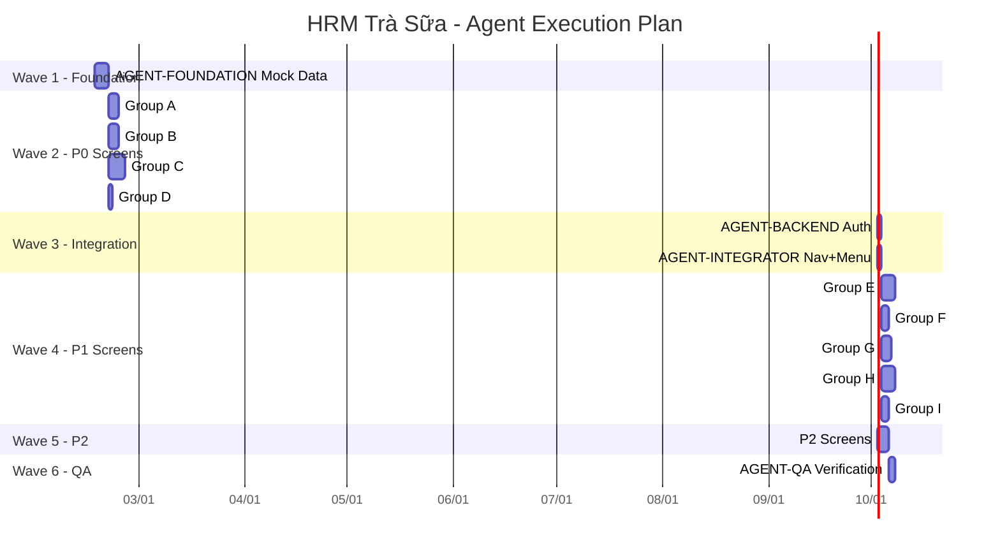

# HRM Trà Sữa — Agent Orchestration Plan

# Genesis v2.2

**Ngày tạo**: 2026-02-15
**Tổng tasks**: 60
**Agents**: 5 chuyên biệt

---

## 1. Agent Roster



### Agent Definitions

| Agent                | Vai trò                                           | Kỹ năng                       | Scope    |
| -------------------- | ------------------------------------------------- | ----------------------------- | -------- |
| **AGENT-FOUNDATION** | Tạo mock data, TypeScript types, shared utilities | TypeScript, data modeling     | 10 tasks |
| **AGENT-FRONTEND**   | Xây dựng UI pages, components, responsive         | React, Next.js, TailwindCSS   | 37 tasks |
| **AGENT-BACKEND**    | Auth logic, session, business logic               | Supabase, JWT, Edge Functions | 3 tasks  |
| **AGENT-INTEGRATOR** | Navigation wiring, menu, dashboard links          | Next.js routing, layout       | 3 tasks  |
| **AGENT-QA**         | Build verify, test scenarios, lint, accessibility | Next.js build, TypeScript     | 7 tasks  |

---

## 2. Task → Agent Mapping

### Wave 1: Foundation (AGENT-FOUNDATION — Sequential)

> **Mục tiêu**: Tạo toàn bộ mock data files trước khi bất kỳ screen nào được build.

| Task ID | REQ          | Output                       | Giờ     |
| ------- | ------------ | ---------------------------- | ------- |
| T1.1.1  | AUTH-003~004 | `mock-data-auth.ts`          | 2h      |
| T2.1.1  | SCH-001~005  | `mock-data-scheduling.ts`    | 3h      |
| T3.1.1  | ATT-001~010  | `mock-data-attendance.ts`    | 4h      |
| T4.1.1  | TASK-001~004 | `mock-data-tasks.ts`         | 3h      |
| T5.1.1  | COM-001~006  | `mock-data-communication.ts` | 3h      |
| T6.1.1  | PAY-001~011  | `mock-data-payroll.ts`       | 4h      |
| T7.1.1  | RPT-001~007  | `mock-data-reports.ts`       | 3h      |
| T8.1.1  | SET-001~021  | `mock-data-settings.ts`      | 4h      |
| T9.1.1  | LVE-001~005  | `mock-data-leave.ts`         | 3h      |
| T10.1.1 | EMP-005~007  | `mock-data-employee-ext.ts`  | 2h      |
|         |              | **Subtotal**                 | **31h** |

**Execution**: Sequential (mỗi file ~2-4h, tổng ~4 ngày)
**Gate**: Build pass sau khi tạo tất cả files

---

### Wave 2: P0 Core Screens (AGENT-FRONTEND — Parallel Groups)

> **Mục tiêu**: Build tất cả P0 screens. Có thể chạy song song theo module.

#### Group A: Scheduling + Attendance (đồng thời)

| Task ID | Agent    | Screen            | Giờ     | Priority |
| ------- | -------- | ----------------- | ------- | -------- |
| T2.2.1  | FRONTEND | ScheduleByShift   | 5h      | P0       |
| T3.2.1  | FRONTEND | AttendanceByStore | 6h      | P0       |
| T3.2.2  | FRONTEND | AttendanceByDate  | 4h      | P0       |
| T3.2.7  | FRONTEND | OvertimeRequest   | 4h      | P0       |
|         |          | **Subtotal**      | **19h** |

#### Group B: Tasks Module (đồng thời với Group A)

| Task ID | Agent    | Screen         | Giờ     | Priority |
| ------- | -------- | -------------- | ------- | -------- |
| T4.2.1  | FRONTEND | TaskTemplates  | 5h      | P0       |
| T4.2.2  | FRONTEND | DailyTasks     | 5h      | P0       |
| T4.2.3  | FRONTEND | TaskHandover   | 4h      | P0       |
| T4.2.4  | FRONTEND | IncidentReport | 5h      | P0       |
|         |          | **Subtotal**   | **19h** |

#### Group C: Leave + Payroll Core (đồng thời với A, B)

| Task ID | Agent    | Screen             | Giờ     | Priority |
| ------- | -------- | ------------------ | ------- | -------- |
| T9.2.1  | FRONTEND | LeaveBalance       | 3h      | P0       |
| T9.2.2  | FRONTEND | LeaveRequest       | 4h      | P0       |
| T9.2.3  | FRONTEND | LeaveApproval      | 4h      | P0       |
| T6.2.1  | FRONTEND | PayrollByStore     | 5h      | P0       |
| T6.2.2  | FRONTEND | PayrollCompany     | 5h      | P0       |
| T6.2.4  | FRONTEND | BonusSlip          | 4h      | P0       |
| T6.2.5  | FRONTEND | DeductionSlip      | 3h      | P0       |
| T6.2.7  | FRONTEND | SalarySlip         | 5h      | P0       |
| T6.2.9  | FRONTEND | PayrollCalculation | 6h      | P0       |
|         |          | **Subtotal**       | **39h** |

#### Group D: Reports P0

| Task ID | Agent    | Screen           | Giờ    | Priority |
| ------- | -------- | ---------------- | ------ | -------- |
| T7.2.1  | FRONTEND | HROverview       | 4h     | P0       |
| T7.2.3  | FRONTEND | AttendanceReport | 4h     | P0       |
|         |          | **Subtotal**     | **8h** |

**Wave 2 Total**: ~85h (~11 ngày, nhưng parallel → ~6 ngày thực)

---

### Wave 3: Integration (AGENT-INTEGRATOR + AGENT-BACKEND)

| Task ID | Agent      | Screen               | Giờ     |
| ------- | ---------- | -------------------- | ------- |
| T1.2.1  | BACKEND    | Session + FirstLogin | 4h      |
| T11.1.1 | INTEGRATOR | Tác vụ Menu          | 4h      |
| T11.2.1 | INTEGRATOR | Dashboard Nav Links  | 3h      |
|         |            | **Subtotal**         | **11h** |

---

### Wave 4: P1 Screens (AGENT-FRONTEND — Parallel Groups)

#### Group E: Scheduling + Attendance P1

| Task ID | Screen             | Giờ     |
| ------- | ------------------ | ------- |
| T2.2.2  | ScheduleByEmployee | 4h      |
| T2.2.3  | ScheduleApproval   | 4h      |
| T2.2.5  | WorkLocations      | 4h      |
| T3.2.3  | AttendanceRequest  | 5h      |
| T3.2.5  | LateEarlyReport    | 4h      |
| T3.2.6  | DeviceManagement   | 3h      |
| T3.2.8  | AttendanceCalendar | 4h      |
| T3.2.9  | ManualAttendance   | 4h      |
|         | **Subtotal**       | **32h** |

#### Group F: Communication

| Task ID | Screen        | Giờ     |
| ------- | ------------- | ------- |
| T5.2.1  | NewsFeed      | 4h      |
| T5.2.2  | Announcements | 3h      |
| T5.2.3  | Policies      | 3h      |
| T5.2.4  | TeamChat      | 6h      |
|         | **Subtotal**  | **16h** |

#### Group G: Payroll + Leave P1

| Task ID | Screen              | Giờ     |
| ------- | ------------------- | ------- |
| T6.2.3  | SalaryHold          | 3h      |
| T6.2.6  | SalaryAdvance       | 4h      |
| T6.2.8  | InsuranceReport     | 3h      |
| T6.2.10 | PayrollHistory      | 3h      |
| T6.2.11 | AllowanceManagement | 4h      |
| T9.2.4  | LeaveCalendar       | 4h      |
| T9.2.5  | LeavePolicy         | 3h      |
|         | **Subtotal**        | **24h** |

#### Group H: Reports + Settings P1

| Task ID | Screen                | Giờ     |
| ------- | --------------------- | ------- |
| T7.2.2  | StaffByHour           | 3h      |
| T7.2.4  | SalaryStructure       | 3h      |
| T7.2.5  | PayrollBudget         | 3h      |
| T8.2.1  | Payroll Settings (5p) | 6h      |
| T8.2.2  | Master Data (7p)      | 8h      |
| T8.2.3  | System Settings (9p)  | 8h      |
|         | **Subtotal**          | **31h** |

#### Group I: Employee Extended P1

| Task ID | Screen              | Giờ     |
| ------- | ------------------- | ------- |
| T10.2.1 | EmployeeImport      | 5h      |
| T10.2.2 | EmployeeExport      | 3h      |
| T10.2.3 | EmployeeOffboarding | 4h      |
|         | **Subtotal**        | **12h** |

**Wave 4 Total**: ~115h (~15 ngày, parallel → ~8 ngày thực)

---

### Wave 5: P2 Polish (AGENT-FRONTEND)

| Task ID | Screen               | Giờ     |
| ------- | -------------------- | ------- |
| T2.2.4  | AutoSchedule         | 5h      |
| T3.2.4  | DuplicateDeviceAlert | 3h      |
| T5.2.5  | DirectMessage        | 4h      |
| T7.2.6  | AutoRaiseReport      | 3h      |
| T7.2.7  | TaskReport           | 3h      |
| T12.1.1 | Asset Management     | 5h      |
|         | **Subtotal**         | **23h** |

---

### Wave 6: QA & Verification (AGENT-QA)

| Task ID | Verification                                  | Giờ     |
| ------- | --------------------------------------------- | ------- |
| T11.3.1 | Build verification tổng                       | 3h      |
| QA-001  | TypeScript strict mode check                  | 2h      |
| QA-002  | Responsive spot-check 10 pages                | 2h      |
| QA-003  | Permission matrix validation                  | 2h      |
| QA-004  | Navigation dead-link scan                     | 1h      |
| QA-005  | Accessibility audit (touch targets, contrast) | 2h      |
| QA-006  | Test scenarios TC-AUTH/ATT/LVE/PAY            | 3h      |
|         | **Subtotal**                                  | **15h** |

---

## 3. Execution Timeline (Gantt)



**Tổng thời gian thực (parallel)**: ~24 ngày làm việc

---

## 4. Agent Communication Protocol

### Handoff Rules

```
AGENT-FOUNDATION → AGENT-FRONTEND:
  Signal: "mock-data-{module}.ts committed"
  Payload: File path + exported types list

AGENT-FRONTEND → AGENT-INTEGRATOR:
  Signal: "Module {X} screens complete"
  Payload: Route list + page exports

AGENT-BACKEND → AGENT-INTEGRATOR:
  Signal: "Auth session logic ready"
  Payload: Session utils + middleware

AGENT-INTEGRATOR → AGENT-QA:
  Signal: "All routes wired"
  Payload: Route count + nav structure

AGENT-QA → FINAL:
  Signal: "Build pass + all checks green"
  Payload: Verification report
```

### Conflict Resolution

| Conflict                           | Resolution                                    |
| ---------------------------------- | --------------------------------------------- |
| Type mismatch giữa mock data và UI | AGENT-FOUNDATION sửa types                    |
| Route không tồn tại                | AGENT-INTEGRATOR tạo route stub               |
| Build fail                         | AGENT-QA triage, assign fix cho agent phù hợp |

---

## 5. Summary Statistics

| Metric                       | Value                            |
| ---------------------------- | -------------------------------- |
| **Total Agents**             | 5                                |
| **Total Tasks**              | 60 (+ 6 QA tasks = 66)           |
| **P0 Tasks**                 | 26 (~115h)                       |
| **P1 Tasks**                 | 26 (~114h)                       |
| **P2 Tasks**                 | 8 (~26h)                         |
| **QA Tasks**                 | 6 (~15h)                         |
| **Tổng giờ**                 | ~270h                            |
| **Calendar days (parallel)** | ~24 ngày                         |
| **Parallel groups max**      | 4 (Wave 2: A, B, C, D đồng thời) |

### Agent Workload Distribution

```
AGENT-FOUNDATION: ████████████████ 31h (11%)
AGENT-FRONTEND:   ████████████████████████████████████████████████████████████████ 200h (74%)
AGENT-BACKEND:    ████ 4h (2%)
AGENT-INTEGRATOR: ██████ 7h (3%)
AGENT-QA:         ████████ 15h (5%)
                  (+ overhead coordination ~13h = 5%)
```

---

## 6. Execution Checklist

### Per Wave Gate

- [ ] **Wave 1 Gate**: All 10 mock data files exist + `npm run build` pass
- [ ] **Wave 2 Gate**: All P0 screens render + no TypeScript errors
- [ ] **Wave 3 Gate**: Tác vụ Menu links work + Dashboard nav complete
- [ ] **Wave 4 Gate**: All P1 screens render + filters/CRUD work
- [ ] **Wave 5 Gate**: P2 screens render
- [ ] **Wave 6 Gate**: Build green + accessibility pass + test scenarios pass

### Final Deliverable

```
✅ 60 tasks completed
✅ 90+ screens accessible
✅ Build: 0 errors
✅ Routes: all linked from navigation
✅ Responsive: mobile-first verified
✅ Permission: role-based views working
```
