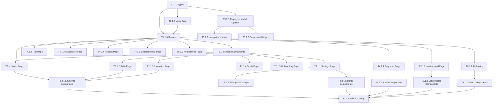

# Task List — Career Path Module v2

> Genesis v3 | 24 features | 17 routes | ~82 files
> Generated: 2026-02-21

---

## Dependency Graph



---

## System 1: Data Layer

### Phase 1: Foundation

- [ ] **T1.1.1** [REQ-CP-001..017]: Tạo TypeScript interfaces cho Career Path
  - **Mô tả**: Tạo 30+ interfaces (CareerLevel, Skill, EmployeeSkill, PromotionCondition, OnboardingStep, CareerGoal, SkillEndorsement, SkillRefreshConfig, CrossTrainingRecord, CareerAnalytics, etc.)
  - **Đầu vào**: PRD `01_PRD.md`, user spec
  - **Đầu ra**: `src/lib/types/career-path.ts`
  - **Nghiệm thu**:
    - [ ] 30+ interfaces đầy đủ fields
    - [ ] `tsc --noEmit` pass
    - [ ] Tất cả union types / enums được define
  - **Kiểm tra**: Chạy `tsc --noEmit`, kiểm tra file có đầy đủ interfaces
  - **Thời gian**: 3h
  - **Phụ thuộc**: Không
  - **Ưu tiên**: P0

- [ ] **T1.1.2** [REQ-CP-001..017]: Tạo mock data cho Career Path
  - **Mô tả**: Mock data hoàn chỉnh: 4 levels, 18 skills (4 basic + 8 advanced + 6 management), 3 skill levels, 2 employee types, 3 promotion conditions, 5 buddy rewards, 5 trial checklist items, 8 onboarding steps, 10-12 employees, 5-6 requests, goals, endorsements, analytics, leaderboard
  - **Đầu vào**: `types/career-path.ts`, user spec section 3
  - **Đầu ra**: `src/lib/mock-data/career-path.ts`
  - **Nghiệm thu**:
    - [ ] Mỗi entity type có ≥2 sample records
    - [ ] Dữ liệu nhất quán (IDs tham chiếu đúng)
    - [ ] `tsc --noEmit` pass
  - **Kiểm tra**: Chạy type check; kiểm tra cross-reference IDs
  - **Thời gian**: 4h
  - **Phụ thuộc**: T1.1.1
  - **Ưu tiên**: P0

- [ ] **T1.1.3** [REQ-CP-001..017]: Tạo career-path-service.ts (100+ functions)
  - **Mô tả**: CRUD cho levels/skills/conditions; skill unlock eligibility/execution; promotion flow; buddy/trial; onboarding; goals; endorsements; skill refresh; cross-training; reports/analytics; settings/templates; change logs; export/import; localStorage persistence
  - **Đầu vào**: `types/career-path.ts`, `mock-data/career-path.ts`
  - **Đầu ra**: `src/lib/services/career-path-service.ts`
  - **Nghiệm thu**:
    - [ ] 100+ exported functions
    - [ ] localStorage load/save pattern (giống KPI module)
    - [ ] initCareerPathStores() / resetCareerPathData()
    - [ ] `tsc --noEmit` pass
  - **Kiểm tra**: Type check; kiểm tra mỗi nhóm chức năng (levels, skills, promotion, buddy, etc.)
  - **Thời gian**: 8h
  - **Phụ thuộc**: T1.1.1, T1.1.2
  - **Ưu tiên**: P0

- [ ] **T1.1.4** [基础]: Tạo shared components (6 files)
  - **Mô tả**: ProgressRing (SVG), ProgressBar (CSS), IconPicker (emoji grid), ConditionChip, TimelineView, SkillHexagon
  - **Đầu vào**: Design system hiện tại (CSS vars, .card class)
  - **Đầu ra**: `src/components/career-path/shared/*.tsx` (6 files)
  - **Nghiệm thu**:
    - [ ] Mỗi component render không lỗi
    - [ ] Responsive 375px+
    - [ ] Sử dụng CSS vars hiện có
    - [ ] `tsc --noEmit` pass
  - **Kiểm tra**: Build pass; kiểm tra visual trên mobile viewport
  - **Thời gian**: 4h
  - **Phụ thuộc**: T1.1.1
  - **Ưu tiên**: P0

---

## System 2: Employee UI

### Phase 1: Core Pages

- [ ] **T2.1.1** [REQ-CP-012]: Trang career-path chính (role-based)
  - **Mô tả**: 3 views: Employee (greeting + goals + progress + suggestions + badges + buddy), Manager (team overview + alerts + chart), CEO (all stores + analytics + pending)
  - **Đầu vào**: Service, shared components, useAuthStore
  - **Đầu ra**: `src/app/career-path/page.tsx`
  - **Nghiệm thu**:
    - [ ] Employee view hiện progress card + smart suggestions
    - [ ] Manager view hiện team overview + cảnh báo
    - [ ] CEO view hiện all stores summary
    - [ ] Responsive 375px
  - **Kiểm tra**: Login các role khác nhau; kiểm tra layout responsive
  - **Thời gian**: 5h
  - **Phụ thuộc**: T1.1.3, T1.1.4
  - **Ưu tiên**: P0

- [ ] **T2.1.2** [REQ-CP-003, REQ-CP-004]: Trang Skills (skill tree)
  - **Mô tả**: 3 views (list/hexagon/timeline), filter (all/unlocked/upcoming/locked), group by (basic/advanced/management), unlock request, endorsement display, "Set as goal" action
  - **Đầu vào**: Service (getSkills, checkSkillUnlockEligibility), shared components
  - **Đầu ra**: `src/app/career-path/skills/page.tsx`
  - **Nghiệm thu**:
    - [ ] 3 view modes hoạt động
    - [ ] Filter/group chính xác
    - [ ] Unlock button chỉ hiện khi đủ điều kiện
    - [ ] Skill detail bottom sheet
  - **Kiểm tra**: Switch views; filter; thử unlock flow
  - **Thời gian**: 5h
  - **Phụ thuộc**: T1.1.3, T1.1.4
  - **Ưu tiên**: P0

- [ ] **T2.1.3** [REQ-CP-005, REQ-CP-006]: Trang Promotion progress
  - **Mô tả**: Visual level timeline (🌱→☕→⭐→👔), conditions checklist với progress bars, predicted date, request button, promotion history
  - **Đầu vào**: Service (checkPromotionEligibility, createPromotionRequest)
  - **Đầu ra**: `src/app/career-path/promotion/page.tsx`
  - **Nghiệm thu**:
    - [ ] Timeline visual đúng
    - [ ] Progress bars cho từng condition
    - [ ] Request button chỉ active khi 100%
    - [ ] Lịch sử hiện đúng
  - **Kiểm tra**: Kiểm tra data matches; thử submit request
  - **Thời gian**: 4h
  - **Phụ thuộc**: T1.1.3, T1.1.4
  - **Ưu tiên**: P0

- [ ] **T2.1.4** [REQ-CP-017]: Trang Goals (MỚI)
  - **Mô tả**: Active goals với progress, add new goal dialog, suggested goals (từ service), completed history
  - **Đầu vào**: Service (getEmployeeGoals, createGoal, getSuggestedGoals)
  - **Đầu ra**: `src/app/career-path/goals/page.tsx`
  - **Nghiệm thu**:
    - [ ] Tạo goal mới (skill/level/custom)
    - [ ] Progress tự cập nhật khi conditions thay đổi
    - [ ] Cancel/achieve goal hoạt động
    - [ ] Suggested goals hiện đúng
  - **Kiểm tra**: Tạo goal → kiểm tra progress → achieve
  - **Thời gian**: 3h
  - **Phụ thuộc**: T1.1.3, T1.1.4
  - **Ưu tiên**: P1

- [ ] **T2.1.5** [基础]: Trang Onboarding (MỚI)
  - **Mô tả**: Step-by-step onboarding cho NV mới: video/doc/quiz/task, progress bar, mentor info, sequential unlock
  - **Đầu vào**: Service (getOnboardingSteps, completeOnboardingStep)
  - **Đầu ra**: `src/app/career-path/onboarding/page.tsx`
  - **Nghiệm thu**:
    - [ ] Steps hiện đúng thứ tự
    - [ ] Quiz scoring hoạt động
    - [ ] Progress bar cập nhật
    - [ ] Later steps locked cho đến previous complete
  - **Kiểm tra**: Chạy qua flow hoàn chỉnh
  - **Thời gian**: 3h
  - **Phụ thuộc**: T1.1.3, T1.1.4
  - **Ưu tiên**: P1

### Phase 2: Components

- [ ] **T2.2.1** [基础]: Employee components (17 files)
  - **Mô tả**: CareerProgressCard, SkillTreeView, SkillGroupSection, SkillItemCard, SkillDetailSheet, SkillHexagonView, PromotionProgressCard, PromotionTimeline, ConditionProgressBar, LevelBadge, SkillLevelBadge, AchievementBadge, BuddyStatusCard, SmartSuggestionCard, GoalCard, OnboardingStepCard, EndorsementDisplay
  - **Đầu vào**: Types, shared components, design system
  - **Đầu ra**: `src/components/career-path/employee/*.tsx` (17 files)
  - **Nghiệm thu**:
    - [ ] Mỗi component render không lỗi
    - [ ] Props đúng type
    - [ ] Responsive 375px
    - [ ] Animations smooth (60fps)
  - **Kiểm tra**: Build pass; visual check mỗi component
  - **Thời gian**: 8h
  - **Phụ thuộc**: T1.1.4, T2.1.1, T2.1.2, T2.1.3
  - **Ưu tiên**: P0

---

## System 3: Admin Settings UI

### Phase 1: Pages

- [ ] **T3.1.1** [REQ-CP-001, REQ-CP-002, REQ-CP-005, REQ-CP-007]: Settings page (6 tabs)
  - **Mô tả**: Horizontal scrollable tabs: Cấp bậc (CRUD + reorder + toggle), Kỹ năng (CRUD + groups), Loại NV (edit + limits), Điều kiện thăng tiến (CRUD), Onboarding (steps CRUD), Cài đặt chung. Export/Import buttons.
  - **Đầu vào**: Service (CRUD functions), ConfirmDialog
  - **Đầu ra**: `src/app/career-path/settings/page.tsx`
  - **Nghiệm thu**:
    - [ ] 6 tabs hoạt động, scroll mobile
    - [ ] CRUD mỗi entity type
    - [ ] Toggle bật/tắt
    - [ ] Toast notifications
    - [ ] Export/Import JSON
  - **Kiểm tra**: Thêm/sửa/xóa mỗi loại; export → import
  - **Thời gian**: 6h
  - **Phụ thuộc**: T1.1.3, T1.1.4
  - **Ưu tiên**: P0

- [ ] **T3.1.2** [REQ-CP-009, REQ-CP-010, REQ-CP-014, REQ-CP-015]: Settings sub-pages (5 files)
  - **Mô tả**: buddy/page.tsx (toggle + rewards config), trial/page.tsx (checklist CRUD), templates/page.tsx (CRUD + apply), history/page.tsx (logs + revert), onboarding/page.tsx (steps CRUD + preview)
  - **Đầu vào**: Service, ConfirmDialog
  - **Đầu ra**: 5 files trong `src/app/career-path/settings/*/page.tsx`
  - **Nghiệm thu**:
    - [ ] Buddy toggle + rewards
    - [ ] Trial checklist CRUD + reorder
    - [ ] Template create/preview/apply
    - [ ] History log + revert button
    - [ ] Onboarding steps CRUD
  - **Kiểm tra**: Thao tác CRUD trên mỗi page; verify revert
  - **Thời gian**: 6h
  - **Phụ thuộc**: T3.1.1
  - **Ưu tiên**: P1

### Phase 2: Components

- [ ] **T3.2.1** [基础]: Settings components (16 files)
  - **Mô tả**: LevelCard/Form, SkillCard/Form, EmployeeTypeCard/Form, PromotionConditionCard/Form, BuddyRewardToggle, TrialChecklistItem, SettingsChangeLogItem, TemplateCard, OnboardingStepCard/Form, SkillRefreshConfig, ExportImportButtons
  - **Đầu vào**: Types, shared components
  - **Đầu ra**: `src/components/career-path/settings/*.tsx` (16 files)
  - **Nghiệm thu**:
    - [ ] Forms có validation
    - [ ] Cards hiện đủ info
    - [ ] Toggle/switch hoạt động
    - [ ] Responsive
  - **Kiểm tra**: Build pass; kiểm tra form submit
  - **Thời gian**: 6h
  - **Phụ thuộc**: T3.1.1
  - **Ưu tiên**: P0

---

## System 4: Admin Management UI

### Phase 1: Pages

- [ ] **T4.1.1** [REQ-CP-006, REQ-CP-008]: Requests page
  - **Mô tả**: Tabs: Thăng tiến / Chuyển đổi loại NV. Sub-tabs: Chờ duyệt / Đã duyệt / Từ chối. Card list + actions. Review dialog.
  - **Đầu vào**: Service (getPromotionRequests, approve/reject)
  - **Đầu ra**: `src/app/career-path/requests/page.tsx`
  - **Nghiệm thu**:
    - [ ] Tabs filter đúng
    - [ ] Approve/reject hoạt động
    - [ ] Review dialog với note
    - [ ] Toast + data update
  - **Kiểm tra**: Approve/reject request; verify status change
  - **Thời gian**: 4h
  - **Phụ thuộc**: T1.1.3
  - **Ưu tiên**: P0

- [ ] **T4.1.2** [REQ-CP-010]: Trial evaluation page
  - **Mô tả**: List NV đang thử việc, highlight sắp hết hạn, evaluation form dialog (checklist + rating + result)
  - **Đầu vào**: Service (getPendingTrialEmployees, createTrialEvaluation)
  - **Đầu ra**: `src/app/career-path/trial/page.tsx`
  - **Nghiệm thu**:
    - [ ] List hiện đúng NV thử việc
    - [ ] Highlight sắp hết hạn (< 5 ngày)
    - [ ] Form submit Pass/Extend/Fail
  - **Kiểm tra**: Submit evaluation; verify employee status change
  - **Thời gian**: 3h
  - **Phụ thuộc**: T1.1.3
  - **Ưu tiên**: P0

- [ ] **T4.1.3** [REQ-CP-016]: Manual skill unlock page
  - **Mô tả**: Chọn NV → list skills chưa mở → form nhập lý do → confirm dialog → logged
  - **Đầu vào**: Service (manualUnlockSkill)
  - **Đầu ra**: `src/app/career-path/assign-skill/page.tsx`
  - **Nghiệm thu**:
    - [ ] Chọn NV hiện skills chưa mở
    - [ ] Yêu cầu nhập lý do
    - [ ] ConfirmDialog trước khi unlock
    - [ ] Logged trong change history
  - **Kiểm tra**: Unlock skill → kiểm tra change log
  - **Thời gian**: 2h
  - **Phụ thuộc**: T1.1.3
  - **Ưu tiên**: P1

- [ ] **T4.1.4** [REQ-CP-013]: Reports + Analytics page
  - **Mô tả**: Period + store selector, summary cards (avg time to promotion, skills unlocked, buddy success rate), level distribution chart (SVG), retention by level, upcoming promotions, warnings, skill expiry alerts
  - **Đầu vào**: Service (getCareerPathReport, getCareerAnalytics)
  - **Đầu ra**: `src/app/career-path/reports/page.tsx`
  - **Nghiệm thu**:
    - [ ] Summary cards hiện đúng số liệu
    - [ ] Charts render SVG/CSS
    - [ ] Upcoming promotions list đúng
    - [ ] Warnings hiện đúng loại
  - **Kiểm tra**: Đổi period/store; verify data changes
  - **Thời gian**: 4h
  - **Phụ thuộc**: T1.1.3
  - **Ưu tiên**: P1

- [ ] **T4.1.5** [基础]: Endorsements management page (MỚI)
  - **Mô tả**: List endorsements by employee, endorse skill form (rating 1-5 + comment), endorsement stats
  - **Đầu vào**: Service (getSkillEndorsements, endorseSkill)
  - **Đầu ra**: `src/app/career-path/endorsements/page.tsx`
  - **Nghiệm thu**:
    - [ ] List endorsements grouped by employee
    - [ ] Endorse form submit
    - [ ] Stats hiện avg rating
  - **Kiểm tra**: Endorse skill → verify in employee profile
  - **Thời gian**: 2h
  - **Phụ thuộc**: T1.1.3
  - **Ưu tiên**: P1

### Phase 2: Components

- [ ] **T4.2.1** [基础]: Admin components (10 files)
  - **Mô tả**: PromotionRequestCard, TypeChangeRequestCard, ReviewDialog, TrialEvaluationForm, ManualSkillUnlockForm, CareerReportSummary, UpcomingPromotionsList, WarningsList, EndorsementReviewCard, AnalyticsChart
  - **Đầu vào**: Types, shared components
  - **Đầu ra**: `src/components/career-path/admin/*.tsx` (10 files)
  - **Nghiệm thu**:
    - [ ] Forms validate input
    - [ ] Cards hiện đủ data
    - [ ] AnalyticsChart render SVG
    - [ ] Responsive
  - **Kiểm tra**: Build pass; visual check
  - **Thời gian**: 5h
  - **Phụ thuộc**: T4.1.1
  - **Ưu tiên**: P0

---

## System 5: Leaderboard & Integration

### Phase 1: Leaderboard

- [ ] **T5.1.1** [REQ-CP-011]: Leaderboard page
  - **Mô tả**: Period selector, category tabs (top_mentor/streak/skill_unlock/drinks_made), animated podium (top 3), full list, my position highlight, achievement highlights
  - **Đầu vào**: Service (getLeaderboard)
  - **Đầu ra**: `src/app/career-path/leaderboard/page.tsx`
  - **Nghiệm thu**:
    - [ ] Category tabs switch data
    - [ ] Podium animation
    - [ ] My position highlighted
    - [ ] Period filter hoạt động
  - **Kiểm tra**: Switch categories; check data consistency
  - **Thời gian**: 3h
  - **Phụ thuộc**: T1.1.3
  - **Ưu tiên**: P1

- [ ] **T5.1.2** [基础]: Leaderboard components (5 files)
  - **Mô tả**: LeaderboardPodium (animated CSS), LeaderboardRow, MyPositionCard, CategoryTab, AchievementHighlight
  - **Đầu vào**: Types, CSS vars
  - **Đầu ra**: `src/components/career-path/leaderboard/*.tsx` (5 files)
  - **Nghiệm thu**:
    - [ ] Podium animation smooth
    - [ ] Responsive
    - [ ] Highlight current user
  - **Kiểm tra**: Build pass; visual check animations
  - **Thời gian**: 3h
  - **Phụ thuộc**: T5.1.1
  - **Ưu tiên**: P1

### Phase 2: Integration

- [ ] **T5.2.1** [基础]: Update Employee model
  - **Mô tả**: Thêm `employee_type`, `current_level_id`, `level_started_at`, `hired_at` vào Employee interface + populate mockEmployees
  - **Đầu vào**: Existing `mock-data.ts`, career-path types
  - **Đầu ra**: Modified `src/lib/mock-data.ts`
  - **Nghiệm thu**:
    - [ ] Employee interface có 4 fields mới
    - [ ] Tất cả mockEmployees có data
    - [ ] `tsc --noEmit` pass (no breaking changes)
  - **Kiểm tra**: Type check toàn project
  - **Thời gian**: 2h
  - **Phụ thuộc**: T1.1.1
  - **Ưu tiên**: P0

- [ ] **T5.2.2** [基础]: Update navigation (More page)
  - **Mô tả**: Thêm Career Path section vào More page: Lộ trình, Kỹ năng, Bảng vinh danh, Mục tiêu. Admin: Cài đặt, Yêu cầu (badge count)
  - **Đầu vào**: Existing `more/page.tsx`
  - **Đầu ra**: Modified `src/app/(dashboard)/more/page.tsx`
  - **Nghiệm thu**:
    - [ ] Links hiện đúng theo role
    - [ ] Badge count cho pending requests (admin)
    - [ ] Navigation hoạt động
  - **Kiểm tra**: Click từng link; verify routing
  - **Thời gian**: 1h
  - **Phụ thuộc**: T5.2.1
  - **Ưu tiên**: P1

- [ ] **T5.2.3** [基础]: Dashboard widgets
  - **Mô tả**: EmployeeDashboard (career progress mini + goal reminder), ManagerDashboard (pending + trial alerts), AdminDashboard (system overview)
  - **Đầu vào**: Service, existing dashboard components
  - **Đầu ra**: Modified 3 dashboard files
  - **Nghiệm thu**:
    - [ ] Widgets render data đúng
    - [ ] Click navigates to career-path
    - [ ] Không break layout hiện tại
  - **Kiểm tra**: Load dashboards các role; verify widgets
  - **Thời gian**: 3h
  - **Phụ thuộc**: T5.2.1
  - **Ưu tiên**: P1

---

## System 6: Smart Features

### Phase 1: AI & Notifications

- [ ] **T6.1.1** [REQ-CP-017]: Career Path AI service
  - **Mô tả**: getSmartSuggestions, predictPromotionDate, findMentorMatch, getPersonalizedTips — rule-based logic (không dùng AI thật)
  - **Đầu vào**: Service data, employee progress
  - **Đầu ra**: `src/lib/services/career-path-ai.ts`
  - **Nghiệm thu**:
    - [ ] Suggestions dựa trên data thực
    - [ ] Prediction tính đúng
    - [ ] Mentor match score hợp lý
    - [ ] `tsc --noEmit` pass
  - **Kiểm tra**: Gọi functions với different employee data
  - **Thời gian**: 3h
  - **Phụ thuộc**: T1.1.3
  - **Ưu tiên**: P2

- [ ] **T6.1.2** [基础]: Smart components (4 files)
  - **Mô tả**: SmartSuggestionBanner, PredictionCard, MentorMatchCard, PersonalizedTip
  - **Đầu vào**: AI service, types
  - **Đầu ra**: `src/components/career-path/smart/*.tsx` (4 files)
  - **Nghiệm thu**:
    - [ ] Components render suggestions
    - [ ] Action buttons hoạt động
    - [ ] Responsive
  - **Kiểm tra**: Build pass; visual check
  - **Thời gian**: 2h
  - **Phụ thuộc**: T6.1.1
  - **Ưu tiên**: P2

- [ ] **T6.1.3** [基础]: Notifications page
  - **Mô tả**: Notification center cho career path: skill_unlock, promotion_eligible, goal_reminder, buddy_update, skill_expiring, trial_reminder, endorsement_received
  - **Đầu vào**: Service (getCareerPathNotifications)
  - **Đầu ra**: `src/app/career-path/notifications/page.tsx`
  - **Nghiệm thu**:
    - [ ] List notifications by type
    - [ ] Mark as read
    - [ ] Click to navigate
    - [ ] Empty state
  - **Kiểm tra**: Check notifications; mark read; navigate
  - **Thời gian**: 2h
  - **Phụ thuộc**: T1.1.3
  - **Ưu tiên**: P2

---

## System 7: Quality Assurance

### Phase 1: Polish & Verification

- [ ] **T7.1.1** [基础]: Polish + build verification
  - **Mô tả**: Responsive testing (375px, 414px, 768px, 1024px), loading/error/empty states, toast notifications, confirm dialogs, form validation, touch targets (44px min), smooth animations
  - **Đầu vào**: All pages và components
  - **Đầu ra**: Polished UI, clean build
  - **Nghiệm thu**:
    - [ ] `tsc --noEmit` pass
    - [ ] `next build` pass — exit code 0
    - [ ] Responsive ở 375px nhìn được
    - [ ] Empty states hiện message hữu ích
    - [ ] Toast notifications cho actions
  - **Kiểm tra**: Chạy build commands; test từng page ở mobile viewport
  - **Thời gian**: 4h
  - **Phụ thuộc**: T2.2.1, T3.2.1, T4.2.1, T5.1.2, T6.1.2
  - **Ưu tiên**: P0

---

## Summary

| Metric                  | Value |
| ----------------------- | ----- |
| Tổng tasks              | 24    |
| P0 tasks                | 13    |
| P1 tasks                | 8     |
| P2 tasks                | 3     |
| Tổng thời gian ước tính | ~104h |

### Execution Order (Critical Path)

```
T1.1.1 → T1.1.2 → T1.1.3 → T1.1.4
  ↓                   ↓
T5.2.1             T2.1.1 → T2.1.2 → T2.1.3 → T2.2.1
  ↓                   ↓
T5.2.2             T3.1.1 → T3.1.2 → T3.2.1
T5.2.3               ↓
                   T4.1.1 → T4.1.2 → T4.2.1
                      ↓
                   T5.1.1 → T5.1.2
                      ↓
                   T6.1.1 → T6.1.2
                      ↓
                   T7.1.1 ← (all converge)
```
